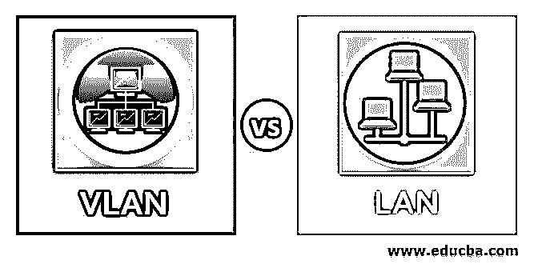
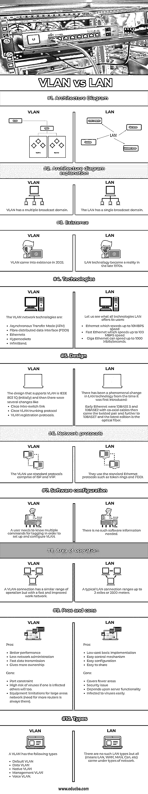
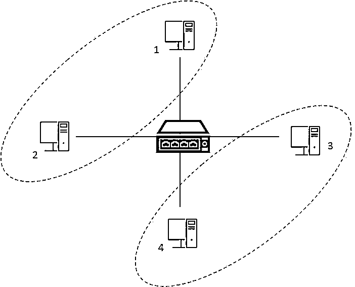
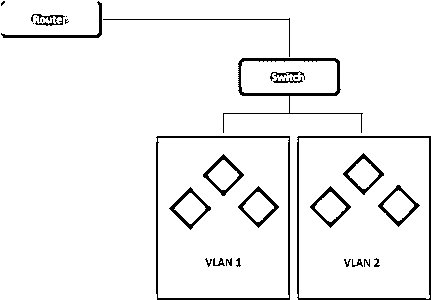
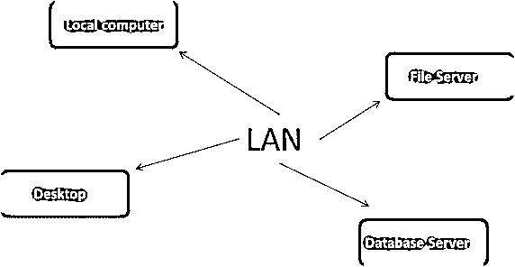

# 对兰

> 原文：<https://www.educba.com/vlan-vs-lan/>

## 和兰的区别

LAN 是一组使用连接设备通信的网络设备。同样，VLAN 是一种增加平面局域网功能的局域网。兰与之间存在着显著的差异；例如，局域网在单个域中运行，而 VLAN 在多个域中工作。不管它们的物理位置如何，VLAN 可以将终端与完全相同的要求结合起来，这在局域网中是不可能的。为了避免拥塞和负载，网络被分成局域网内的工作站。局域网以前的基本容量减少，导致网络拥塞。局域网由集线器、交换机或路由器构成，而虚拟局域网只能由交换机或网桥构成。

### 和蓝的对决(资料图)

以下是和兰之间的十大差距

<small>网页开发、编程语言、软件测试&其他</small>

### 与兰的主要区别

VLAN 与局域网的主要区别如下:

*   LAN 代表局域网，而 VLAN 代表虚拟局域网
*   建立局域网是一种昂贵的安排，而 VLAN 是一种投资相对较少的有效管理策略。
*   与 VLAN 的缓慢延迟相比，局域网中数据、软件和硬件方面的资源传输速度很快。
*   在局域网设置安排中，我们通常使用集线器、路由器和交换机，而在 VLAN，我们通常使用[桥和](https://www.educba.com/bridge-vs-switch/)交换机。
*   信息包是交换信息的一种方式，在局域网中，信息包被引入每一台设备，而在 VLAN，信息包被发送到不同的特定广播域。
*   局域网的效率不如 VLAN
*   在局域网中，所有的配置都是在一台 PC 上完成的，而在 VLAN，配置是在交换机和 PC 上完成的。
*   在局域网中，用户不能配置交换机中的可用端口，而在 VLAN，配置是在交换机的每个可用端口上完成的。
*   局域网的性能图不如 VLAN。
*   局域网比 VLAN 需要更多的管理网络设置；在 VLAN，已经根据不断变化的需求定义了层次结构，但是对于局域网，用户必须定期访问数据或信息。
*   在局域网中，与 VLAN 设置相比，数据传输不安全。
*   像令牌环和 FDDI 这样的局域网协议被用于局域网标准，而在 VLAN，像 ISL(交换机间链路)和 VTP (VPN 中继协议)这样的特殊协议被采用。
*   通过交换机，VLAN 提供了更好和增强的流量管理，并减少了相对较高的局域网延迟。
*   我们有两个主机，即一个部门的主机 1 和 2，另一个部门的主机 3 和 4。当用户进行局域网设置时，他们只有两种选择来建立连接——要么将所有设备连接在同一个局域网上(只有当我们假设没有两个用户组需要来自另一个组的信息时，这种情况才会发生),要么不同的子组可以进行单独的设置。
*   对于两者来说，这些情况在当今世界都不是一个好的实践，因为一个(前者)将有多个与安全相关的问题，而后者将很快变得昂贵。而在 VLAN 协议中，我们得到了管理这些问题的有效方法——我们可以将 1 & 2 和 3 & 4 分开；通过这样做，流量将在交换机上保持隔离。请参考下图。

### VLAN 与局域网对比表

以下是与兰的主要比较:

| **比较的基础** | **VLAN** | **兰** |
| **架构图** | 

 | 

 |
| **架构图说明** | VLAN 有多个广播域。 | 局域网有一个广播域。 |
| **存在** | VLAN 诞生于 2003 年。 | 局域网技术在 20 世纪 70 年代末成为现实。 |
| **技术** | VLAN 网络技术有:

*   Asynchronous transfer mode (ATM)
*   Distributed optical data interface (FDDI)
*   Ethernet
*   Hypersocket
*   无限带宽.

 | 让我们看看局域网为用户提供的所有技术:

*   Ethernet, speed up to 10 MBPS
*   Fast Ethernet, up to 100 MBPS
*   Gigabit Ethernet speed can reach 1000 Mbits/ second.

 |
| **设计** | 支持 VLAN 的设计是 IEEE 802 1Q(最初)，后来有过几次变化像

*   Cisco interswitch link
*   Cisco VLAN trunk protocol
*   VLAN registration protocol.

 | 自首次推出以来，局域网技术发生了巨大的变化:
早期的以太网是 10BASE 5 和 10BASE2，采用同轴电缆，然后是双绞线，再到 10BASET，最新版本是光纤。 |
| **网络协议** | VLAN 使用由 ISP 和 VTP 组成标准协议。 | 它们使用标准的以太网协议，如令牌环和 FDDI。 |
| **软件配置** | 为了设置和配置 VLAN，用户需要知道用于标记的多个命令。 | 不需要这样的软件信息。 |
| **操作区域** | VLAN 连接具有类似的操作范围，但是具有更快和更好的工作网络。 | 典型的局域网连接范围可达 2 英里或 2500 米。 |
| **利弊** | 优点:

*   Better performance
*   Less network management
*   Data transmission is faster.
*   Give more ownership

缺点:

*   Port constraint
*   The risk of infection is high; So will others.
*   Equipment limitations of large area networks (more routers are always needed).

 | 优点:

*   Low cost, basic realization
*   Easy control mechanism
*   Easy configuration
*   Easy to share

缺点:

*   Less coverage area
*   security issue
*   It depends on the server function.
*   Easy to get infected with viruses.

 |
| **类型** | 一个 VLAN 有以下几种类型:

*   Default VLAN
*   Data VLAN
*   Native VLAN
*   Management VLAN
*   Voice VLAN.

 | 没有这样的局域网类型，但是 all(表示局域网、广域网、城域网、城域网等。)归入网络类型。 |

### 结论

随着文章的重点放在局域网和 VLAN 的多个方面，我们可以说，VLAN 是局域网的延伸与使用多个广播域。两者都关注较小的领域，但操作方式却完全不同，这一点我们可以从比较和差异部分看出。每种方法都有一堆优点和缺点，这取决于用户的需求。

### 推荐文章

这是 vs 兰的攻略。在这里，我们讨论了 VLAN 与局域网的区别以及主要区别、信息图和比较表。您也可以浏览我们的其他相关文章，了解更多信息——

1.  [手机应用 vs 网站](https://www.educba.com/mobile-apps-vs-website/)
2.  [Weblogic vs Tomcat](https://www.educba.com/weblogic-vs-tomcat/)
3.  [WebSockets vs WebRTC](https://www.educba.com/websockets-vs-webrtc/)
4.  [VLAN vs 子网](https://www.educba.com/vlan-vs-subnet/)

