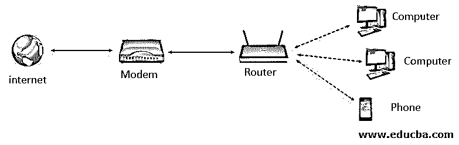
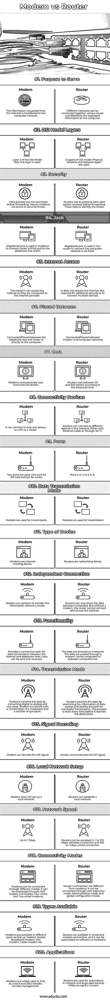

# 调制解调器与路由器

> 原文：<https://www.educba.com/modem-vs-router/>

## 调制解调器与路由器的区别

以下文章提供了调制解调器与路由器的概要。调制解调器被称为调制器和解调器。调制解调器设备接收计算机的数字信号，对其进行调制，并将信号作为模拟信号发送到电话线。它也可以在相同的过程中解调信号。调制解调器充当公共互联网和计算机网络之间的翻译器。没有调制解调器，计算机无法访问互联网。调制解调器在数据链路层以数据包[的形式传输数据。以及其将从因特网接收的信息带到计算机的目的。它不会扫描或筛选收到的数据包。对于单台计算机连接，调制解调器本身可以使用以太网端口及其连接到互联网的电缆进行连接。](https://www.educba.com/data-link-layer/)

连接到路由器的调制解调器图示:

<small>网页开发、编程语言、软件测试&其他</small>

路由器是将数据从一个局域网路由到另一个局域网的设备。数据包在网络之间转发。路由器携带数据包，通常通过互联网从一个路由器转发到另一个路由器，通过管理流量和引导数据包通过互联网到达目的地。路由器可以连接两个或更多不同的网络。路由器的工作方式是只允许授权的机器连接其他系统。它还通过记录文件来跟踪活动。

### 调制解调器与路由器的面对面比较(信息图)

以下是调制解调器与路由器之间的 20 大对比:

### 调制解调器与路由器的主要区别

让我们讨论一下调制解调器与路由器之间的一些关键区别:

*   路由器帮助将其设备连接到各种网络。调制解调器设备将数字信号转换为模拟信号，称为调制器，并将模拟信号转换为数字信号，称为解调器。
*   路由器的职责是将从一台计算机接收到的信息分发到网络中请求的其他计算机。其中调制解调器负责将信息从互联网传送到所请求的网络，而路由器则负责休息。
*   当计算机在互联网上执行上传时，调制解调器帮助将数字信号转换成电话线的模拟信号；下载操作在调制解调器中相反。调制解调器不分析接收到的信号。路由器分析数据包的目的地字段并读取其物理地址，然后将数据包路由到指定的目的地。
*   路由器在 OSI 模型的三层上运行——物理层、数据链路层和网络层，而调制解调器仅在数据链路层上运行。
*   调制解调器可以连接到计算机或公共互联网网络。其中路由器仅通过向指定设备发送数据包来引导网络中的流量。
*   路由器每次在发送目的地之前都会检查数据包。在路由器中实现的防火墙帮助计算机网络免受威胁。其中调制解调器只是传输数据包而不进行任何检查，容易受到威胁。
*   路由器位于调制解调器和计算机网络之间。电话线和路由器之间的调制解调器线路。

### 调制解调器与路由器对照表

下表总结了调制解调器与路由器之间的比较:

| **参数** | **调制解调器** | **路由器** |
| **服务目的** | 从因特网请求的信息被传送到计算机网络。 | 不同的网络可以使用路由器连接在一起，并将请求的信息分发给计算机。 |
| **OSI 模型层** | 使用 OSI 模型数据链路层的第 2 层。 | 使用 OSI 模型的 3 层物理层、数据链路层和网络层。 |
| **安全** | 数据包在转发前不会被检查。因此，调制解调器容易受到安全威胁。 | 路由器用于在转发之前检查收到的每个数据包。这些有助于识别威胁。 |
| **千斤顶** | 注册插孔用于连接路由器是 RJ45 的调制解调器，而电话线是 RJ11 的。 | 路由器中使用的注册插孔是通过 RJ45 连接计算机网络的。 |
| **互联网接入** | 当调制解调器连接到互联网提供商时，它可以访问互联网。 | 它不需要互联网。但是需要额外的安全性或连接多个设备。 |
| **放置在**之间 | 连接/放置在电话线和路由器之间或直接连接到计算机。 | 连接/放置在调制解调器和计算机网络之间。 |
| **成本** | 相对而言，调制解调器的价格超过 50 美元。 | 路由器根据高级程度价格在 20-200 美元之间。 |
| **连接设备** | 它只能连接到一台设备、一台 PC 或一台路由器。 | 路由器可以连接到网络中的不同设备。使用以太网电缆或通过 Wi-Fi。 |
| **端口** | 使用了两个端口。一个端口用于 ISP，另一个端口用于路由器。 | 端口 2 或 4 或 5 或 8。 |
| **数据传输模式** | 数据包用于传输。 | 数据包用于传输。 |
| **设备类型** | 调制解调器是互联网工作设备。 | 路由器是网络设备。 |
| **独立连接** | 调制解调器可以在没有路由器的情况下传输信息。 | 路由器只能在计算机之间共享数据。但是如果没有调制解调器，路由器就无法连接和访问互联网。 |
| **功能** | 为互联网和电话线之间的数据传输提供连接路径。可以发送和接收数据。 | 数据被导向网络。数据通过调制解调器、家用电脑或电脑之间传递。 |
| **传输模式** | 调制解调器通过将数字转换成模拟来传输数据，反之亦然。调制解调器是一种结合了调制器和症状整流器的设备。 | 路由器通过检查数据包信息来传输数据，并验证成功传输的路径。这个过程每次都是在到达目的地之前完成的。 |
| **信号解码** | 调制解调器可以解码 ISP 信号。 | 路由器无法解码 ISP 信号。 |
| **本地网络设置** | 调制解调器没有设置本地网络。 | 路由器可以建立本地网络。 |
| **网络速度** | 最高 1 Gbps。 | 路由器可以以 1 到 100 Mbps 的速度访问。无线连接和 100 到 1 Gbps 的有线连接。 |
| **连接模式** | 调制解调器可以通过不同的模式连接。它可以通过半双工、全双工、四个有线和两个有线调制解调器连接。 | 路由器的连接不同于调制解调器。它可以通过用户执行模式、管理模式和全局配置模式进行连接。 |
| **可用类型** | 调制解调器有不同的类型，如拨号调制解调器，移动宽带调制解调器，DSL 调制解调器，电缆调制解调器等。 | 路由器有有线和无线两种连接方式，可以基于软件或硬件使用。 |
|  

**应用程序**

 | 调制解调器广泛应用于 PoS，作为后台和数据传输、远程管理。 | 路由器用于网络冗余和大数据备份。VPN 用于路由器。 |

### 结论

讨论了路由器和调制解调器的基本功能及其工作模式和工作原理。路由器和调制解调器可以组合成一台设备，用作混合设备。这被称为网关，仅由特定的提供商提供。

### 推荐文章

这是关于调制解调器和路由器的指南。在这里，我们还将通过信息图和比较表来讨论调制解调器与路由器的主要区别。您也可以看看以下文章，了解更多信息–

1.  [网络拓扑](https://www.educba.com/network-topologies/)
2.  [网络面试问题](https://www.educba.com/networking-interview-questions/)
3.  [网关 vs 路由器](https://www.educba.com/gateway-vs-router/)
4.  [宽带 vs WiFi](https://www.educba.com/broadband-vs-wifi/)

