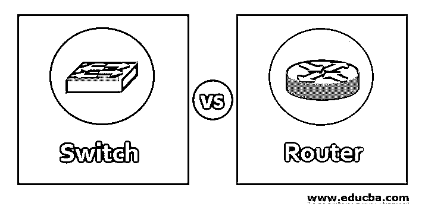
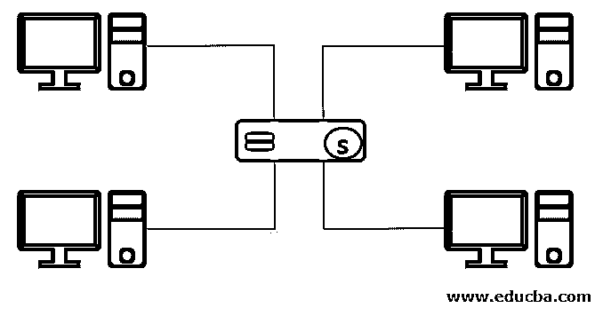
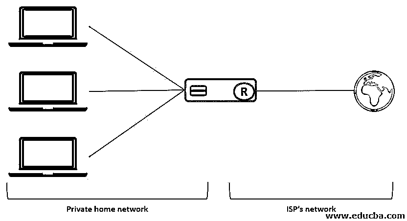
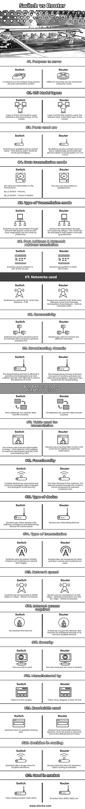

# 交换机与路由器

> 原文：<https://www.educba.com/switch-vs-router/>

## 交换机与路由器的区别

在本主题中，我们将讨论交换机与路由器的区别。

**开关:**有助于加快网内通信，是网络的主要组成部分。它可以使用节点从一个连接到另一个。这些有助于速度，有效的沟通和转移。虽然交换机有不同的类型，但它们的基本功能是为专用网络中的每个节点提供单独的连接。当收到数据包时，它识别数据包的目的地址，并将数据包转发到特定的目的地。

<small>网页开发、编程语言、软件测试&其他</small>

它是如何工作的？

交换机充当网络设备之间的桥梁，使用其 MAC 地址转发数据。该交换机可以在不同的层(如第 2 层或第 3 层)上执行数据传输，同时保持安全性。

路由器:这些设备将数据从一个局域网路由到另一个局域网。数据包在网络之间转发。路由器传送数据包，通常通过管理流量将数据包从一台路由器转发到另一台路由器，然后通过互联网将数据包发送到目的地。路由器可以连接两个或更多不同的网络。路由器的工作方式是只允许授权的机器连接其他系统。它还通过记录文件来跟踪活动。

它是如何工作的？

当路由器连接到不同 IP 地址的两条或多条线路时，数据包会从一条线路传输到另一条线路。当数据包到达时，路由器从数据包报头中读取网络地址信息并确定目的地。根据读取的信息，使用路由表或策略将数据包定向到下一个网络。

### 交换机与路由器的面对面比较(信息图表)

以下是交换机与路由器之间的 21 大区别

### 交换机与路由器的主要区别

以下是交换机与路由器之间的一些主要区别:

*   有局域网、广域网之类的网络。路由器能够连接局域网和广域网，2 个广域网或 2 个局域网。另一方面，可以通过使用交换机同时连接多个设备来创建网络。
*   通过在路由器中识别最短和最佳的包路径，包可以容易地到达目的地。另一方面，交换机识别数据包的目的地址，并将数据包转发到目的地址。数据传输是两者的主要目的。
*   路由器可分为自适应路由和非自适应路由，而交换机可分为分组交换、电路交换和消息交换。
*   在 OSI 模型中，路由器在前三层(物理层、数据链路层和网络层)运行，而交换机仅在两层(数据链路层和网络层)运行。
*   路由器工作在比交换机更高的网络层次。路由器做出智能决策，它依靠作为中介来连接来自不同区域的网络，而交换机仅用于有线网络。
*   路由器比交换机更贵，因为它们也可以连接无线网络。
*   建议使用高性能路由器将不同设备连接到网络，使用无线路由器。对于交换机，它用于有限的预算，以较低的成本体验高性能。

### 交换机与路由器对照表

为了便于理解，让我们通过一个比较表来看看交换机和路由器之间的更多区别:

| **比较** | **开关** | **路由器** |
| **服务目的** | 可以使用连接到交换机的多台设备来创建网络。 | 使用路由器可以连接不同的网络。 |
| **OSI 模型层** | 使用 OSI 模型的第 2 层。数据链是模型的第二层。 | 使用 OSI 模型的第 3 层。网络层是模型的第三层。 |
| **使用的端口是** | 交换机仅在特定端口可用，即端口 8、16、24、48、64。作为多端口桥接。 | 默认情况下，路由器只包含两个端口。此外，还可以添加串行端口。它可以是端口 2 或 4 或 5 或 8。 |
| **数据传输模式** | The data are transmitted in the frames form.由 L2 开关-框架，通过 L3 交换机-帧和数据包。 | 数据以包的形式传输。 |
| **传输模式的类型** | 交换机也可以通过全双工和半双工模式传输。可以通过偏好进行自动协商。 | 默认情况下，路由器通过全双工传输。该模式可以根据偏好手动更改为半双工。 |
| **端口地址&网络地址翻译** | 交换机也不能在 NAT 和 PAT 中运行。 | 路由器可以在 NAT 和 PAT 中运行。 |
| **使用的网络** | 交换机仅用于局域网 LAN。 | 路由器用于广域网、局域网、城域网-广域网和局域网，城域网。 |
| **连通性** | 交换机用于连接端到端设备，如计算机、打印机、扫描仪等。 | 路由器用于连接两个不同的网络。 |
| **广播域** | 交换机中允许广播域，广播域按端口冲突域传播。一个域在没有 VLAN 时使用。 | 广播域在路由器中被分成几个部分，不允许传播。每个端口都有自己的广播域。 |
| **用于数据传输的地址** | MAC 地址用于数据传输。 | IP 地址用于数据传输。 |
| **用于传输的表** | 该交换机使用内容可寻址存储器–CAM 表作为 MAC 地址到达目的地，并且该 CAM 由 ASIC 访问。 | 路由器使用路由表来存储和路由 IP 地址以到达目的地。 |
| **功能** | 连接多台设备，管理端口。它还管理 VLAN 安全性中的设置。 | 网络中定向的数据。数据通过调制解调器、家用计算机或计算机之间传递。 |
| **设备类型** | 交换机是配置了软件的活动设备，是用于传输的网络设备。 | 路由器是网络设备。 |
| **变速器类型** | 交换机最初使用广播。单播和组播在后期使用。 | 路由器最初也使用广播，然后使用单播和组播。 |
| **网络速度** | 可以通过 10/100 Mbps 或 1 Gbps 有线连接访问交换机。 | 路由器可以通过 1 到 100 Mbps 的无线连接和 100 到 1 Gbps 的有线连接进行访问。 |
| **需要互联网接入** | 不需要网络。 | 它不需要互联网。但是需要额外的安全性或连接多个设备。 |
| **安全** | 使用端口安全。 | 安全措施是用来保护。 |
| **由**制造 | 思科和 D-link Juniper。 | 思科、华硕、网件、D-link、TP-link。 |
| **使用的带宽** | 交换机没有单独的共享端口。 | 路由器动态共享带宽。它可以是静态的，也可以是动态的。零是默认的百分比值。 |
| **路由中的决策** | 对于复杂的决策，切换需要更长的时间。 | 路由器做决定花费的时间更少。更快的路由是可用的。 |
| **用于市场** | 思科 Catalyst 交换机 4500、6500。 | Ex 系列 Cisco 3900、2900 等。 |

### 结论

两者的特点都是基于局域网和广域网/城域网。在局域网和广域网/城域网中，L3 交换机的交换速度更快；路由器比 L3 交换机更快。交换机不像路由器那样支持某些配置。但是路由器和交换机在市场上应用相对广泛。

### 推荐文章

这是交换机与路由器的指南。在这里，我们通过信息图和比较表来讨论交换机和路由器的主要区别。您也可以看看以下文章，了解更多信息–

1.  [SOA 与微服务](https://www.educba.com/soa-vs-microservices/)
2.  [桥 vs 开关](https://www.educba.com/bridge-vs-switch/)
3.  [交换机 vs 路由器 vs 集线器](https://www.educba.com/switch-vs-router-vs-hub/)
4.  [网关 vs 路由器](https://www.educba.com/gateway-vs-router/)

