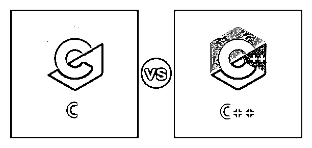
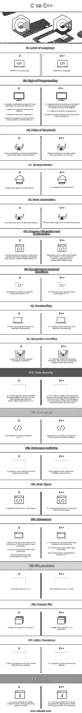

# C 与 C++

> 原文：<https://www.educba.com/c-vs-c-plus-plus/>

## C 与 C++的区别

C vs C++是编程世界中最流行和最古老的语言之一。这些语言是许多现代语言的基础。这篇博客的主要目的是区分 C 和 C++。但是在深入理解 C 和 C++之间的区别之前。

让我们先从了解这两种语言开始。

<small>网页开发、编程语言、软件测试&其他</small>

c 语言最初是由 Dennis Ritchie 在 1969 年到 1973 年间为 UNIX 操作系统设计和实现的。而比雅尼·斯特劳斯特鲁普在受到 C 和 Simula 的启发后于 1979 年开发了 C++。有趣的是，两位创始人都在 AT&T 的贝尔实验室工作。

C++受 C 启发，从 C 派生而来，因此，C++是 C 的超集。我们可以把 C 想象成黑白电视，把 C++想象成彩色电视。

C 和 C++有相似的语法、代码结构、编译和内存模型。所有的 C 操作符在 C++中都是有效的，大多数 C 程序都可以在 C++编译器中编译。

### C 与 C++的直接比较(信息图)

以下是 C 与 C++之间的 18 大区别:

### C 与 C++的主要区别

让我们继续寻找这两种语言之间的一些关键差异的细节:

#### 1.编程范例

c 是一种中级编程语言，它结合了机器语言和高级编程语言之间的差距。它主要是为编写操作系统内核而设计的。因此，它被设计成一种过程语言，这意味着它遵循自顶向下的编译方法。在 C 语言中，一个典型的程序从 main()函数开始，然后依次进入相应的函数。c 是一种不支持类和对象的过程语言。此外，它不支持多态性、封装和继承等特性。

让我们试着理解这些术语到底是什么。多态性是一个对象采取多种形式的能力。封装是指将数据和功能绑定在一起。这限制了任何其他函数对数据的直接访问。因此，它试图使数据更加安全。继承是子对象自动获取其父对象所有属性的能力。

另一方面，C++被认为是一种高级编程语言。它既支持过程式编程，也支持面向对象编程(OOP)范式。C++被称为“带类的 C”。它支持类和对象。C++是一种高级的面向对象语言，支持多态、封装和继承等特性。在 C++中，数据和函数可以以对象的形式封装在一起。由于封装，数据在 C++中更加安全。

#### 2.数据抽象

c 语言的数据抽象程度很低。数据抽象只显示基本信息，隐藏它们的背景细节，即隐藏所有的实现细节。与 c 相比，C++提供了高级别的数据抽象。

#### 3.名称空间

命名空间是 C++中增加的特性，但 C #中没有。命名空间是一个声明性区域，它为标识符提供了一个范围，如类型、变量、函数等的名称。，在里面。它有助于代码的逻辑组织，并防止名称冲突。

#### 4.内嵌函数

C 的原始版本不支持内联函数。然而，一些最新版本的 C 语言确实支持它们。内联函数是小函数，可以在调用时直接定义。C++支持内联函数。

#### 5.参考变量

C++提供的其他东西很少是 C++提供但 C 不喜欢的；C++支持指针和引用变量，而 C 只支持指针。在 C 中，我们只能有一种类型的数据类型，即内置数据类型。另一方面，C++既支持内置数据类型，也支持用户定义的数据类型。

#### 6.异常处理

C 不允许直接的异常处理，但是 C++允许使用它的 try 和 catch 块。其他一些事情，比如，在 C 结构中，我们只能有数据成员，但是在 C++中，我们可以同时有数据成员和函数。

#### 7.存储器分配

两种语言中动态内存分配的方式不同。在 C 中，我们使用 malloc()和 calloc()函数进行内存分配，使用 free()函数进行释放。在使用 C++时，我们使用一组不同的操作符，比如 New 和 Delete，分别用于内存分配和释放。

### C 与 C++对照表

让我们来讨论一下 C 与 C++之间的主要对比:

| **C 与 C++的比较基础** | **C** | **C++** |
| **语言水平** | 中级语言。 | 高级语言。 |
| **编程风格** | C supports the procedural programming paradigm for code development.它不支持类和对象。c 遵循自顶向下的方法。它不支持多态、封装和继承。 | C++ supports both procedural and object-oriented programming paradigm.它支持类和对象。C++遵循自底向上的方法。

它支持多态、封装和继承。

 |
| **重点** | 重点在于功能/方法，而不是问题的数据。 | 重点是数据，而不是过程或功能。 |
| **封装** | c 不支持封装。 | C++支持封装。 |
| **数据抽象** | c 提供了低级别的数据抽象。 | CPP 提供了高级别的数据抽象。 |
| **内存分配和解除分配** | malloc()、calloc()等函数用于动态内存分配，free()用于 c 中的释放。 | 在 C++中，New 和 Delete 等运算符分别用于动态内存分配和释放。 |
| **输入/输出标准功能** | Scanf()和 printf()用于 c 中的输入和输出。 | 在 C++中，Cin 和 Cout 用于输入和输出。 |
| **过载** | c 不支持函数或运算符重载。 | C++支持函数和运算符重载。 |
| **异常处理** | c 不直接支持异常处理。 | C++直接支持异常处理。这可以通过使用 try 和 catch 块来实现。 |
| **数据安全** | In C, data can be communicated between different blocks of code using global declarations.因此，数据在 c #中不太安全。 | 在 C++中，数据是隐藏的。数据和函数以对象的形式封装在一起。因此，外部函数无法访问数据，因此比 c 更安全。 |
| **命名空间** | 命名空间是 c #中没有的特性。 | 名称空间是 CPP 中的一个特性。它可以防止名称冲突。 |
| **参考变量** | c 只支持指针，不支持引用变量。 | CPP 支持引用变量和指针。 |
| **数据类型** | c #只支持内置数据类型。 | C++支持内置和用户定义的数据类型。 |
| **结构** | C allows only data members in its structures. C structs cannot have functions.c 结构不能有静态数据成员。结构声明没有在 c #中建立范围。 | C++ structures can have both data members and functions.C++结构可以有静态数据成员。结构声明在 C++中建立了一个作用域。 |
| **文件扩展名** | C 中的文件扩展名是**。c** | C++中的文件扩展名是。cpp。 |
| **头文件** | C 中使用的头文件是 stdio.h | C++中使用的头文件是 iostream.h |
| **内嵌函数** | 默认情况下，c 不支持内联函数定义。 | 默认情况下，C++支持内联函数。 |
| **可用性** | c 更适合像写操作系统内核这样的稳定程序。 | C++更适合为直接与硬件一起工作的应用程序编写程序。 |

比较 C 和 C++就像比较手机和智能手机。C 可以认为是 C++ 的[基础。两种语言都有各自的优缺点。c 更适合于编写我们需要难以置信的稳定性的程序。例如，编写我们操作系统的内核。另一方面，C++更适合为直接与硬件一起工作的应用程序编写程序。比如写服务器端应用，网络，游戏，设备驱动。](https://www.educba.com/features-of-c-plus-plus/)

### 结论

最后，让我们来回答最重要的问题:一个人，尤其是一个有抱负的程序员，为什么要学习 C 或 C++。这些语言在现代软件行业中很少使用，但它们构成了许多流行编程语言和库的主干，如 Python、Java、Javascript、Numpy 等。我们最喜欢的网络浏览器，如谷歌 Chrome、Mozilla Firefox 等。，我们操作系统的内核，像 MongoDB 这样的现代数据库都是用 C 或 C++写的。最重要的是，C/C++有助于新程序员轻松理解复杂的计算机科学理论。

### 推荐文章

这是一本关于 C 和 C++的指南。在这里，我们讨论了 C 与 C++的区别，以及关键的区别、信息图表和比较表。您也可以浏览我们的其他相关文章，了解更多信息——

1.  [PHP vs C#](https://www.educba.com/php-vs-c-sharp/)
2.  [C++ vs C#](https://www.educba.com/c-plus-plus-vs-c-sharp/)
3.  [JRE vs JVM](https://www.educba.com/jre-vs-jvm/)
4.  [C++结构](https://www.educba.com/c-plus-plus-struct/)

