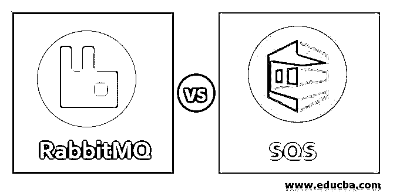
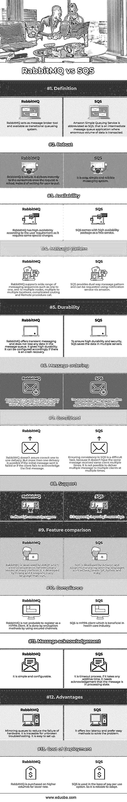

# 兔子队对 SQS 队

> 原文：<https://www.educba.com/rabbitmq-vs-sqs/>

## RabbitMQ 与 SQS 的区别

RabbitMQ vs SQS 用于消息排队应用程序。SQS 和 RabbitMQ 为您的应用程序提供了一个共享消息的地方，发送的消息在到达目的地之前是安全的。它既有能力共享海量数据。在 SQS 的帮助下，如果有扩展和激活的附加任务，用户可以卸载，当有任何高可用的消息集群时，以低价获得。RabbitMQ 充当消息代理，标准充当消息传递的即时场所。

### RabbitMQ 与 SQS 的对决(信息图)

以下是 RabbitMQ 与 SQS 的 13 大对比:

<small>网页开发、编程语言、软件测试&其他</small>

### RabbitMQ 与 SQS 的主要区别

RabbitMQ 和 SQS 之间的显著差异解释如下:

**1。开发者的选择:**开发者很迷茫选择 RabbitMQ 还是 SQS。选择 RabbitMQ 的原因是它的可靠性、紧凑性、用户友好性、低维护性、低安装价格，并且它是无服务器的。但有些人选择采用 SQS，因为它有吸引力的用户界面，耐用性，易于监控和配置，以及快速工作。

**2。配置难度:** RabbitMQ 难以配置，SQS 对集群配置和管理过于复杂。

**3。消息队列的可靠性:**与 RabbitMQ 相比，SQS 是高度可靠的，因为它不需要额外的努力。

**4。传输中的消息丢失**

由于转换和配置中的移动部分较多，RabbitMQ 中消息以多种方式蒸发的几率很高。但是在 SQS，与 RabbitMQ 相比，消息的丢失相对较低。

**5。处理多个客户:** RabbitMQ 为多个客户提供了标准的方法和用户友好的方式，而 SQS 未能以用户友好的方式即时提供。

**6。消息消费的模式:** RabbitMQ 遵循 push 作为唯一的方法，而 SQS 遵循 pull 作为定期的标准方法

**7。Nservice Bus:** Nservice bus 在 RabbitMQ 得到支持，而在 SQS，它是由社区运营的交通扩展提供的

**8。RabbitMQ 和 SQS 的性能:** RabbitMQ 拥有海量不同技术的库；它是开源的，使用简单。SQS 表现出高性能，因为它具有持续的可扩展性和最小的延迟。消息发送方式可判断性较差。对于大量的数据传输，SQS 提供廉价的服务并给予长期支持。它支持两种类型的数据，如高和低，但它需要一个任务队列来进行相互之间的传输。尽管消息吞吐量很低，但它提供了最佳性能。

**9。RabbitMQ 和 SQS 的限制**

路由密钥仅限于少数订购型号，但却是 AMQP 需求的重要组成部分。管理和生产文档是有限的，没有互操作演示。SQS 无法支持多个客户。如果从网络中删除了任何消息，都无法恢复或检索。如果错误的消息也被处理，我们不能停止该过程。它不支持同一队列中的多个客户端。

### RabbitMQ 与 SQS 对比表

下面是 RabbitMQ 与 SQS 的对比:

| **比较的基础** | **RabbitMQ** | **SQS** |
| **定义** | RabbitMQ 充当一个消息代理工具，并作为一个过渡排队系统提供。 | Amazon Simple Queuing Service 缩写为 SQS，它是一个中间消息队列应用程序，处理大量数据。 |
| **健壮** | RabbitMQ 很健壮。一旦提出请求，它就立即交付给消费者，而不是等待用户拉取。 | 这是一个简单可靠的信息系统。 |
| **可用性** | RabbitMQ 根据用户要求具有高可用性，因为它需要一些特殊费用。 | SQS 附带了一个高可用性包作为免费服务。 |
| **消息模式** | RabbitMQ 支持广泛的消息传递序列，例如一对一、一对多节点、多对多位置、复杂的路由和远程过程调用。 | SQS 提供双向消息模式，可以通过 amazon 使用通知服务进行请求。 |
| **耐久性** | RabbitMQ 提供瞬时消息传递，并且不会丢失消息队列中的任何数据。它具有很高的耐用性。如果有崩溃恢复，可以对其进行相应的配置。 | 为了确保高耐用性和安全性，SQS 将数据保存在多个服务器上。 |
| **消息排序** | 根据配置，一次只能接收一条消息。如果有任何故障，全部重定向。 | 标准消息队列提供单对单传递，也支持即时消息处理。 |
| **一致** | RabbitMQ 不保证正确的一对一交付。但是，如果最初发送的消息失败，或者如果客户端未能确认第一条消息，则可能有不止一次的传递。 | 在 SQS 确保一致性是一项艰巨的任务，因为它不会让同一个客户端多次收到相同的消息。不可能同时向多个客户端发送多条消息。 |
| **支持** | 它提供高度的社区支持。 | 最近几天情况明显好转。 |
| **特征对比** | RabbitMQ 是由 AMQP 开发的，它允许许多平台上的许多供应商之间的互操作。它由 Erlang 开发，支持除 SQS 以外的许多语言。 | SQS 由 Amazon 开发，支持许多编程语言，如 Java、JavaScript、Python 和 Ruby。 |
| **符合性** | RabbitMQ 不可能注册为 HIPPA 客户。这是通过使用安全通道的加密方法来完成的。 | SQS 是 HIPPA 的客户，这在医疗保健行业是有益的。 |
| **消息确认** | 它简单且可配置。 | 这是一个超时过程。如果需要额外的时间，它需要确认消息处于处理状态。 |
| **优势** | 镜像队列以减少硬件故障。对于不间断的故障排除，它是可追踪的。很容易设置。 | 它提供了低延迟，并且更喜欢用简单的方法来解决问题。 |
| **部署成本** | RabbitMQ 以较低的价格大量购买。 | SQS 用于按使用付费选项的基础。所以适应还是比较靠谱的。 |

### 结论

有很多客户选择了 SQS 和 RabbitMQ。如 MongoDB、localstack、Architect、Apache NiFI、Cloudcraft、Buddy、Datadog、StackStorm、SignalFx、Timescale DB 等。用户需求选择合适的消息队列以实现网络中的高性能和可靠性。

### 推荐文章

这是一个 RabbitMQ vs SQS 的指南。在这里，我们讨论 RabbitMQ 与 SQS 的介绍，信息图的主要区别，以及一个比较表。您也可以浏览我们推荐的其他文章，了解更多信息——

1.  [ActiveMQ vs RabbitMQ](https://www.educba.com/activemq-vs-rabbitmq/)
2.  [ActiveMQ vs Kafka](https://www.educba.com/activemq-vs-kafka/)
3.  [MySQL vs SQLite](https://www.educba.com/mysql-vs-sqlite/)
4.  [RabbitMQ vs 卡夫卡](https://www.educba.com/rabbitmq-vs-kafka/)

