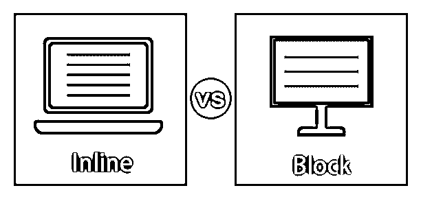
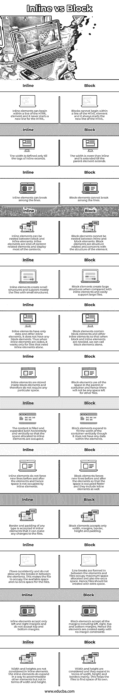

# 内联与块

> 原文：<https://www.educba.com/inline-vs-block/>

## 内联与块之间的区别

程序、文档或消息中的任何元素都称为内联或内嵌。当考虑 HTML 时，任何内置到网页中的代码都被称为内联。它不包括从外部文件加载的任何代码。在任何网页中，除了 CSS 和图像文件，几乎所有的内容都是内嵌的。任何开始一个段落的新行并使用整个页面或容器的元素都称为块元素。它有一行或多行，并且在行的元素之前和之后有一个换行符。CSS 可以用来格式化 block 元素。

### 内联与块之间的直接比较(信息图表)

下面是内联与块之间的主要比较。

<small>网页开发、编程语言、软件测试&其他</small>

### 内联与块之间的主要区别

让我们从以下几点来讨论内联与块之间的一些关键差异:

*   块元素总是从新行开始，向左和向右延伸，并占据整个可用宽度。块元素的例子有

    <address>、

    <main>、div >等。新行不是以 inline 开始的，它只占用必要的空间或宽度。内联元素有<input>、<select>、等。</select></main>

    </address>

*   块元素位于既有内联元素又有其他元素的 HTML 主体中，而我们不能将内联元素称为块元素。CSS 属性用于将元素从 inline 改为 block 或其他。它也有助于不显示元素。
*   块元素是一种在一行中有许多元素的块。而行内元素占据一整行的空间，并且在空间宽度内只有一行。
*   内联元素不考虑上边距和下边距，只考虑左边距和右边距，并且还考虑填充。而块元素考虑左、右、上、下边距和填充。
*   宽度和高度集不包括在内联元素中。block 元素中有 width 和 height 元素。
*   允许任何元素位于行内元素的左侧和右侧。但是块元素不允许其他元素坐在左边和右边，因为只有其他块元素。
*   每个块元素后都有一个换行符，而行内元素中没有换行符。
*   宽度应该在块元素中定义，否则块元素将占据整个宽度。内联元素没有这个问题，因为它占用的宽度与父元素一样多。
*   内联元素前后没有换行符，它接受它旁边的任何 HTML 元素。而块元素前后有空白，并且块元素旁边没有 HTML 元素。

### 内联与块比较表

下表总结了内联与块之间的比较。

| **内嵌** | **块** |
| 内联元素可以在 HTML 元素的一行中开始，它不会为 HTML 开始新的一行。 | 块不能在 HTML 元素的一行中开始，它总是从 HTML 的新行开始。 |
| 宽度仅在内联标签延伸时定义。 | 宽度大于行内宽度，并且一直延伸到父元素延伸为止。 |
| 行内元素可以在行之间断开。 | 块元素不能在行之间断开。 |
| 行内元素可以嵌套在块和行内元素之间。内联元素是一种与内容相关的元素，显示大部分内容。 | 块元素不能嵌套在 inline 和 Block 元素之间。块元素是结构相关的，涉及元素的结构。 |
| 内联元素创建小结构，主要支持小结构文件。 | 与行内元素相比，块元素创建大的结构，并且容易支持大文件。 |
| 行内元素只有数据和其他行内元素。它没有任何块元素。因此，当调用内联元素时，它只适用于只需要内联元素的文件。 | 块元素包含块元素和其他内联元素，这样当需要块和内联元素时，我们可以单独调用块元素。 |
| 内联元素存储在块元素中，因此不需要任何特殊的空间。 | 块元素使用父元素或容器中的所有空间，因此没有任何空间留给其他文件。 |
| 内容被水平和垂直地填充和扩展，以占据分配给行内元素的空间。 | 块元素扩展以垂直填充容器的宽度，尽管它在元素中没有任何数据。 |
| 内联元素不会在元素前后强制换行，因此空间不会被内联元素占用。 | 块元素在元素前后强制换行，以便更快地占用空间，并且它们还包括行内元素。 |
| 任何类型的边框和填充在内联元素中都是可以接受的，它可以对文件进行任何更改。 | Block 元素只接受宽度、边距、边框、高度和填充。 |
| 流动一致，不允许元素之间有任何换行。这使得文件占用了可用空间而没有多余的空间存放文件。 | 元素之间形成换行符，文件占用分配的最大空间和额外空间。因此，应该用额外的空间创建文件。 |
| 内联元素只接受左右边距，不接受上下边距。 | Block 元素接受所有的边距，包括左边距、右边距、上边距和下边距。因此，这些元素很容易创建，没有边距限制。 |
| 行内元素中不考虑宽度和高度。内联元素确实以某种方式扩展以容纳其他元素，但不是在宽度和高度方面。 | 考虑宽度和高度，主要在宽度、高度和边框方面展开。这有助于文件找到自己的空间。 |

### 结论

HTML 块帮助用户创建具有块和内联元素的文件，这些元素对文件非常有用。这些元素一个接一个地排列起来，这样文件就不会混淆。

### 推荐文章

这是内联与块之间主要区别的指南。在这里，我们还通过信息图和比较表讨论了内联与块的关键区别。您也可以看看以下文章，了解更多信息–

1.  [HTML 块](https://www.educba.com/html-blocks/)
2.  [HTML 中的 div 标签](https://www.educba.com/div-tag-in-html/)
3.  [HTML 中的字体标签](https://www.educba.com/font-tag-in-html/)
4.  [HTML 字体](https://www.educba.com/html-schriftart/)

