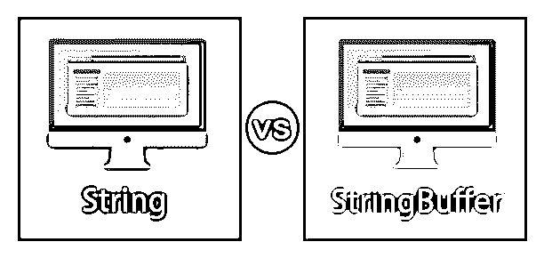
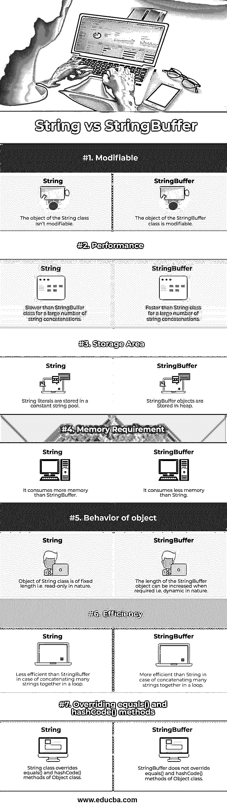
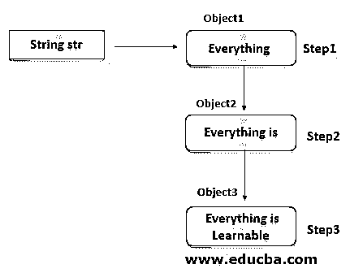
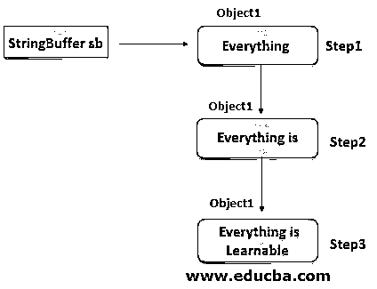
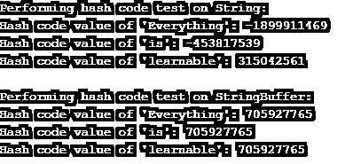

# 字符串与字符串缓冲区

> 原文：<https://www.educba.com/string-vs-stringbuffer/>




## String 与 StringBuffer 的区别

在 JAVA 中，String 和 StringBuffer 类都用于处理字符串，并且存在于 java.lang 包中。String 与 StringBuffer 的主要区别在于:

**一个字符串是不可变的**:一旦你创建了一个字符串对象，你就不能改变它。对字符串的每一次修改都会创建一个新的字符串对象并丢弃旧的对象，这会在堆中创建大量临时垃圾。

<small>网页开发、编程语言、软件测试&其他</small>

**StringBuffer 是可变的**:StringBuffer 的对象是可变的，即使用 string buffer 对字符串进行修改不会在内存中创建新的对象，但会更新现有对象中字符串的内容。

### String 与 StringBuffer 之间的直接比较(信息图表)

以下是 String 与 StringBuffer 的 7 大区别:


### String 与 StringBuffe 的主要区别 **r**

让我们讨论一下 String 和 StringBuffer 之间的一些主要区别:

1.  如果我们使用 string 类对字符串执行任何操作，都会导致在内存中重复创建整个字符串，而 StringBuffer 会占用一些缓冲区空间，并修改内存中该缓冲区空间中的字符串值。

*   **字符串类内部工作**

```
String str = new String("Everything ");
Str.concat("is ");
Str.concat("learnable");
```




*   **string buffer 类的内部工作**

```
StringBuffer sb = new StringBuffer("Everything ");
sb.append("is ");
sb.append("learnable");
```




2.在大量字符串操作和许多字符串连接的情况下，stringBuffer 提供了比 String 更好的性能。

**代码:**

```
import java.util.*;
public class Main
{
public static String StringConcat()
{
String str = "Hello";
for (int i = 0; i < 1000; i++)
{
str = str + "World";
}
return str;
}
public static String StringBufferConcat()
{
StringBuffer stringBuffer = new StringBuffer("Hello");
for (int i = 0; i < 1000; i++)
{
stringBuffer.append("World");
}
return stringBuffer.toString();
}
public static void main(String args[])
{
long time= System.currentTimeMillis();
StringConcat();
System.out.println("Time taken for String Concatenation: " + (System.currentTimeMillis()
- time) + "ms");
time = System.currentTimeMillis();
StringBufferConcat();
System.out.println("Time taken for StringBuffer Concatenation: " + (System.currentTimeMillis()
- time) + "ms");
}
}
```

**输出:**


3.由于 String 类在对字符串执行任何操作后都会在内存中创建大量的字符串垃圾，因此与 StringBuffer 相比，它需要更多的内存。

4.如果需要对字符串执行多个字符串连接或繁重的操作，应该使用 StringBuffer。如果字符串的内容在整个程序中不会改变，那么应该使用 string 类以线程安全的方式处理字符串。

5.如果需要很少数量的字符串连接，那么 string 类是有效的，并且比 StringBuffer 工作得更快，因为在缓冲区空间中添加字符，然后再次将整个内容转换为 String，会增加 StringBuffer 的开销。因此，在这种情况下，StringBuffer 与 String 类的“按值复制”特性相比工作速度较慢。

6.String 类重写 Object 类的 equals()和 hashCode()方法，而 StringBuffer 不重写 Object 类的 equals()和 hashCode()方法。

**代码:**

```
import java.util.*;
public class Main
{
public static void main(String args[])
{
System.out.println("Performing hash code test on String:");
String str = "Everything";
System.out.println("Hash code value of 'Everything': " + str.hashCode());
str = str + "is";
System.out.println("Hash code value of 'is': " + str.hashCode());
str = str + "learnable";
System.out.println("Hash code value of 'learnable': " + str.hashCode());
System.out.println("");
System.out.println("Performing hash code test on StringBuffer:");
StringBuffer stringBuffer = new StringBuffer("Everything");
System.out.println("Hash code value of 'Everything': " + stringBuffer.hashCode());
stringBuffer.append("is");
System.out.println("Hash code value of 'is': " + stringBuffer.hashCode());
stringBuffer.append("learnable");
System.out.println("Hash code value of 'learnable': " + stringBuffer.hashCode());
}
}
```

**输出:**




在上面的输出中，我们可以看到 String 为不同的字符串返回不同的哈希代码值，而 StringBuffer 为所有的字符串返回相同的哈希代码值。这证明了 String 类覆盖了 Object 类的 hashCode()方法。

7.字符串文字存储在常量字符串池中，而 StringBuffer 对象存储在堆中。

8.String 类的对象是固定长度的，本质上是只读的，而 StringBuffer 的对象的长度可以在需要时增加，本质上是动态的。

9.String 类支持 interning，即内容相同的字符串共享相同的内存位置，而 StringBuffer 不支持 interning。

**代码:**

```
import java.util.*;
public class Main
{
public static void main(String[] args) throws Exception
{
String str1 = "hello";
String str2 = "hello";
System.out.println(str1 == str2); //returns true
String str3 = str1.intern();
System.out.println(str1 == str3); //returns true
}
}
```

**输出:**


10.我们可以通过将 String 对象传递给 StringBuffer 类构造函数来将 String 对象转换为 StringBuffer 对象，而要将 StringBuffer 对象转换为 String 对象，我们需要调用 toString()方法。

**举例:**

```
String str = "abc";
StringBuffer stringBuffer = new StringBuffer(str);
StringBuffer stringBuffer = new StringBuffer("abc");
String str = stringBuffer.toString();
```

### String 和 StringBuffer 的对照表

让我们来看看 String 与 StringBuffer 之间最顶层的比较:

| **参数** | **字符串** | 串缓冲 |
| **可修改** | String 类的对象不可修改。 | StringBuffer 类的对象是可修改的。 |
| **性能** | 对于大量的字符串连接，比 StringBuffer 类慢。 | 对于大量的字符串连接，比 String 类快。 |
| **存储区** | 字符串文字存储在常量字符串池中。 | StringBuffer 对象存储在堆中。 |
| **内存需求** | 它比 StringBuffer 消耗更多的内存。 | 它消耗的内存比 String 少。 |
| **对象的行为** | 字符串类的对象是固定长度的，即本质上是只读的。 | StringBuffer 对象的长度可以在需要时增加，即本质上是动态的。 |
| **效率** | 在一个循环中将许多字符串连接在一起的情况下，效率低于 StringBuffer。 | 在一个循环中将许多字符串连接在一起的情况下，比 String 更有效。 |
| **覆盖 equals()和 hashCode()方法** | String 类覆盖 Object 类的 equals()和 hashCode()方法。 | StringBuffer 不重写 Object 类的 equals()和 hashCode()方法。 |

### 结论

在 JAVA 中，String 和 StringBuffer 类都用来表示字符序列。如果字符串的操作没有改变它的值，那么 string 类不会为该字符串创建新的对象。当字符串的值更改时，会创建一个新的对象。

### 推荐文章

这是一个字符串与字符串缓冲区的指南。在这里，我们用信息图和比较表来讨论 String 与 StringBuffer 的主要区别。您也可以看看以下文章，了解更多信息–

1.  [C#接口 vs 抽象类](https://www.educba.com/c-sharp-interface-vs-abstract-class/)
2.  [类型脚本接口 vs 类](https://www.educba.com/typescript-interface-vs-class/)
3.  [Java 接口 vs 抽象类](https://www.educba.com/java-interface-vs-abstract-class/)
4.  [字符串 vs 字符串 C#](https://www.educba.com/string-vs-string-c-sharp/)


