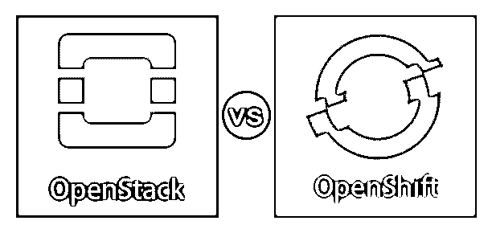
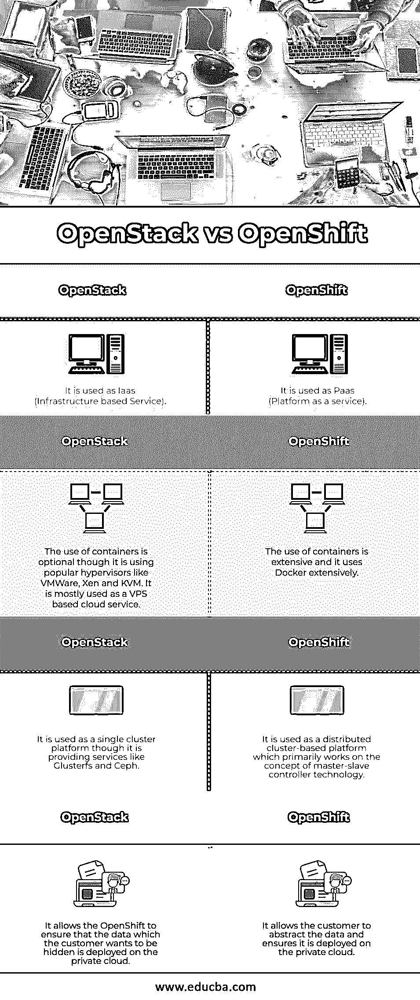

# OpenStack 与 OpenShift

> 原文：<https://www.educba.com/openstack-vs-openshift/>

## OpenStack 和 OpenShift 的区别

OpenStack 和 OpenShift 都是最流行的基于 Linux 的云技术，都是开源的，由 RedHat 公司管理。OpenStack 是一种 Iaas(基础设施即服务),用于将现有服务器转换为云。OpenShift 是一个 [Paas(平台即服务)](https://www.educba.com/what-is-paas/)，运行在 AWS、Google 云平台等提供的现有云服务之上。因此，OpenShift 可以在 OpenStack 上作为基于云的服务使用。这是可能的，因为这两种技术是相互独立的。因此，OpenStack 可以用于服务器基础设施，而 OpenShift 可以用作第三方 API 服务。

### OpenStack

OpenStack 作为一种 [Iaas(基础设施即服务)](https://www.educba.com/what-is-iaas/)，可以将传统平台转换为基于云的平台。它允许基于客户的应用程序自动化其日常工作流，如资源分配，以便客户获得使用虚拟存储服务(如 VPS、数据块存储、对象存储等)的额外优势。，此外还有其他服务。它主要被用作 VPS。通常，it 部门会使用 VMWare 等虚拟机管理程序来启动虚拟机。

<small>网页开发、编程语言、软件测试&其他</small>

### OpenShift

OpenShift 是一个 Paas(平台即服务)，可以像 Google 计算平台、Amazon web services、Microsoft Azure 等同类产品一样使用。，就其用法而言。它还通过确保开发人员不必担心在需要时在物理和虚拟服务器之间切换，使应用程序的开发和测试工作流变得更加容易，从而为开发人员提供支持。因此，它有助于提高现有应用程序工作流程的生产率和效率，同时降低维护成本。

OpenShift 和 OpenStack 可以在单个客户应用程序工作流中结合使用。由于 OpenShift 是 PaaS(平台即服务)，它可以在部署在 OpenStack 平台上的现有云服务上使用，即 Iaas(基础设施即服务)。这降低了客户的设置成本，并提高了现有应用程序工作流的效率和生产率。这也确保了现有应用程序工作流的可扩展性；由于这两种技术都是云平台不可或缺的一部分，它们可以独立使用。

### OpenStack 和 OpenShift 的面对面比较(信息图表)

以下是 OpenStack 与 OpenShift 的四大对比 **:**

### OpenStack 和 OpenShift 的主要区别

让我们从以下几点来讨论 OpenStack 与 OpenShift 之间的一些关键差异:

#### 1.容器

OpenStack 使用虚拟机形式的容器，称为虚拟机管理程序，可以是 VMWare、Xen 或 KVM。当客户将它用作 VPS 时，可以在其中随意使用容器。就虚拟机管理程序的使用而言，它是最佳选择。另一方面，OpenShift 依赖于容器，并且用法不是可选的。它使用定义像 Kubernetes 这样的 DevOps 平台的思想，允许最终客户在云平台上轻松开发和测试他们的应用程序。它所使用的基于容器的流行技术之一是 Docker。

#### 2.分布式环境

OpenStack 用作单点基于云的平台。它控制着相关的数据中心。尽管如此，与 Kubernetes 等流行的基于 DevOps 的平台相比，这是最小的，因为 Kubernetes 可以在一个全球集群中处理相关的数据中心。OpenStack 还在分布式平台上提供 Glusterfs 和 Ceph 作为存储技术。但是由于他们是第三方，它并不完全依赖他们。另一方面，OpenShift 在使用 Kubernetes 时广泛使用了分布式系统的概念。它基于主从概念工作，即有一个控制器节点，它是控制工作节点的主节点。有一个封装的网络层，便于主节点和从节点之间的通信。

#### 3.云平台服务

OpenStack 将基础设施作为一种服务来使用，这有助于服务器管理，归因于与流行的基于云的 VPS 提供商(如 Google Cloud、Microsoft Azure、Digital Ocean、Amazon Web Services 等)的相似性。最终客户可以使用 OpenStack，将现有的服务器基础架构转变为基于云的基础架构。另一方面，OpenShift 使用平台即服务来简化开发和测试终端客户应用程序的使用。应用程序可以在 Docker 这样的容器上运行。因此，应用程序可以简化为基于 DevOps 的云应用程序，包括持续集成/持续开发管道。

#### 4.基于混合云的平台

OpenStack 和 OpenShift 的使用也可以齐头并进。如果应用程序必须从其他交互服务中抽象出来，OpenShift 就派上用场了。它确保客户数据保存在私有云上。这可以通过使 OpenStack 在私有节点数据上运行与数据存储相关的 pod 来实现。它还确保了负载平衡，因为其他数据可以在公共云上处理。因此，上述两种技术都是可扩展的并且易于使用。

### OpenStack 与 OpenShift 对比表

下表总结了 OpenStack 与 OpenShift 的比较 **:**

| **OpenStack** | **OpenShift** |
| 它被用作 Iaas(基于基础设施的服务)。 | 它被用作 Paas(平台即服务)。 |
| 容器的使用是可选的，尽管它使用了流行的虚拟机管理程序，如 VMWare、Xen 和 KVM。它主要用作基于 VPS 的云服务。 | 容器的使用是广泛的，它广泛使用 Docker。 |
| 虽然它提供 Glusterfs 和 Ceph 之类的服务，但它被用作单一集群平台。 | 它被用作基于集群的分布式平台，主要基于主从控制器技术的概念工作。 |
| 它允许 OpenShift 确保客户希望隐藏的数据部署在私有云上。 | 它允许客户提取数据，并确保数据部署在私有云上。 |

### 结论

基于 Linux 平台的 OpenStack 和 OpenShift 技术正被全球的终端客户广泛使用。它们都是 RedHat 的伟大创意，并且是开源的。他们给现有的基于云的平台，如谷歌、亚马逊、微软等，带来了激烈的竞争。

### 推荐文章

这是一个关于 OpenStack 和 OpenShift 之间主要区别的指南。在这里，我们还将讨论信息图和比较表的主要区别。您也可以看看以下文章，了解更多信息–

1.  [Openstack 与虚拟化](https://www.educba.com/openstack-vs-virtualization/)
2.  [什么是 App Stack？](https://www.educba.com/what-is-app-stack/)
3.  [OpenShift 替代方案](https://www.educba.com/openshift-alternatives/)
4.  [OpenStack 面试问题](https://www.educba.com/openstack-interview-question/)

