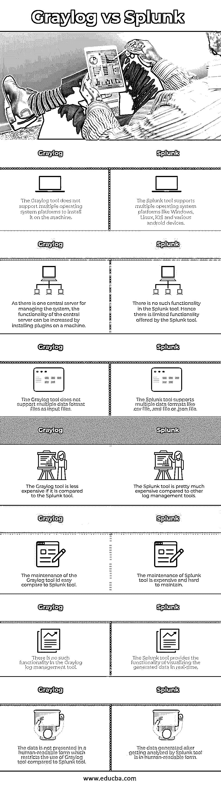

# Graylog 与 Splunk

> 原文：<https://www.educba.com/graylog-vs-splunk/>

## Graylog 和 Splunk 的区别

Graylog 软件是一种日志管理工具，有助于发现安全威胁和网络中浮动数据(非结构化数据和结构化数据)中的问题。Splunk 工具是另一种日志管理工具，用于分析机器生成的大量数据。在网络世界中，网络设备用于通信并通过网络发送数据包。因此，为了监控网络设备，需要一些监控软件来检查数据并发现网络中的安全威胁。

### Graylog 和 Splunk 之间的直接比较(信息图表)

以下是 Graylog 与 Splunk 之间的前 7 项比较 **:**

<small>网页开发、编程语言、软件测试&其他</small>

### Graylog 和 Splunk 的主要区别

让我们从以下几点来讨论 Graylog 与 Splunk 之间的一些关键差异:

#### 灰色测井工具

*   Graylog 工具提供了一个强大的平台，有助于管理网络中流动的数据，并提供了几个用于调试安全威胁的应用程序。
*   Graylog 工具管理的数据既可以是结构化数据，也可以是非结构化数据。
*   Graylog 工具使用其他平台，如 MongoDB、ElasticSearch 和 Scala。
*   在 Graylog 工具中，有一个中央服务器控制着安装在众多服务器上的所有客户端。该工具中还安装了一个 web 界面，有助于可视化数据并监控由中央服务器维护的日志。
*   使用 Graylog 软件的主要目的是存储 web 应用程序生成的日志。从 web 应用程序生成的日志文件可以是任何形式，包括结构化数据和非结构化数据。
*   以原始字符串形式生成的日志 Graylog 工具将原始字符串转换为结构化数据以供读取和分析。
*   Graylog 工具提供了支持结构化查询的附加功能，因此可以进行自定义搜索，并且可以轻松解析日志文件。
*   Graylog 工具可以很容易地与不同的 web 应用程序集成，这有助于开发人员和系统工程师看到系统行为并逐行分析代码。
*   主要使用 Graylog 工具，因为它为一个完整的系统生成一个日志实例。因为只有一个日志实例，所以可以更好地分析系统行为。日志实例也可以在多个实例中生成，但是这会给工程师带来问题，因为日志实例将在不同的地方生成，这将会给从中央服务器分析整个系统带来问题。

#### Splunk 工具

*   [Splunk 工具主要用于需要管理大量数据的场合](https://www.educba.com/what-is-splunk-tool/)。
*   该工具有助于将原始数据转换成有意义的形式，以便理解数据和分析系统行为。
*   Splunk 工具是一种数据分析平台，用于分析不同机器生成的数据。Splunk 工具能够以人类可读的形式显示机器生成的数据。
*   Splunk 工具使用三个阶段以人类可读的形式呈现数据。第一阶段包括确定数据以及数据分析的解决方案。第二阶段包括将大量数据转换成一些有意义的结果。最后一个阶段是根据要求将生成的结果转换成报告、图形或图表。
*   今天安装的机器不断产生数据，这就产生了管理数据和以某种有意义的形式展示数据的需求。
*   通过使用 Splunk 工具，机器生成的数据可以轻松访问、查看并用于决策。
*   该工具分析的数据不容易理解，因为数据可能以任何形式存在，如原始字符串或非结构化格式。大多数时候，机器的数据是以难以理解的有形形式呈现的。这时，Splunk 工具出现在画面中。
*   Splunk 工具有助于浏览机器生成的日志文件。该工具使用 SPL(搜索处理语言)，这有助于搜索日志文件中的任何简单术语。
*   Splunk 工具的另一个好处是数据可以以任何格式插入工具中，这意味着不同的数据格式文件，即。csv，。json，或者。xml 数据文件，可以在 Splunk 工具中给出进行分析。
*   除了所有这些功能之外，Splunk 工具还有一个强大的功能，使该工具不同于其他日志管理工具:工具的可扩展性和安装。

### Graylog 与 Splunk 的对比表

下表总结了 Graylog 与 Splunk **:** 之间的比较

| **灰色日志** | **Splunk** |
| Graylog 工具不支持在机器上安装多种操作系统平台。 | Splunk 工具支持多种操作系统平台，如 Windows、Linux、iOS 和各种 android 设备。 |
| 因为有一个中央服务器用于管理系统，所以可以通过在机器上安装插件来增加中央服务器的功能。 | Splunk 工具中没有此类功能。因此，Splunk 工具提供的功能有限。 |
| Graylog 工具不支持将多种数据格式文件作为输入文件。 | Splunk 工具支持多种数据格式，如。csv 文件，。xml 文件或。json 文件。 |
| 与 Splunk 工具相比，Graylog 工具更便宜。 | 与其他日志管理工具相比，Splunk 工具非常昂贵。 |
| 与 Splunk 工具相比，Graylog 工具的维护更容易。 | Splunk 工具的维护费用昂贵且难以维护。 |
| Graylog 日志管理工具中没有这样的功能。 | Splunk 工具提供实时可视化生成数据的功能。 |
| 数据不是以人类可读的形式呈现，与 Splunk 工具相比，这限制了 Graylog 工具的使用。 | Splunk 工具分析后生成的数据是人类可读的形式。 |

### 结论

所有日志管理工具，如 Graylog 和 Splunk，都可以帮助企业维护他们的机器和服务器，并有效地管理从机器生成的日志。这两个工具都具有缩放功能，这有助于正确管理日志文件。

### 推荐文章

这是关于 Graylog 和 Splunk 之间的主要区别的指南。在这里，我们还讨论了这两种工具的功能，并给出了主要区别和比较表。您也可以看看以下文章，了解更多信息–

1.  [Splunk 面试问题](https://www.educba.com/splunk-interview-questions/)
2.  [Datadog vs Splunk](https://www.educba.com/datadog-vs-splunk/)
3.  [Kibana vs Splunk](https://www.educba.com/kibana-vs-splunk/)
4.  [灰鲸 vs 麋鹿](https://www.educba.com/graylog-vs-elk/)

