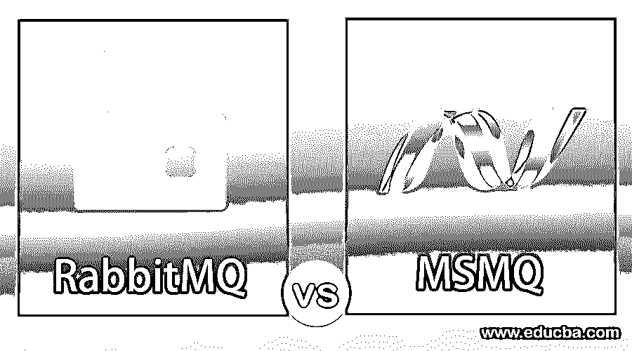
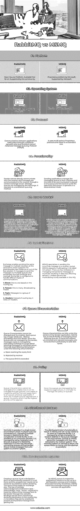

# MSMQ 诉 rabbitmq

> 原文：<https://www.educba.com/msmq-vs-rabbitmq/>

## MSMQ 和兔子的区别

MQ 代表消息队列，它是一个中间件(软件类)，支持应用程序之间的通信。这是一个概念，程序将要传递给另一个应用程序的内容以消息的形式放入一个队列，由队列服务提供者以异步方式传输。

在这个总框架下，有几个不同的版本，根据不同的类别进行分组，

<small>Hadoop、数据科学、统计学&其他</small>

*   传播方法论走向了一，一对多，多对多。
*   消息在发送和接收应用程序之间传送的方式。

消息队列领域的主要参与者有:

*   Rabbit Technologies 的 Rabbit MQ
*   微软 MQ
*   IBM MQ
*   Apache Kafka(开源)
*   亚马逊 MQ
*   谷歌云发布/订阅

### MSMQ 和 RabbitMQ 的面对面比较(信息图)

以下是 MSMQ 和 RabbitMQ 的 10 大区别:

### 主要差异

让我们看看 MSMQ 和 RabbitMQ 的主要区别如下:

*   MSMQ 有自己的队列，这个队列管理消息，直到它被传送到接收方。RabbitMQ 将整个工作委托给一个叫做 Exchange 的外部系统。交换机管理由发送方发布的消息，并将它们传输到接收方。
*   Rabbit MQ 可以通过交换系统向发布/订阅模型中的许多接收者发送消息，而 MSMQ 的多播选择有限。
*   RabbitMQ 还有其他复杂的方法，可以根据主题向一组其他服务器传输消息。
*   MSMQ 有一个内置的选项，跟踪过期的信息(死字)并删除它们。在 RabbitMQ 中，发件人系统需要指示 exchange 删除此类旧邮件。
*   MSMQ 有一个内置的工具来管理分布式代理，而 RabbitMQ 通过外部插件来管理这个功能。
*   从开发人员的角度来看，在 RabbitMQ 中，在软件中创建队列和交换很简单，而在 MSMQ 中，队列是很难配置的，并且它会一直保持到被删除。
*   MSMQ 是微软的专有产品，它只能在 Windows 环境下工作。RabbitMQ 是一个开源产品，可以在任何操作系统上运行。
*   Rabbit MQ 使用一种叫做 AMQP 的标准协议，而 MSMQ 使用多种专有协议。

### MSMQ 与 RabbitMQ 对比表

MSMQ 和 RabbitMQ 的一些比较如下:

| **比较的基础** | **RabbitMQ** | **MSMQ** |
| **平台** | 开源平台。所有人都可以免费获得。得到了社区的支持。 | 微软的专有平台。由微软支持。 |
| **操作系统** | 可在多种操作系统(Linux、Mac、Windows)中运行。 | 它只能在 Windows 操作系统下工作。 |
| **协议** | 应用程序之间的通信通过一种平台无关的有线级协议进行，该协议称为高级消息队列协议(AMQP)。 | 它使用多种多样的专有协议，没有标准的协议。 |
| **功能** | 发件人不能直接与收件人通信，邮件通过中央 exchange 服务器传递给收件人。exchange 管理邮件队列。它以集中排队的方式运行。 | 发送应用程序管理其机器中的消息队列，要传递的数据放在队列中，接收方从该队列中提取数据。它以分散的方式运作。 |
| 它是如何工作的？ | 发送应用程序将消息提交给 exchange，然后忘记它。像邮局一样，交换局将它发送到接收方队列交换局，接收方从那里提取信息。Exchange 不会在其中存储任何邮件。RabbitMQ 在交换模式下蓬勃发展。 | MSMQ 是 windows 中的默认功能，应该在发送方和接收方同时启用。发送机器可以完全控制队列中的消息，并且消息会一直留在队列中，直到接收机器变为活动状态。当接收方需要时，由接收方检索消息。交换在 MSMQ 是一个新概念。 |
| **专业化** | Exchange 允许同时向多个接收者发送相同的消息，并且它支持作为现成解决方案的发布/订阅模型。它设法通过绑定和路由将消息发送到多个队列和交换。Exchange 被配置为处理不同类型的通信。
**1。直接:**基于路由键的一对一。
**2。扇出:**多了一个。广播模式。
**3。主题:**给一群接收者的信息。
**4。头:**它依赖于头，而不是路由关键字。 | MSMQ 专门负责将传入消息发送到接收方队列。MSMQ 在其最新的 3.0 版本中支持多播。在多播中管理事务性消息的限制很少，这会导致影响传递的数据丢失。像多播这样的有限选项只在这个 MQ 中可用。 |
| **队列特征** | 队列特性在创建后不能更改。每个队列有两个主要属性:生存期(持久性)和自动删除。由于发件人不管理队列，因此通过指示 exchange 清除 exchange 服务器中的(死信)邮件来管理邮件过期。在下列情况下，通常会出现死字。
a .达到到期限制
b .被接收方拒绝
c .超过队列限制 | 队列特征完全由发送方应用程序控制。MSMQ 有一个管理死字队列的内置设施。它跟踪过期，未检索和拒绝的邮件，并定期删除它们以节省磁盘空间。 |
| **政策** | 队列特征一旦创建就无法更改，但可以通过策略进行更改。需要首先创建策略，并在适用的情况下将它们应用于所有队列。如果在一个队列中应用了多个策略，将应用优先级最高的策略。 | 因为各自的应用程序管理队列，所以管理队列上的策略更简单。 |
| **分布式经纪人** | 通常，它在单个代理环境中运行，其中有多个主机连接到它。在 RabbitMQ 中管理多个代理有点复杂，而且这个工具不是现成的解决方案。它是通过使用 Federation 和 Shower 作为 RabbitMQ 的插件来管理的。联合是连接队列和交换的单向交换。铲子把信息从一个系统转移到另一个系统。 | 分布式代理的功能是内置在 MSMQ 中的，不会作为一个单独的工具对其用户可见。只需在本地服务器的队列管理器中更改接收者地址，就可以对其进行管理。MSMQ 的队列存储消息，直到它们被传递到接收方系统。如果接收系统或网络出现故障，队列会继续尝试，直到尝试成功。 |
| **发展方面** | 创建队列只是一个声明，如果它不在那里，它会自动创建，程序员在声明之前不需要检查它是否存在。同样的事情也适用于交换。它有一个消息确认机制(ack-acknowledge，nack-Issues-negative)来跟踪通过网络发送给代理的消息的状态。通过在路由关键字中声明目的地，可以缩短绑定。可以启用强制标志来防止重要消息丢失。 | 在 MSMQ，各个应用程序中的队列需要通过配置过程来建立，并且它永久地驻留在那里，直到被删除。MSMQ 通过其本地服务跟踪消息不适用。 |

### 结论

上面的比较揭示了这样一个事实，RabbitMQ 在性能、队列管理和其他复杂特性上比 MSMQ 更胜一筹。

### 推荐文章

这是一个 MSMQ vs 兔子的指南。在这里，我们用信息图和比较表来讨论 MSMQ 和 RabbitMQ 的主要区别。您也可以浏览我们推荐的其他文章，了解更多信息——

1.  [ROLAP vs MOLAP vs HOLAP](https://www.educba.com/rolap-vs-molap-vs-holap/)
2.  [CNN vs RNN——热门对比](https://www.educba.com/cnn-vs-rnn/)
3.  [C 与 c++–最大差异](https://www.educba.com/c-vs-c-plus-plus/)
4.  [Clojure vs Scala](https://www.educba.com/clojure-vs-scala/)
5.  [了解 RabbitMQ 架构的主要组件](https://www.educba.com/rabbitmq-architecture/)
6.  [ZeroMQ 与 RabbitMQ |最大差异](https://www.educba.com/zeromq-vs-rabbitmq/)

