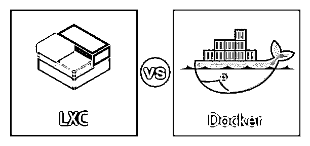
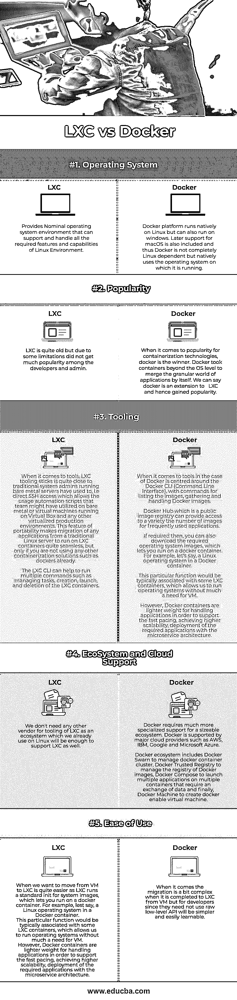

# lxc vs docker

> 原文:# t0]https://www . educba . com/lxc-vs 坞站/

## LXC 和码头工人的区别

Docker 和 LXC 都被开发/测试和生产领域的程序员广泛使用。随着行业的发展不再局限于占用大量资源的虚拟机，容器变得越来越重要。有许多类型的容器可用，这两个突出的是 LXC 和码头。选择采用哪种容器完全取决于用例及应用程序类型。根据其受欢迎程度，Docker 是构建新的 webscale 微服务应用程序和优化测试或运行区域的绝佳平台。就轻量级 LXC 而言，它还提供了对传统的基于虚拟机管理程序的虚拟化方法的零影响替代方案，因此 LXC 更适合数据 I/O 操作密集型应用程序。

### LXC 和 Docker 的正面比较(信息图)

以下是 LXC 和码头工人的七大对比

<small>网页开发、编程语言、软件测试&其他</small>

### LXC 和 Docker 的主要区别

让我们从以下几点来讨论 LXC 和码头工人之间的一些关键区别:

*   尽管 LXC 和 Docker 使用容器来隔离和封装应用程序工作负载，但他们之间的主要区别在于。
*   LXC 是一种为我们提供轻量级 Linux 容器的容器技术，Docker 是基于容器之上的单应用虚拟化。因此，即使基于容器利用率，它们听起来可能相似，但在使用时它们是完全不同的。
*   与轻量级 LXC 容器不同，docker 不倾向于表现轻量级 VM 的行为。docker 的单个应用程序限制是严格设计的。
*   我们可以轻松地登录到我们的 LXC 容器，并将其视为一个操作系统，安装我们所需的应用程序和其他服务，并按预期工作。但是当您考虑 Docker 时，基本操作系统模板被削减为单一应用程序环境，并且没有适当的初始化守护进程、cron、Syslog 等。
*   Docker 为基于容器的技术增加了许多有趣的变化，如分层容器、图像注册等，因此在开发人员中引起了很大反响。
*   说到最近的更新，那么 LXC 可以支持非特权容器，让非根用户部署容器，而 docker 还不支持这一点。
*   所以容器的选择完全取决于用例，由用户决定。Docker 方法可能需要在每个阶段定制方法来完成多项任务，例如安装、运行和缩放容器。

### LXC 与码头工人对比表

下表总结了 LXC 与码头工人 **:** 的对比

| **功能** | **LXC** | **码头工人** |
| **操作系统** | 提供名义上的操作系统环境，可以支持和处理 Linux 环境所需的所有特性和功能。 | Docker 平台可以在 Linux 上运行，但也可以在 windows 上运行。还包括了对 macOS 的后续支持，因此 Docker 并不完全依赖于 Linux，而是直接使用运行它的操作系统。 |
| **人气** | LXC 很老了，但由于一些限制，在开发人员和管理员中没有得到太多的欢迎。 | 谈到集装箱技术的普及，docker 是赢家。Docker 让容器超越了操作系统的层次，自己融合了应用程序的粒度世界。我们可以说 docker 是 LXC 的延伸，因此获得了普及。 |
| **工装** | When it comes to tools, LXC tooling sticks is quite close to traditional system admins running bare metal servers have used to, i.e. direct SSH access, which allows the usage of automation scripts that the team might have utilized on bare metal or virtual machines running on Virtual Box and any other virtualized production environments. This portability feature makes the migration of any applications from a traditional Linux server to run on LXC containers quite seamless, but only if you are not using any other containerization solutions such as dockers already.LXC CLI 可以帮助运行多个命令，如管理任务、创建、启动和删除 LXC 容器。 | 

就 Docker 的工具而言，它以 Docker CLI(命令行界面)为中心，包含用于列出图像、收集和处理 Docker 图像的命令。Docker Hub 是一个公共图像注册表，可以为经常使用的应用程序提供对各种图像的访问。如果需要的话，您还可以下载所需的操作系统映像，它允许您在 docker 容器上运行。比如说，Docker 容器中的 Linux 操作系统。这个特殊的功能通常与一些 LXC 容器相关联，它允许我们运行操作系统，而不太需要虚拟机。然而，Docker 容器在处理应用程序时重量更轻，以支持快速调整，实现更高的可扩展性，并使用微服务架构部署所需的应用程序。

 |
| **生态系统和云支持** | 我们不需要任何其他供应商来提供 LXC 的工具，因为我们已经在 Linux 上使用的生态系统也足以支持 LXC。 | Docker 需要更专业的支持来支持大规模的生态系统。Docker 得到了 AWS、IBM、Google、微软 Azure 等主要云提供商的支持。Docker 生态系统包括 Docker Swarn 来管理 Docker 容器集群；Docker 信任的注册表来管理 Docker 图像的注册表；docker 组合以在需要数据交换的多个容器上启动多个应用程序，最后，Docker 机器创建支持 Docker 的虚拟机。 |
| **易用性** | 从虚拟机迁移到 LXC 要容易得多，因为 LXC 为系统映像运行了一个标准的 init，这让您可以在 docker 容器上运行。比如说，Docker 容器中的 Linux 操作系统。这个特殊的功能通常与一些 LXC 容器相关联，它允许我们运行操作系统，而不太需要虚拟机。然而，Docker 容器在处理应用程序时重量更轻，以支持快速调整，实现更高的可扩展性，并使用微服务架构部署所需的应用程序。 | 当完成从虚拟机到 LXC 的迁移时，这有点复杂，但对于开发人员来说，由于他们不需要使用原始的低级 API，因此会更简单，也更容易学习。 |

### 结论

LXC 为 quiet 提供了 Linux 虚拟环境的一大优势，提供了相互隔离。它也是虚拟机的一种更便宜、更快速的替代方案。Docker 是 docker 功能的重要扩展，因此更受开发人员和组织的青睐。

### 推荐文章

这是一个 LXC 和码头工人之间的主要区别的指南。这里我们讨论信息图和比较表的主要区别。您也可以看看以下文章，了解更多信息–

1.  [立方 vs 码头](https://www.educba.com/kubernetes-vs-docker/)
2.  [流浪汉 vs 码头工人](https://www.educba.com/vagrant-vs-docker/)
3.  [市场 vs 码头](https://www.educba.com/rkt-vs-docker/)
4.  lxc vs lxd

