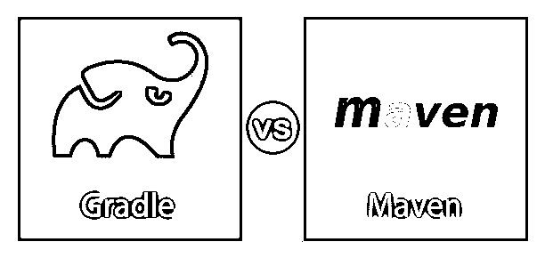
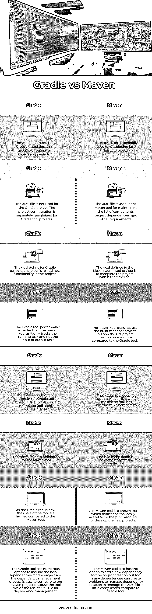

# 度与胃

> 原文：<https://www.educba.com/gradle-vs-maven/>

## Gradle 和 Maven 的区别

Gradle 是 build automation 类型工具的名称，它作为开源软件提供，用于创建不同类型的软件。Gradle tool 的软件性能高，可扩展，支持各种类型的 IDE。Maven 是项目管理工具的名字，它帮助程序员在工具的生命周期中开发任何类型的软件。Maven 工具有助于使项目变得简单，并且可以通过使用这种全面的 Maven 工具来标准化项目。

### Gradle 和 Maven 之间的正面比较(信息图)

以下是 Gradle 和 Maven 的八大对比 **:**

<small>网页开发、编程语言、软件测试&其他</small>

### Gradle 和 Maven 的主要区别

让我们从以下几点来讨论 Gradle 与 Maven 之间的一些关键差异:

*   Gradle 是一个软件开发工具，用于创建新的软件。可以在 Gradle 工具中创建的软件基于 java 编程语言。Gradle 工具作为开源工具免费提供给开发者。
*   Gradle 工具在其配置中使用了 Apache Ant 和 Apache Maven 的概念。这个工具也有助于用 java 语言创建各种类型的软件。Gradle 工具的主要用途是创建需要额外配置的大型软件。
*   Gradle 工具使用的项目配置是 Groovy 和 Java，取代了可扩展标记语言。为形成该工具而创建的软件应用程序可以是任何类型的，如 Android 或基于 web 的应用程序。
*   Gradle 工具支持在集成环境中开发软件和测试软件的各种平台。用于在 Java、C、Scala、C++、Android 和 Groovy 中进行软件开发的编程语言。
*   用于软件开发的 IDE 有 Eclipse、Android Studio、Jenkins。与 Maven 工具相比，Gradle 工具的性能更快，因为 Gradle 工具不跟踪输入任务和输出任务。该工具仅跟踪正在运行的任务，该任务在项目开发过程中已经被改变。
*   Gradle 工具还有一个额外的优势，即该工具使用以前在 Gradle 工具中创建的项目的构建输出。唯一的要求是输入应该保持不变，这有助于减少项目创建时间。
*   Maven 是另一种类型的软件开发工具，也用于创建多种类型的软件，帮助程序员开发软件。它是程序员的项目生命周期框架，该工具对开发人员是开源的。
*   Maven 工具主要用于基于 JAVA 语言的项目。另一种可以用来创建软件的编程语言是 Scala、C#和 Ruby。Maven 工具负责软件开发过程，包括两种类型的方面，软件构建过程和软件的依赖性。对于 Maven 工具，使用 XML 文件，它处理项目构建步骤、所有项目依赖性、项目中使用的模块以及项目的其他组件。所有这些都包含在 Maven 自动化工具的 XML 文件中。
*   与 Gradle 工具相比，Maven 工具中的项目创建时间更少，因为 Maven 工具使用默认布局和标准目录，这有助于减少项目创建时间。用于 Maven 工具的软件开发的依赖模块被适当地管理，使得软件可以容易地并且在简洁的持续时间内被开发。
*   Maven 工具管理标准库，这些标准库可以在项目创建中使用，预先指定的任务可以根据定义的 Maven 标准来创建。
*   Maven 工具支持新插件的安装，也支持项目创建生命周期过程。由于项目是使用 Maven 工具创建的，因此在 Maven 工具中的调试过程比在 Gradle 工具中容易。与 Gradle 工具相比，项目创建可以在很短的时间内完成。

### Gradle 与 Maven 对比表

下表总结了 Gradle 与 Maven 的比较 **:**

| 【T0 度】T1 | **胃** |
| Gradle 工具使用基于 Groovy 的领域特定语言来开发项目。 | Maven 工具通常用于开发基于 java 的项目。 |
| XML 文件不用于 Gradle 项目。Gradle 工具项目的项目配置是单独维护的。 | XML 文件在 Maven 工具中用于维护组件、项目依赖项和其他需求的列表。 |
| 为基于 Gradle 的工具项目定义的目标是在项目中添加新功能。 | 基于 Maven 工具的项目中定义的目标是在时间表内完成项目。 |
| Gradle 工具的性能优于 maven 工具，因为它只跟踪正在运行的任务，而不跟踪输入或输出任务。 | Maven 工具不使用构建缓存来创建项目；因此，它的项目创建时间比 Gradle 工具长。 |
| 就 IDE 支持而言，Gradle 工具中有各种选项。因此，它使工具高度可定制。 | Maven 工具不支持各种 IDE，这使得它与 Gradle 相比具有更少的可定制性。 |
| 对于 Maven 工具来说，编译是强制性的。 | java 编译对于 Gradle 工具不是强制性的。 |
| 由于 Gradle 工具是新的，与 Maven 工具相比，该工具的用户是有限的。 | Maven 工具是一种已知的工具，它使得程序员可以很容易地使用该工具来开发新项目。 |
| Gradle 工具有许多选项来包含项目的新依赖项。依赖性管理过程很容易与 maven 项目进行比较，因为它避免了使用 XML 文件进行依赖性管理。 | Maven 工具还可以为项目创建添加新的依赖项，但是过多的依赖项会给管理依赖项带来问题，因为与 Gradle 工具相比，管理 XML 文件有点复杂。 |

### 结论

Gradle 和 Maven 都是用于以支持多种 IDE 环境的各种编程语言创建新项目的自动化工具。这两种工具各有优缺点，选择哪种工具完全取决于项目需求。

### 推荐文章

这是一个关于 Gradle 和 Maven 之间主要区别的指南。这里我们讨论信息图和比较表的主要区别。您也可以看看以下文章，了解更多信息–

1.  [Maven 命令](https://www.educba.com/maven-commands/)
2.  [Maven vs Ant](https://www.educba.com/maven-vs-ant/)
3.  [什么是 Maven 插件？](https://www.educba.com/what-is-maven-plugins/)
4.  [詹金斯 vs 梅文](https://www.educba.com/jenkins-vs-maven/)

