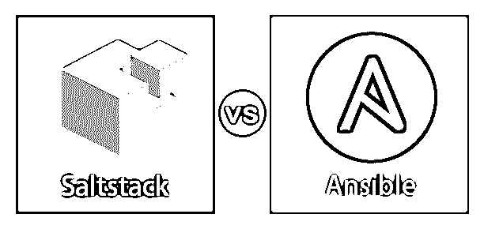
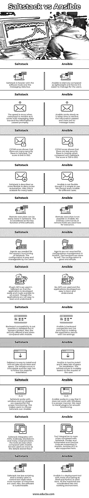

# Saltstack vs Ansible

> 原文：<https://www.educba.com/saltstack-vs-ansible/>

## Saltstack 和 Ansible 之间的区别

下面的文章给出了 Saltstack vs Ansible 的描述。由事件驱动的信息技术自动化开源软件叫做 Saltstack。该软件是基于 Python 的。它进行远程任务执行和配置管理。Thomas S Hatch 在 2011 年 3 月开发了 Saltstack。它适用于大多数操作系统，包括 OS X、微软视窗和 UNIX。

用于软件供应和应用程序部署的开源工具叫做 Ansible。它是用 Python、PowerShell 和 Ruby 编写的。Ansible 可以在 Linux、UNIX、MacOS 和 Windows 上运行。它管理系统配置的声明性语言。Michael DeHaan 于 2012 年 2 月开发了 Ansible。它使用远程电源外壳来完成任务。

<small>网页开发、编程语言、软件测试&其他</small>

### Saltstack 和 Ansible 的面对面比较(信息图)

以下是 Saltstack 与 Ansible 之间的 12 大区别:

### Saltstack 和 Ansible 的主要区别

让我们讨论一下 Saltstack 和 Ansible 之间的一些主要区别:

*   Saltstack 具有多个主机的配置。如果一个主设备未能按照预期工作，其他主设备将通过列表的代理进行连接。这有助于 Saltstack 不间断地工作。Ansible 有一个称为主实例的活动节点。如果主实例停止工作，将有一个辅助实例来执行该任务。
*   与 Saltstack 相比，Ansible 有很好的文档，所以用户发现在 Ansible 中工作很容易。它被认为是世界范围内易于使用的配置管理工具。另外，Ansible 很容易理解。Saltstack 还为用户提供了文档，并为新用户提供了一个很好的学习曲线，让他们发现使用这些工具很简单。
*   Github 中支持 Saltstack，红帽中支持 ansi ble[。Saltstack 的项目在 Github](https://www.educba.com/what-is-redhat/) 中更多的是参考和[流行的一个。这也是社区中最大和最活跃的项目之一。Ansible 的代码库是开源的，是 Ansible 社区中最受用户欢迎的代码库之一。](https://www.educba.com/install-github/)
*   每当有新的更新时，Ansible 和 Saltstack 都会发布新的版本。Saltstack 版本基于版本号的日期。当前版本为 2016.11.2，企业版为 5。而 Ansible 的当前版本是 2.2.1，塔式版本是 3。
*   Saltstack 为使用开源软件的用户提供 Python 客户端 API。对于企业用户，提供 REST API。此外，REST API 以有限的版本提供给开源用户。使用 Ansible 时，开源用户可以访问 Python API。为塔式用户提供了一个被很好地记录和使用的 REST API。这种差异是由于使用不同的工具和提供的服务。
*   Saltstack 与云提供商集成得很好，而 Ansible 与虚拟化工具集成得很好。Saltstack 与 AWS、微软 Azure 和数字海洋合作。Ansible 可与 VMware、vagger 和 Github 等其他 DevOps 工具配合使用。这种集成有助于工具很好地配置和管理工具。自动化也很容易做到。

### Saltstack 与 Ansible 比较表

让我们讨论一下 Saltstack 和 Ansible 之间的主要比较:

| **盐堆** | **可回答的** |
| Saltstack 的软件工具和消息数据总线更重。 | Ansible 相对来说是轻量级的，因此对用户来说更容易管理。 |
| 与 Ansible 相比，它的速度更快，因为它使用消息数据总线，信息传递迅速。 | Ansible 运行缓慢，因为它需要时间来检索传递的信息，并且没有消息总线。 |
| CSTAR 评分显示 Saltstack 存在很多安全漏洞。分数是 950 分 646。 | CSTAR 评分表明，与 Saltstack 相比，Ansible 的安全缺陷较少。分数是 950 分 759。 |
| Saltstack 被描述为在数据中心自动化方面更加灵活。此外，这对于许多任务都是可扩展的。 | Ansible 虽然使用简单，但并不灵活。我们无法根据不同的任务来调整规模。 |
| 远程执行可以在 Saltstack 中轻松完成。这被认为是该软件的关键功能。 | Ansible 中不能远程执行。这里没有使用任意命令或远程主机来执行。 |
| 盐堆的平稳运行需要药剂。用户可以轻松管理配置。 | Ansible 中的配置管理不需要代理。Self 执行这些功能。配置不错，简单。 |
| Saltstack 中使用了插件 API，因此该应用程序易于开发，并具有一定的可扩展性。然而，应用程序不容易学习和理解。 | 不使用 API，开发的应用程序易于学习和理解。 |
| 在 Saltstack 中向后兼容是不可能的，但是它显得臃肿。此外，与 Ansible 相比，它提供的安全性较低。 | Ansible 是向后兼容的，这些工具有助于使应用程序的设置更加安全。 |
| Saltstack 易于安装，不会占用太多时间和空间。基础设施是不可变的，用户必须遵循安装步骤。 | Ansible 很难安装，而且需要很大的安装空间。基于用户的请求，基础设施是可变的。 |
| Saltstack 适用于 windows，正常运行不需要插件。这使得用户选择 Saltstack 而不是 Ansible。 | Ansible 的工作方式与 Windows 不兼容。我们需要安装插件才能顺利运行。 |
| Saltstack 集成了 AWS、Scaleway、Stackstorm 和许多云提供商。与 Ansible 相比，这些工具更少。使用的服务器更多的是作为细节存储在那里。 | 与 Saltstack 相比，工具集成更多。Ansible 支持 Docker 和 Kubernetes 以及 DevOps 工具。这里也支持 Amazon EC2。 |
| Saltstack 的脚本较少，主要用于在使用更多机器时控制负载。此外，软件是可定制的。 | Ansible 是一个部署工具，因为这里使用了 Shell 和 Python，所以它包含了更多的脚本。所有的机器都协调在一个工作环境中。 |

### 结论

虽然 Ansible 和 Saltstack 是开源的，但是从企业的角度来看，它们提供的服务没有足够的竞争力。因此，就有了盐栈企业，以及提供了成本的 Ansible Tower，以便它们按照企业的期望工作。两者都用于配置管理和 IT 自动化。

### 推荐文章

这是一个关于 Saltstack vs Ansible 的指南。这里我们讨论信息图和比较表的主要区别。您也可以看看以下文章，了解更多信息–

1.  [Terraform vs Ansible](https://www.educba.com/terraform-vs-ansible/)
2.  [Ansible vs 木偶 vs 厨师](https://www.educba.com/ansible-vs-puppet-vs-chef/)
3.  【T0 度与腹部】T1
4.  [天使 vs 木偶](https://www.educba.com/ansible-vs-puppet/)

