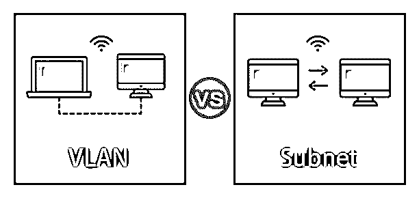
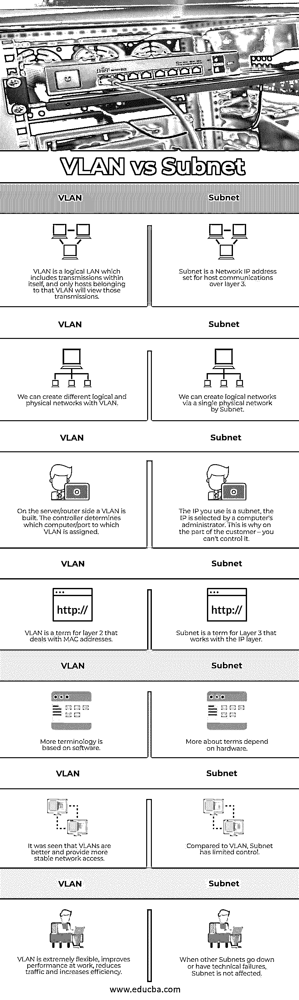

# VLAN vs 子网

> 原文：<https://www.educba.com/vlan-vs-subnet/>

## VLAN 与子网的区别

VLAN 和子网都是为了对网络进行分段或分区而设计的。它们有相似之处，例如广播域的限制或特定子网的隔离。VLAN 是第二层，通常是广播域。子网是三层术语中的一层。第 2 层是使用 Windows pc 地址的地方。第 3 层是具有可用 IP 地址的 IP 层。

什么是 VLAN？–VLAN 是一个或多个独立于物理位置的局域网上的计算机集合，也称为虚拟局域网。换句话说，设备可以打包在一起，即使没有连接到同一个光纤交换机。然而，网络硬件/软件通常需要支持 VLAN 功能，例如，VLAN 交换机是建立 VLAN 网络所必需的。在 VLAN，可以通过软件广泛定制网络。通常，第 2 层 VLANs 用于区分广播域。

<small>网页开发、编程语言、软件测试&其他</small>

**什么是子网？–**子网是由一小组 IP 地址组成的网络。这属于一个更大的网络。在同一个子网内，任何 IP 地址都可以在没有路由工具的情况下进行通信。为了透明起见，我们应该假设子网是一个公司组织，在这个组织中，同一个部门的人可以在不离开办公室的情况下自由交谈。如果您想访问子网外的地址，您必须通过具有路由器功能的路由或现代千兆位以太网交换机。由于子网是与 IP 地址相关的，所以它通常与第 3 层一起工作。

### VLAN 与子网之间的直接比较(信息图)

以下是 VLAN 与子网 **:** 的 7 大比较

### VLAN 与子网的主要区别

让我们从以下几点来讨论 VLAN 与子网之间的一些关键区别:

*   划分子网和实施 VLANs 为管理者提供了创建大中型网络的能力。本质上，VLANs 和子网的目标是相似的。但它有明显的功能、操作和/或更深层次的目标差异。
*   当支持 VLAN 功能的网络硬件/软件通过两个或更多端口进行物理连接或组合在一起时，就存在 VLAN。一般来说，VLAN 与真实的局域网非常相似。它们的主要区别是 VLAN 的能力，不需要同一个网络交换机将终端站组合在一起。在 VLAN，网络配置可以通过软件广泛地完成。
*   通过 VLAN 是一个独立的实体，只有一个 VLAN 可以通过路由器到达。您可以通过 VLANs 使用单个网络，但是如果某个网络由于某种原因出现故障，整个逻辑网络都会受到影响。原则上，子网是一个 IP 地址组。属于同一子网的任何地址都可以在没有路由设备的情况下到达。
*   在 IT 专家部门的社区中，VLANs 对于提高工作性能、减少流量和生产率非常有用。现在，如果您的地址在您的子网之外，您将不得不像在您的 VLANs 中一样通过路由器。第 3 层(IP)是包含 IP 地址的子网。
*   划分子网时，您需要将 IP 地址划分成更小的子网。这使得许多网络被添加到系统中，这对于任何组织或机构都是必要的。

### VLAN 与子网对照表

下表总结了 VLAN 与子网 **:** 之间的比较

| **VLAN** | **子网** |
| VLAN 是一种逻辑 LAN，其内部包含传输，只有属于该 VLAN 的主机才能看到这些传输。 | 子网是为第 3 层上的主机通信设置的网络 IP 地址。 |
| 我们可以用 VLAN 创建不同的逻辑和物理网络。 | 我们可以通过单个物理网络按子网创建逻辑网络。 |
| 在服务器/路由器端，构建了一个 VLAN。控制器确定 VLAN 被分配到哪个计算机/端口。 | 您使用的 IP 是一个子网；电脑管理员选择 IP 地址。这就是为什么对客户来说，你无法控制它。 |
| VLAN 是处理 MAC 地址的第 2 层术语。 | 子网是与 IP 层一起工作的第 3 层的术语。 |
| 更多的术语是基于软件的。 | 更多关于术语取决于硬件。 |
| 可以看出，VLANs 更好，提供更稳定的网络访问。 | 与 VLAN 相比，子网控制有限。 |
| VLAN 非常灵活，可以提高工作效率，减少交通流量，提高效率。 | 当其他子网出现故障或出现技术故障时，子网不会受到影响。 |

### 结论

在本文中，我们已经看到了 VLAN 和子网之间的主要区别。VLAN 比子网划分更受欢迎，但它们通常是相辅相成的。有些人认为划分子网更容易，但 VLAN 提供了网络容量。我希望这篇文章对你有所帮助。

### 推荐文章

这是 VLAN 与子网之间主要差异的指南。在这里，我们通过信息图和比较表来讨论 VLAN 与子网的主要区别。您也可以看看以下文章，了解更多信息–

1.  [什么是 VLAN 网络？](https://www.educba.com/what-is-vlan-network/)
2.  [VLAN 的种类](https://www.educba.com/types-of-vlan/)
3.  [VLAN 标记 vs 未标记](https://www.educba.com/vlan-tagged-vs-untagged/)
4.  什么是地道的 VLAN 人？

