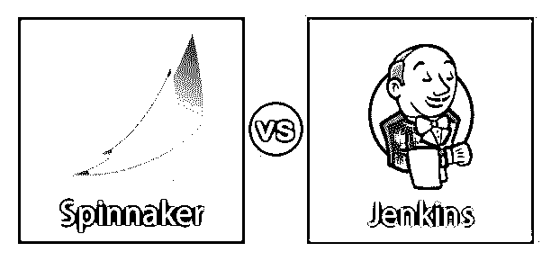
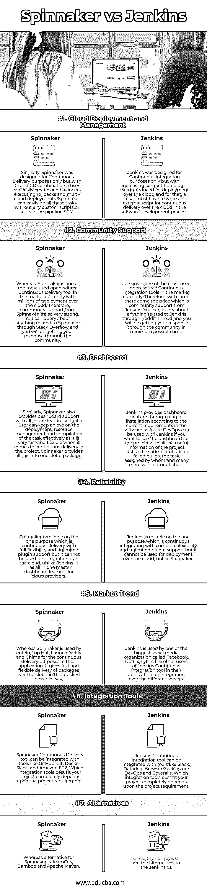

# 三角帆 vs 詹金斯

> 原文：<https://www.educba.com/spinnaker-vs-jenkins/>

## 三角帆和詹金斯的区别

Jenkins 是一个可扩展的持续集成开源服务器。它有 300 多个插件支持软件项目的测试和构建。同样，Spinnaker 也是一个开源的持续交付服务器，用于以非常高的速度发布软件变更。Spinnaker 由网飞开发，是目前生产中使用最广泛的连续交付服务器，被数千个团队用于部署目的。Spinnaker 可以归类为持续部署目的，而 [Jenkins 可以](https://www.educba.com/what-is-jenkins/)归类为持续集成目的。然而，Spinnaker vs Jenkins 是一个开源工具，可以提高软件开发过程的效率。

### Spinnaker 和 Jenkins 之间的正面比较(信息图)

以下是 Spinnaker 与 Jenkins 之间的 7 大对比:

<small>网页开发、编程语言、软件测试&其他</small>

### Spinnaker 和 Jenkins 之间的主要区别

Spinnaker 与 Jenkins 的主要区别如下:

*   第一个也是最重要的区别是，用户认为 Spinnaker 是一个构建工具，但事实是它不是一个构建工具；事实上，它可以与像 Jenkins 这样的构建工具集成。
*   为了在您的项目中部署 AWS [Amazon Web Services](https://www.educba.com/what-is-aws/) ，在 Jenkins jobs 中使用了 Spinnaker API。
*   对于发布软件，Jenkins 用于开发过程中的持续集成，这有助于通过一个主服务器轻松地在线维护一切。
*   对于发布软件，Spinnaker 用于开发过程中的连续交付，这有助于在线维护一切，例如启动作业和监控过程中的进度。
*   Spinnaker 被引入市场，将持续集成(CI)和持续交付(CD)结合在一起。
*   Spinnaker 是为云部署而设计的，而 Jenkins 不是。因此，为了在 Jenkins 中实现云部署，您必须在管道脚本中手动编写外部脚本。
*   Spinnaker 是一个开源的持续交付平台，适用于基于云的企业的小规模和大规模部署，而 Jenkins 通常适用于较小的部门。
*   如果您正在与 Jenkins 一起工作，并且希望使您的部署阶段更快、更灵活，那么 spinnaker 可以用于此目的。
*   您可以在 Spinnaker 中拥有一个完整的仪表板，其功能包括资源管理和多个云环境，而 Jenkins 没有这样的仪表板，但在插件的帮助下，可以实现这一功能。
*   Spinnaker 中的管道特性是以云为中心的，用于持续交付，而 Jenkins 管道特性是以服务器为中心的，用于持续集成。
*   当任务涉及运行多个测试用例、为类构建包以及最重要的 SCM(源代码控制管理)时，Jenkins 比 Spinnaker 表现得更好。

### Spinnaker vs Jenkins 比较表

以下是 Spinnaker 与 Jenkins 之间的主要区别:

| **比较的基础** | **三角帆** | 詹金斯 |
| **云部署和管理** | Similarly, Spinnaker was designed for Continuous Delivery purposes only, but with Ci and CD combination, a user can easily create load balancers, executing rollbacks and multi-cloud deployments.

Spinnaker 可以轻松地完成所有这些任务，而不需要管道 SCM 中的任何自定义脚本或代码。

 | Jenkins 只是为了持续集成的目的而设计的，但是随着竞争的加剧，插件被引入到云部署中，为此，用户必须在软件开发过程中编写一个外部脚本来持续交付云。 |
| **社区支持** | 然而，Spinnaker 是目前市场上使用最多的开源持续交付工具之一，在云上有数百万的部署。因此，来自 Spinnaker 的社区支持也非常强大。您可以通过 Stack Overflow 查询与 Spinnaker 相关的任何内容，并且您将通过社区获得您的响应。 | Jenkins 是目前市场上使用最多的开源持续集成工具之一。因此，有了名气，就有了代价，那就是来自詹金斯的社区支持。您可以通过 Reddit Thread 查询任何与 Jenkins 相关的信息，您将在最短的时间内通过社区获得回复。 |
| **仪表板** | 类似地，Spinnaker 还提供了具有 all in one 特性的仪表板支持，以便用户可以有效地关注任务的部署、资源管理和编译，因为它在项目的连续交付方面非常快速和灵活。Spinnaker 将所有这些都提供到一个云包中。 | Jenkins 根据软件中的当前要求，通过插件安装提供仪表板功能，因为如果您希望查看项目的仪表板，其中包含项目的所有有用信息，如构建数量、失败的构建、由谁分配的任务以及燃尽图等，Azure DevOps 可以与 Jenkins 一起使用。 |
| **可靠性** | Spinnaker 在一个目的上是可靠的，这是具有完全灵活性和无限插件支持的连续交付，但它不能用于云上的集成，不像 Jenkins。它拥有面向云提供商的一体化主控制面板功能。 | Jenkins 在一个目的上是可靠的，这是具有完全灵活性和无限插件支持的持续集成，但它不能用于云部署，不像 Spinnaker。 |
| **市场趋势** | 而 entelo、Top Hat、LaunchDarkly 和 Chime 在其应用中使用 Spinnaker 进行连续交付。它以最快的方式通过云提供快速灵活的包交付。 | Jenkins 被最大的社交媒体组织之一脸书使用。网飞，Lyft 是詹金斯持续集成工具的其他用户，他们的应用程序集成在不同的服务器上。 |
| **集成工具** | Spinnaker 连续交付工具可以与 GitHub、Git、Docker、Slack 和 Amazon EC2 等工具集成。哪种集成工具最适合您的项目完全取决于项目需求。 | Jenkins 持续集成工具可以与 Slack、Datadog、BrowserStack、Azure DevOps 和工作服等工具集成。哪种集成工具最适合您的项目完全取决于项目需求。 |
| **替代品** | 而 Spinnaker 的替代产品是 TeamCity、Bamboo 和 Apache Maven。 | Circle CI 和 Travis CI 是 Jenkins CI 的替代产品。 |

### 结论

对于所有功能都可以在一个仪表板上看到的大型和小型企业基于云的项目，Spinnaker 的开源是具有持续交付功能的最佳工具。类似地，对于软件开发中基于小型和服务器的持续集成目的，Jenkins 可以用在项目中。

### 推荐文章

这是一个大三角帆 vs 詹金斯指南。在这里，我们讨论 Spinnaker 与 Jenkins 的区别，以及主要区别、信息图表和比较表。您也可以浏览我们的其他相关文章，了解更多信息——

1.  [Gitlab CI vs Jenkins](https://www.educba.com/gitlab-ci-vs-jenkins/)
2.  [詹金斯 vs 哈德森](https://www.educba.com/jenkins-vs-hudson/)
3.  [詹金斯 vs TeamCity](https://www.educba.com/jenkins-vs-teamcity/)
4.  [特拉维斯 vs 詹金斯](https://www.educba.com/travis-vs-jenkins/)

