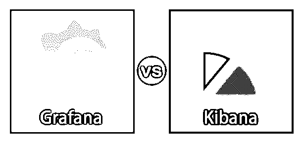
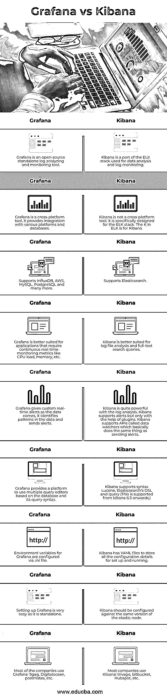

# 格拉夫纳 vs 基巴纳

> 原文：<https://www.educba.com/grafana-vs-kibana/>

## 格拉法纳和基巴纳的区别

Kibana 是一个开源的可视化和探索工具，用于应用程序监控、日志分析、时序分析应用程序。它还提供了内置特性，如统计图(直方图、饼图、折线图等)。它是麋鹿栈的一部分；因此，它还提供了与 Elasticsearch 搜索引擎的内置集成。Grafana 是一个多平台开源可视化工具，用于分析日志和机器生成的数据、应用程序监控、安全和 web 应用程序。它可以在其内置的仪表板、图表等中显示数据。

### Grafana 和 Kibana 之间的直接比较

以下是提到的主要比较:

<small>网页开发、编程语言、软件测试&其他</small>

### Grafana 和 Kibana 的主要区别

以下是 Grafana 与 Kibana 的主要区别:

*   Kibana 提供了一个灵活的可视化平台；它还提供运行数据的实时更新/汇总。Grafana 是为跨平台打造的；它主要与 Graphite、InfluxDB 和 Elasticsearch 集成在一起。
*   Grafana 主要用于可视化和分析系统延迟、CPU 负载、RAM 利用率等指标。，它不支持全文查询。另一方面，Kibana 支持文本查询和监控。
*   Grafana 主要被设计为一个用户界面工具，用于更好地与用户交互；它接受来自不同来源的多个插件数据。Kibana 是专门为 ELK 堆栈设计的。
*   Kibana 在获取数据方面相当死板，但是有插件可以集成 ELK，kibana 使用的就是这个插件。
*   Kibana 是使用 Lucene 库开发的；对于查询，kibana 遵循 Lucene 语法。另一方面，Grafana 使用一个查询编辑器，它基于与之相关联的编辑器遵循不同的语法，因为它可以跨平台使用。例如，对 Prometheus 的查询将不同于对 influx DB 的查询。
*   Grafana 支持对最终用户的内置警告；该功能从 4.0 版开始实施。如果在监控过程中发现任何异常数据，它可以向用户的电子邮件发送警报。Kibana 本身还不支持提醒，但在插件的帮助下，它可以成为可能。
*   存储数据时，Kibana 与 ELK 堆栈集成在一起；默认情况下，它是有索引的，因此检索速度非常快。Grafana 没有像 kibana 那样的索引机制，速度较慢。
*   开发 Kibana 是为了补充 ELK 堆栈；它支持 Elasticsearch 和 Logstash。Grafana 与许多数据库和搜索引擎兼容；它也可以与弹性搜索集成。
*   Kibana 能够执行全文搜索。它对现有的原始数据进行分析，并使用内置的图表显示结果。另一方面，Grafana 不支持全文搜索。它更关注实时数据。它分析时间序列数据，并根据观察结果识别模式。它在其交互式仪表板上显示模式。用户也可以设置提醒；随着数据的不断到来，可以实时发送这些警报。

Grafana 和 Kibana 都支持以下可视化特性:

1.  图表
2.  柱状图
3.  桌子
4.  热图

但是除了上述特性，kibana 还支持额外的特性，如地理空间数据和标签云。

### Grafana 与 Kibana 对比表

Grafana 和 Kibana 都是用于数据可视化的工具；我们来看几个对比。

| **格拉法纳** | **Kibana** |
| Grafana 是一个开源的独立日志分析和监控工具。 | Kibana 是 ELK 堆栈的一部分，用于数据分析和日志监控。 |
| Grafana 是一个跨平台的工具。它提供了与各种平台和数据库的集成。 | Kibana 不是一个跨平台的工具；它是专门为 ELK 堆栈设计的。麋鹿中的 K 代表基巴纳。 |
| 支持 InfluxDB、AWS、MySQL、PostgreSQL 等等。 | 支持弹性搜索。 |
| Grafana 更适合需要持续实时监控 CPU 负载、内存等指标的应用程序。 | Kibana 更适合于日志文件分析和全文搜索查询。 |
| Grafana 在数据到来时给出定制的实时警报；它识别数据中的模式并发送警报。 | Kibana 在日志分析方面非常强大。Kibana 支持提醒，但只能在插件的帮助下。Kibana 支持名为 data watchers 的 API，它基本上与发送警报做同样的事情。 |
| Grafana 提供了一个基于数据库及其查询语法使用多个查询编辑器的平台。 | Kibana 支持 syntax Lucene，Elasticsearch 的 DSL 和 query(这是从 kibana 6.3 开始支持的。) |
| Grafana 的环境变量通过配置。ini 文件。 | Kibana 有 YAML 文件来存储设置和运行的所有配置细节。 |
| 设置 Grafana 非常容易，因为它是独立的。 | Kibana 应该针对相同版本的弹性节点进行配置。 |
| 大多数公司使用 Grafana: 9gag、Digitalocean、postmates 等。 | 大部分公司用的是 Kibana: trivago，bitbucket，Hubspot 等。 |

### 结论

总的来说，正如我们前面看到的，这两种工具各有利弊。选择工具完全基于系统及其需求。对于需要持续后端支持、实时分析和警报的应用程序，Grafana 是更好的选择，而使用 ELK 堆栈并需要强大分析的组织可以选择 Kibana。

### 推荐文章

这是一个关于 Grafana 和 Kibana 之间最大区别的指南。在这里，我们还讨论了这两种工具的功能，并给出了主要区别和比较表。您也可以看看以下文章，了解更多信息–

1.  [格雷洛与基巴纳](https://www.educba.com/graylog-vs-kibana/)
2.  [Kibana vs Splunk](https://www.educba.com/kibana-vs-splunk/)
3.  [什么是基巴纳？](https://www.educba.com/what-is-kibana/)
4.  [灰鲸 vs 麋鹿](https://www.educba.com/graylog-vs-elk/)

