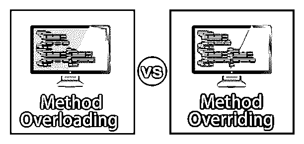
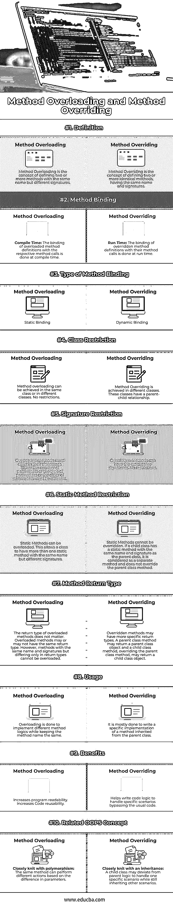

# 方法重载和方法重写

> 原文：<https://www.educba.com/difference-between-method-overloading-and-method-overriding/>




## 方法重载和方法重写之间的区别

面向对象的编程方法，通常缩写为 OOPS，是所有现代编程语言的基础。这些语言遵循并实现了面向对象编程的概念，只有很少的例外。其中两个概念非常关键——方法重载和方法覆盖。

什么是方法重载？

<small>网页开发、编程语言、软件测试&其他</small>

方法重载的概念是定义两个或多个同名但签名不同的方法。根据传递的参数数量调用这两种方法中的任何一种。

什么是方法重写？

方法重写的概念是定义两个或更多相同的方法，具有相同的名称和签名。这两种方法都是基于调用对象调用的。

### 方法重载和方法覆盖之间的直接比较(信息图)

下面是方法重载和方法重写之间的 10 大区别:




### 方法重载和方法重写之间的主要区别

下面是方法重载和方法重写之间的主要区别。

*   这里最基本的区别是重载是在同一个类中实现的，而重写至少需要一个父类和一个子类。
*   要记住的另一个关键概念是，[重载方法在编译时被绑定到](https://www.educba.com/method-overloading-in-java/)方法调用。这意味着编译器知道在代码运行之前要调用哪个方法。
    [被覆盖的方法在运行时被绑定](https://www.educba.com/method-overriding-in-java/)。调用对象确定必须调用父类方法还是子类方法。如果处理不当，这可能会导致更多的运行时异常。
*   静态方法可以重载，但不能重写。这是因为该类的对象不调用静态方法。方法重写由调用方法的对象决定。因此，静态方法不能被重写。

### 方法重载和方法重写比较表

下面是一个比较表，显示了方法重载和方法重写之间的相似之处:

| ****方法重载和方法重写的比较依据**** | ****方法重载**** | ****法覆写**** |
| ****定义**** | 方法重载的概念是定义两个或多个同名但签名不同的方法。 | 方法重写的概念是定义两个或更多相同的方法，具有相同的名称和签名。 |
| ****方法绑定**** | **编译时:**重载方法定义与相应方法调用的绑定是在编译时完成的。 | **运行时:**被覆盖的方法定义与其方法调用的绑定是在运行时完成的。 |
| ****方法绑定类型**** | 静态联编 | 动态绑定 |
| ****阶级限制**** | 方法重载可以在同一个类中实现，也可以在不同的类中实现。没有限制。 | 方法重写是在不同的类中实现的。这些类具有父子关系。 |
| ****签名限制**** | 重载方法的签名必须不同。参数的数量、类型或顺序必须不同。 | 被重写的方法可以有完全相同的签名，没有任何限制。 |
| ****静态法制约**** | 静态方法可以重载。这允许一个类拥有多个同名但不同签名的静态方法。 | 静态方法不能被重写。如果一个子类有一个与父类同名且签名相同的静态方法，它将被视为一个单独的方法，不会重写父类方法。 |
| ****方法返回类型**** | 重载方法的返回类型无关紧要。重载方法可能有也可能没有相同的返回类型。但是，不能重载名称和签名相同但返回类型不同的方法。 | 被重写的方法可能有更具体的返回类型。父类方法可以返回父类对象，覆盖父类方法的子类方法可以返回子类对象。 |
| ****用法**** | 重载是为了实现不同的方法逻辑，同时保持方法名不变。 | 这主要是为了编写从父类继承的方法的特定实现。 |
| ****好处**** | 增加程序可读性。增加代码的可重用性。 | 通过传递通常的代码，帮助编写代码逻辑来处理特定的场景。 |
| ****相关哎呀概念**** | **与多态性紧密结合:**同样的方法，基于参数的不同，可以执行不同的动作。 | **与继承紧密结合:**子类可以偏离父逻辑来处理一个特定的场景，同时仍然继承其他场景。 |

### Java 中方法重载和方法覆盖的例子

下面是 Java 中方法重载和方法覆盖的例子。

#### 示例#1

**代码:**

```
class Hello
{
public void SayHello()
{
System.out.println("Hello World!");
}
//overloading method
public void SayHello(String name)
{
System.out.println("Hello "+name+"!");
}
}
class Main
{
public static void main(String args[])
{
Hello obj = new Hello();
obj.SayHello();
obj.SayHello("Charlie");
}
}
```

**输出:**


#### 实施例 2

**代码:**

```
class Hello{
public String name = "Abc";
public void SayHello(){
System.out.println("Hello World!");
}
}
class HelloMale extends Hello{
public void SayHello(){
System.out.println("Hello Mr. "+name+"!");
}
}
class HelloFemale extends Hello{
public void SayHello(){
System.out.println("Hello Ms. "+name+"!");
}
}
class Main {
public static void main(String args[]){
new Hello().SayHello();
new HelloMale().SayHello();
new HelloFemale().SayHello();
}
}
```

**输出:**


#### 业务用例示例

假设您需要为一家接受所有类型的卡、网上银行、支付钱包等的企业实现一个支付应用程序。现在，您有两种方法来实现这一点:

*   为每种支付类型定义不同的名称，即 Payment_Card()、Payment_Netbanking()、Payment_Wallets()等等。
*   用不同的签名重载一个方法名——Payment(card _ number，cvv)，Payment(netbanking_id，auth_token)，Payment(wallet_number)等等。

第二道不是更干净吗？这就是支付方式在现实场景中过载的方式。

让我们更进一步理解重写。现在有各种卡服务提供商，如 VISA，MasterCard，AmericanExpress，Rupay 等。假设他们都使用一个公共的支付网关，除了 Rupay，它有自己的支付网关。现在，您将编写一个父类，它包含通过公共支付网关接受支付的方法定义。 **Rupay** 的子类将继承所有的父类特性，并且只覆盖一个特性——支付网关方法。毕竟，子类只在支付网关方法上有所不同。所有其他功能，如卡号、安全令牌等。，都一样。

### 结论

因此，我们已经了解了两个最基本的面向对象编程概念——重载和重写——之间的基本区别。我们已经编写了一个基本的例子，并且理解了一个现实生活中的业务场景，其中可以实现重载和重写。这两个概念在理论上很容易理解，但在实际情况下需要实践。因此，强烈建议在程序中尽可能多地使用重载和重写。这将极大地帮助你掌握它的窍门。

### 推荐文章

这是方法重载和方法重写之间区别的指南。在这里，我们用信息图和例子来讨论重载和重写之间的主要区别。您也可以看看以下文章，了解更多信息–

1.  [Python 中的方法覆盖](https://www.educba.com/method-overriding-in-python/)
2.  [PHP 中的方法重载](https://www.educba.com/method-overloading-in-php/)
3.  [Python 中的方法重载](https://www.educba.com/method-overloading-in-python/)
4.  [Java 中的函数重载](https://www.educba.com/function-overloading-in-java/)


