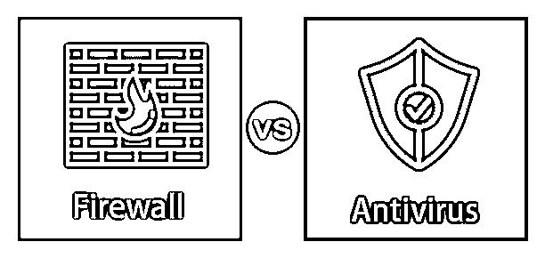
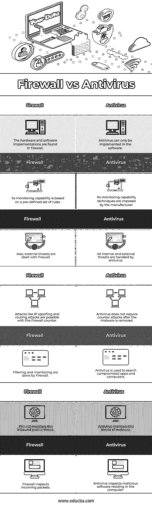

# 防火墙与防病毒软件

> 原文：<https://www.educba.com/firewall-vs-antivirus/>

## 防火墙和防病毒软件的区别

防火墙和防病毒软件都是我们设备的保护框架。在这两种情况下，弱点是不同的。防火墙和防病毒软件是主要区别，因为防火墙是网络传入流量的屏障。无论是防火墙还是杀毒功能的各种方式，比如防火墙，都强调从互联网到电脑的数据检查。相反，反病毒程序强调恶意检查步骤，如识别、检测和删除程序。

### 什么是防火墙？

防火墙是保护本地计算机资产免受外部威胁的标准方法。防火墙旨在过滤从网络进入您计算机的 IP。它还可以有效地保护您的本地系统和网络，并允许您同时访问互联网或广域网。首先，它保证了任何流量从外部到内部的传输，反之亦然。这使用了一个信任系统和一个安全的操作系统，使其能够抵抗渗透。基本上，有 3 种类型的防火墙:电路网关、应用网关和包过滤。

<small>网页开发、编程语言、软件测试&其他</small>

*   **Circuit Gateway:** 它类似于一个应用程序门户，但具有一些额外的功能，如在远程主机和自身之间创建一个新的连接。分组中的 IP 源地址也可以根据终端用户的 IP 而改变。这就是隐藏源 IP 地址的方式。
*   **包过滤:**包过滤也叫过滤和流过滤。包过滤在应用了某些规则(转发或丢弃)后传递数据包，并根据结果做出决定。
*   **应用网关:**代理服务器也被识别。因为它充当应用程序的代理或替代，选择流量的流向，并从外部覆盖源 IP。

### 什么是防病毒？

防病毒软件是一种软件应用程序，它可以保护互联网免受恶意程序的攻击。然而，将它们从连接到互联网的环境中移除是极其困难的或者几乎是不可能的。防病毒软件遵循检测、识别和清除策略。

*   **删除:**最终，防病毒软件会采取措施从受感染文件中删除并恢复原始备份文件/程序。
*   **检测:**该应用程序检测恶意软件攻击，并定位损坏的文件或应用程序。
*   **识别:**它识别出病毒后识别出病毒的类型
    由于病毒和杀毒技术的提高，从杀毒进化了几代。从历史上看，在发现容易检测和删除代码片段的病毒之前，情况并非如此。

### 防火墙和防病毒软件的直接比较(信息图表)

以下是防火墙与防病毒软件的 7 大对比 **:**

### 防火墙和防病毒软件的主要区别

让我们从以下几点来讨论防火墙与防病毒软件之间的一些关键区别:

**1。**防火墙可用于软件和硬件；防病毒只能应用于软件。

**2。**杀毒进行筛选，包括识别、命名、删除。或者，防火墙控制和处理输入和输出集。

**3。**外部攻击只由防火墙管理，防病毒管理外部和内部威胁。

**4。**检查攻击防火墙时，会根据入站数据包应用某些规则。相比之下，被防病毒软件破坏的恶意文件和应用程序会被扫描和检查。IP 欺骗和路由攻击是理论上可能危及包过滤保护的策略。

**5。**网络协议防火墙保护您的设备，从而阻止易受攻击的端口数据包，而反病毒则在文件级别阻止恶意数据。

**6。防火墙的监控功能基于一组预定义的规则。而反病毒的监控能力是基于制造商强加的技术。**

### 防火墙与防病毒软件对照表

下表总结了防火墙与防病毒软件的比较 **:**

| **防火墙** | **杀毒** |
| 硬件和软件实现可以在防火墙中找到。 | 杀毒只能在软件中实现。 |
| 其监控功能基于一组预定义的规则。 | 制造商强加其监控能力技术。 |
| 此外，外部威胁由防火墙处理。 | 所有内部和外部威胁都由防病毒软件处理。 |
| 利用防火墙计数器，像 IP 欺骗和路由攻击这样的攻击是可能的。 | 反病毒不需要在恶意软件被删除后反击。 |
| 防火墙负责过滤和监控。 | 防病毒软件用于搜索被入侵的应用程序和电脑。 |
| 防火墙监控入站数据包威胁。 | 防病毒软件监控恶意软件的威胁。 |
| 防火墙检查传入的数据包。 | 防病毒软件检查驻留在计算机中的恶意软件。 |

### 结论

网络世界正以惊人的速度发展。因此，还不清楚你的网络安全方法将确定最好的防火墙和防病毒软件。防病毒和防火墙应用程序有很大的不同。防病毒软件通过隔离或删除来删除受感染的文件，而防火墙则阻止恶意数据进入设备。

### 推荐文章

这是一个防火墙与防病毒的指南。这里我们讨论信息图和比较表的主要区别。您也可以看看以下文章，了解更多信息–

1.  [防火墙使用](https://www.educba.com/firewall-uses/)
2.  [防火墙的类型](https://www.educba.com/types-of-firewall/)
3.  [防火墙设备](https://www.educba.com/firewall-devices/)
4.  [恶意软件分析](https://www.educba.com/malware-analysis/)

