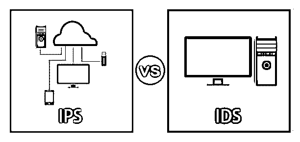

# IPS 与 IDS

> 原文：<https://www.educba.com/ips-vs-ids/>

## IPS 和 IDS 之间的区别

入侵检测系统(IDS)和入侵防御系统(IPS)都是网络基础设施的组成部分。IPS vs IDS 都是包含已知网络攻击特征的数据库，它们使用匹配的标志将网络数据包与网络威胁进行比较。主要区别在于，IDS 是用于跟踪的系统，而 IPS 是用于监管的系统。IPS 根据数据包的内容阻止数据包的传输，而 IDS 不会以任何方式改变网络数据包，就像防火墙通过 IP 地址阻止流量一样。

### 什么是 IP 和 id？

**IPS–**该工具将采取行动，不需要管理员决定阻止任何数据包被 IPS 工具识别为威胁。此外，IPS 系统地评估并应用所有自动到达网络的数据包。另外，入侵检测系统有两种类型:统计异常检测和基于特征的检测。

<small>网页开发、编程语言、软件测试&其他</small>

*   **统计异常检测:**他们随机使用网络流量的样本，并进行比较。它们通过端口、带宽、协议和工具联系在一起。
*   **基于特征的检测:**每种类型的攻击都使用可识别的重要模式。该签名可以是面向攻击者的签名，通过在存储的漏洞攻击文件中查找匹配项，可以跟踪数据包。

**IDS–**IDS 被描述为一种工具，用于检测数据包入侵，并对哪些数据包可能受到威胁或不受威胁进行分类。只应注意不要妨碍。它是一个混合硬件/软件保护平台，可应对外部和内部威胁，并实时跟踪网络活动。id 也有以下两种类型。

*   **基于主机的入侵检测系统:**这是一个基于主机的传感器，涉及到在工作站上使用软件作为代理。HIDS 追踪了这些特工。安装代理时，代理会跟踪并记录特定操作系统的文件。
    如果活动发生异常变化，并且安装活动监控后立即开始作业。他们可以根据内部系统活动的变化来监控攻击。
*   **基于网络的入侵检测系统:**它是一种基于网络的传感器(以太网或 WIFI)，位于分段点或边界，跟踪设备和系统传输数据包
    这些使用实时监控，使攻击者无法再隐藏、修改或擦除攻击证据。这些对法医分析非常有用。

### IPS 和 IDS 之间的直接比较(信息图表)

以下是 IPS 与 IDS 的五大对比 **:**

### IPS 和 IDS 之间的主要区别

让我们从以下几点来讨论 IPS 与 IDS 之间的一些关键差异:

*   IDS 和 IPS 都读取网络数据包并将其与已知威胁的内容进行比较。IDS 是用于检测和监视的工具，它们本身不采取任何行动。
*   IPS 是接受或拒绝注册数据包的控制系统。IDS 需要一个人或其他设备来检查和决定后续步骤，这可能取决于每天生成的网络流量。
*   另一方面，IPS 的目标是在攻击目标之前收集并丢弃危险的数据包。它比 IDS 更主动，IDS 只需要用新的威胁数据定期更新数据库。
*   IPS 系统的故障会导致意想不到的攻击。不要忘记使用防火墙来过滤，阻止和允许端口，地址，操作，但其中一些也可以通过网络访问。除非将技术集成到单个设备中，否则管理人员可以选择将其用作内嵌 IPS，或者仅识别策略性放置的传感器来被动跟踪网络流量。
*   在网络中，IDS 应该放在防火墙之后，而 IPS 应该放在防火墙设备之后。
*   在 IDS 中，配置模式是内嵌模式，通常在第 2 层。另一方面，在 IPS 中，配置模式是串联模式或作为终端主机。

### IPS 与 IDS 的比较表

下表总结了 IPS 与 IDS **:** 之间的比较

| **IPS** | **id** |
| IPS 是基于规则集接受和拒绝数据包的控制系统。 | IDS 是一个检测和监控工具，它不会自己采取行动。 |
| IPS 要求数据库定期更新新的威胁数据。3 | IDS 需要人工或其他系统来检查结果。 |
| 它应该放在网络中的防火墙设备之后。 | IDS 应该放在防火墙之后。 |
| IPS 提供检测和反应支持。 | IDS 提供解耦检测和反应功能。 |
| 在 IPS 中，配置模式是串联模式或作为终端主机。 | 在 IDS 中，配置模式是内嵌模式，通常在第 2 层。 |

### 结论

请记住，在评估企业基础设施或家庭的安全解决方案时，互联网安全威胁会变得更加隐蔽和危险。将签名和计算技术与其他工具集成在一起的分层安全系统将使您能够与参与威胁的参与者及其攻击方法进行公平竞争。入侵防御程序的集成功能是这些重要工具之一，在保护公司网络基础设施和个人计算机方面起着至关重要的作用，无论是基于网络还是基于主机。

### 推荐文章

这是 IPS 和 IDS 之间的主要区别的指南。这里我们讨论信息图和比较表的主要区别。您也可以看看以下文章，了解更多信息–

1.  [IPS 工具](https://www.educba.com/ips-tools/)
2.  [IDS 工具](https://www.educba.com/ids-tools/)
3.  [网络安全攻击的类型](https://www.educba.com/types-of-network-security-attacks/)
4.  [网络安全工具](https://www.educba.com/cyber-security-tools/)

