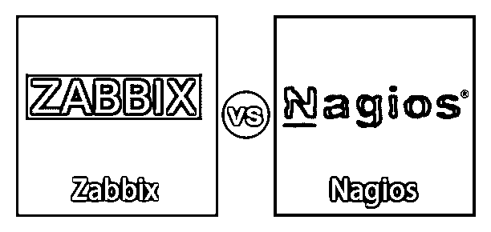
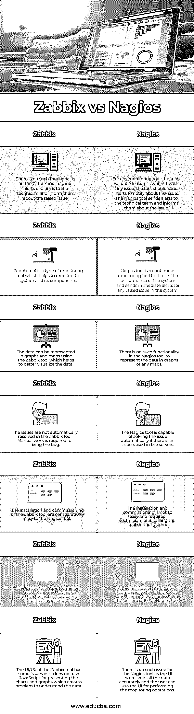

# Zabbix vs Nagios

> 原文：<https://www.educba.com/zabbix-vs-nagios/>

## Zabbix 和 Nagios 的区别

Zabbix 工具可以归类到监控应用程序中，该应用程序是开源的，用于监控虚拟机(虚拟机)、网络和服务器的性能，并能够监控机器上的 CPU 利用率、网络利用率和磁盘消耗。Nagios 是另一种类型的监控工具，也是一种开源工具，用于持续监控网络、基础设施和系统等 IT 组件，还用于检查网络中安装的系统的健康状况。如果系统出现问题，Nagios 工具会立即向技术人员发送警报。

### Zabbix 和 Nagios 的正面比较(信息图)

以下是 Zabbix 与 Nagios 的 8 大对比 **:**

<small>网页开发、编程语言、软件测试&其他</small>

### Zabbix 和 Nagios 的主要区别

让我们从以下几点来讨论 Zabbix 和 Nagios 之间的一些关键差异:

*   这两个工具的主要区别之一是 Nagios 工具是一个持续的监控工具，而 Zabbix 工具不是。Nagios 工具是一个开源工具，它是一个持续的监控工具，用于监控系统机器、网络基础设施和架构的健康状况。Zabbix 工具是一种监控工具，用于监控网络、服务器和虚拟机。
*   Zabbix 和 Nagios 的另一个区别是成本和安装步骤。Zabbix 工具更便宜，也更容易安装在用户系统上，并且不需要额外的安装步骤。在 Nagios 工具中，免费版本的功能非常有限。高级版本更好，价格昂贵，需要额外的安装支持。
*   Zabbix 和 Nagios 工具之间的另一个区别是它们用于监视的组件。Zabbix 工具用于监控网络系统、CPU 负载统计和内存堆。Nagios 工具用于持续监控应用程序、服务和系统。
*   Zabbix 和 Nagios 之间的另一个关键区别是在出现任何问题时发送警告和警报。当在系统上观察到任何异常行为时，Nagios 工具会立即发送警报，以便对警报采取适当的措施。在 Zabbix 工具中，没有发送警报和通知技术团队的功能。
*   在 Zabbix 工具中，数据可以以不同的形式显示，如屏幕、图表、概览和地图。因为该工具可以监控服务器，所以它给出了关于性能数据的实际统计数据和信息。在 Nagios 工具中，不存在可视化数据的功能，这给分析数据和监控系统带来了问题。
*   Zabbix 和 Nagios 的另一个主要区别是 HA(高可用性)和自动修复问题。Nagios 工具可以维护系统的安全性和系统对其他业务操作的高可用性。Nagios 工具还能够在出现任何情况时自动修复问题。Zabbix 工具不会自动修复该问题；它需要技术支持。Zabbix 也可以从小规模环境扩展到大规模环境。
*   在 Zabbix 工具中，一个基于 web 的集中式管理界面用于管理数据库中的数据和监控系统。在 Nagios 工具中，没有集中的系统来监控系统和数据。Nagios 工具使用 GUI，该 GUI 使用 CGI 来显示网页。该网页包括用于通知警报的图形、按钮和声音。当不止一次发出警报时，会立即发出硬警报以通知技术团队。
*   Nagios 工具提供了不同的网络监控服务:HTTP、SNMP、POP、SMTP、SSH、FTP 等等。Zabbix 工具可以监控从各种虚拟机和物理机收集的数千个指标。

### Zabbix 与 Nagios 的对比表

下表总结了 Zabbix 与 Nagios 之间的比较 **:**

| 扎比克斯 | **纳吉奥斯** |
| Zabbix 工具中没有这样的功能来向技术人员发送警告或警报，并通知他们出现的问题。 | 对于任何监控工具来说，最有价值的特性是当出现问题时，该工具应该发送警报来通知问题。Nagios 工具向技术团队发送警报，并通知他们这个问题。 |
| Zabbix 工具是一种帮助监控系统及其组件的监控工具。 | Nagios 工具是一个持续的监控工具，它测试系统的性能，并针对系统中出现的任何问题发送即时警报。 |
| 使用 Zabbix 工具可以在图形和地图中表示数据，这有助于更好地可视化数据。 | Nagios 工具中没有这样的功能来用图形或任何地图表示数据。 |
| Zabbix 工具不会自动解决这些问题。修复这个 bug 需要手工操作。 | 如果服务器出现问题，Nagios 工具能够自动解决问题。 |
| Zabbix 工具的安装和调试相对 Nagios 工具来说比较容易。 | 安装和调试并不容易，需要技术人员在系统上安装工具。 |
| Zabbix 工具的性能比 Nagios 好，而且比 Nagios 工具快。 | 与 Zabbix 工具相比，Nagios 工具有点慢，而且 Nagios 工具的性能总是有问题。 |
| Zabbix 工具的 UI/UX 有一些问题，因为它没有使用 JavaScript 来呈现图表和图形，这就造成了理解数据的问题。 | Nagios 工具不存在这样的问题，因为 UI 准确地表示了所有数据，用户可以使用 UI 来执行监控操作。 |

### 结论

Zabbix 工具和 Nagios 工具都用于监控系统和系统的健康状况。在选择工具时，唯一需要考虑的因素是工具的要求和用途。这两个工具都能够监控服务器、系统和系统性能。

### 推荐文章

这是一个关于 Zabbix 和 Nagios 之间主要区别的指南。这里我们讨论信息图和比较表的主要区别。您也可以看看以下文章，了解更多信息–

1.  [Splunk vs Nagios](https://www.educba.com/splunk-vs-nagios/)
2.  [Graylog vs Splunk](https://www.educba.com/graylog-vs-splunk/)
3.  [什么是 Nagios？](https://www.educba.com/what-is-nagios/)
4.  [灰鲸 vs 麋鹿](https://www.educba.com/graylog-vs-elk/)

