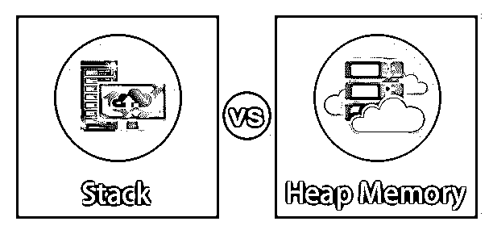
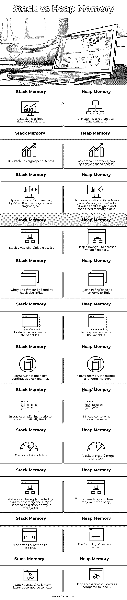

# 堆栈与堆内存

> 原文：<https://www.educba.com/stack-vs-heap-memory/>

## 堆栈内存和堆内存的区别

**什么是堆栈内存:**发生在连续内存块上的分配。我们称之为堆栈内存分配，因为分配发生在函数调用堆栈中。要分配的内存对于编译来说是已知的，当一个特性被调用时，它们的变量将被分配内存给堆栈。一旦函数调用完成，内存就被分配给变量。所有这些都发生在预定义的编译器例程中。程序员不需要考虑为内存分配堆栈变量和重新定位它们。

**什么是堆内存:**堆是编程语言保存全局变量的缓冲区。默认情况下，所有全局变量都存储在堆内存空间中。这有助于动态内存的分配。当程序员执行指令时，内存被保留。注意，堆名与堆数据的结构无关。它被称为堆，因为程序员可以分配和释放内存空间的堆栈。

<small>网页开发、编程语言、软件测试&其他</small>

### 堆栈内存与堆内存的直接比较(信息图表)

下面是堆栈与堆内存的 5 大比较 **:**

### 堆栈内存和堆内存的主要区别

让我们从以下几点来讨论堆栈内存和堆内存之间的一些关键差异:

1.栈是一种线性数据结构，而堆是一种层次数据结构。
2。堆栈内存永远不会被分段，而堆内存可以通过分配内存块并启动它们来分段。
3。Stack 只会处理局部变量，而 Heap 允许你访问全局变量。
4。无法调整堆栈变量的大小，但可以调整堆变量的大小。
5。连续块被分配给堆栈内存，而堆被分配给随机顺序。
6。堆栈不需要释放变量，而释放堆变量是必要的。
7。当程序员分配和移走堆时，赋值和分配通过编译器指令来呈现。
8。堆栈帧访问优于堆帧，因为堆栈具有较小的内存区域并且是缓存友好的，并且当它分布在内存中时，会触发更多的缓存错误。

### 堆栈内存与堆内存的比较表

下表总结了堆栈内存与堆内存的比较 **:**

| **堆栈内存** | **堆内存** |
| 堆栈具有线性数据类型结构。 | 堆具有分层的数据结构。 |
| 堆栈具有高速访问能力。 | 与堆栈相比，堆访问速度较慢。 |
| 操作系统有效地管理空间，因此内存永远不会出现碎片。 | 使用效率不如堆空间。内存可以分解为先分配然后释放的内存块。 |
| 堆栈提供局部变量访问。 | 堆允许你全局访问一个变量。 |
| 操作系统相关的堆栈大小限制。 | 堆没有特定的内存大小限制。 |
| 在股票中，我们不能调整变量的大小。 | 在堆中，我们可以调整变量的大小。 |
| 内存以连续块的方式分配。 | 在堆中，内存是以随机方式分配的。 |
| 在堆栈中，自动使用编译器指令。 | 在堆中，编译器是手动完成的。 |
| 堆栈的成本更低。 | 堆的开销比栈大。 |
| 基于简单数组的动态内存和链表可以通过三种方式实现堆栈。 | 您可以使用数组和树来实现堆。 |
| 大小的灵活性是固定的。 | 堆的大小可以灵活调整。 |
| 与堆相比，堆栈访问时间要快得多。 | 与堆栈相比，堆访问时间较慢。 |

### 堆栈存储器的优缺点

下面是堆栈内存的优点和缺点:

**优点:**

1.  它有助于控制内存分配和释放。
2.  堆栈自动清理对象。
3.  堆栈内存不容易被破坏。

**缺点:**

1.  堆栈内存最小。
2.  在堆栈上创建太多对象会导致堆栈溢出。
3.  在堆栈存储器中，随机存取是不可能的。

### 堆内存的优缺点

以下是热记忆的优缺点:

**优势:**

1.  堆找到最大和最小的数字。
2.  优先级队列中使用的堆方法。
3.  堆允许全局访问变量。
4.  在堆内存中，垃圾收集功能有助于释放对象使用的内存。

**缺点:**

1.  它可以提供操作系统所能提供的最大内存。
2.  它需要更多的时间来计算。
3.  在堆内存中，内存管理更加复杂。
4.  堆内存中的执行时间更多。

### 推荐文章

这是一个堆栈和堆内存的指南。这里我们用信息图和比较表来讨论堆栈和堆内存的主要区别。您也可以看看以下文章，了解更多信息–

1.  [堆栈 vs 队列](https://www.educba.com/stack-vs-queue/)
2.  [什么是堆内存？](https://www.educba.com/what-is-heap-memory/)
3.  [c++中的堆排序](https://www.educba.com/heap-sort-in-c-plus-plus/)
4.  [Java 中的堆栈类](https://www.educba.com/stack-class-in-java/)

