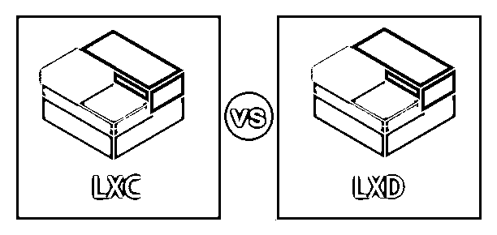

# LXC 对 LXD

> 原文：<https://www.educba.com/lxc-vs-lxd/>

## LXC 和 LXD 的区别

在这篇文章中，我们将了解 LXC 对 LXD。

LXC 和 LXD 是管理员或开发人员在处理容器时经常听到的两个突出的词。它们听起来与首字母缩略词相似，它们使用相同的平台，即容器，但它们是不同的。

<small>网页开发、编程语言、软件测试&其他</small>

LXC，即“Linux 容器”，是一种在 Linux 内核范围内为操作系统级别的软件创建虚拟环境的解决方案。LXC 允许我们在虚拟环境中运行单个应用程序。LXC 的关键因素是能够利用托管操作系统本身的用户空间工具来控制虚拟环境，从而减少开销并提高成本效益。

在某种程度上，LXD 把 LXC 作为它的子集，我们可以说它是它的延伸。LXD 使用 REST API 连接 LXC 的一个软件资源，即 libxlc。LXD 是用 GO 编写的，它有一个守护进程，可以通过 HTTP 协议从网络上的 UNIX 套接字连接到应用程序。这个特殊的 LXD 守护进程可以处理所有与网络和数据存储相关的问题。

### LXC 和 LXD 的直接对比(信息图)

以下是 LXC 和 LXD 之间的比较:

### LXC 与 LXD 的主要区别

让我们讨论一下 LXC 与 LXD 之间的一些主要差异:

*   LXD 是一个开源的容器管理系统，是 LXC 的延伸；因此，LXD 改进了现有的 LXC 特性，并为管理和构建 Linux 容器提供了多个新特性。
*   一个主机可以只使用一个系统守护程序运行多个 LXC 容器，从而减少了所需的开销并简化了管理。对于纯 LXC，我们可能需要对每个容器进行单独的处理。
*   LXD 容器的守护进程将利用主机级安全特性，因此容器更加安全。在基于纯 LXC 的容器上获得这种级别的安全性是很成问题的。
*   LXC 没有提供动态容器迁移的特性，在动态容器迁移中，与容器相关的完整配置和目录被移动到不同的机器上，而这个特性是非常需要的。这个优势可以通过使用 LXD 来克服，它提供了这个额外的功能。
*   LXD 可以拍摄运行中的集装箱，这也是我们在 LXC 看不到的高级功能之一。由于 LXD 是 LXC 的延伸，我们看到 LXD 可以有效地处理所有与 LXC 相关的任务。
*   LXD 容器具有广泛的安全特性，LXD 可以很容易地与规范的 RBAC 服务集成。谈到与 LXC 的安全，这是好的，但与 LXD 相比不够有竞争力。

### LXC 与 LXD 对比表

让我们来看看 LXC 和 LXD 的顶级对比。

| **比较的基础** | **LXC** | **LXD** |
| **集装箱** | LXC——与 Vmware 等传统虚拟机管理程序不同，Linux 容器是虚拟化解决方案。LXC 使得使用容器的虚拟环境非常容易控制。对于 LXC，您将需要对每个集装箱进行单独的处理。 | LXD 是 LXC 功能的延伸，它也使用容器进行操作。它使用一个 REST API，可以连接到 LXC 的 libxlc 库。由于它是 LXC 的扩展，LXD 将支持一些高级功能，如实时迁移和快照。LXD 并不是为了取代 LXC，而是为了让 LXC 的集装箱更好，更灵活，更容易使用。 |
| **人性化** | Canonical 已经和 LXC 合作了很多年，而 LXC 在这方面做得很好，但是通过提供非常好的低级 API、工具、库来管理和创建容器。但是这些低级的 API 不是那么用户友好，可能需要专业知识。 | LXD 是 LXC 的延伸，它回答了许多缺点，用户友好是其中之一。它还可以满足用户的许多高级需求，比如资源限制、容器迁移和实时迁移。 |
| **安全** | LXC 有很好的安全功能，LXD 将利用所有这些功能与附加功能。LXC 允许控制和限制容器的功能。凭借组访问和 AppArmor 配置文件的良好配置，LXC 可以防止大多数攻击。同样，这些特征对于主机的操作系统也有限制。两个相关的配置包括 lxc.cap.drop 和 lxc.cap.keep。 | LXD 的主要安全特性是通过使用 LXC 库实现的，它们是内核命名空间 secccomp。Apprmor、cgroups 等。LXD，而不是直接向用户公开这些功能，有一个内置的配置，可以将这些功能中的大部分抽象成一些更加用户友好的东西。与 LXD 的通信通过 TLS1.2 使用最少允许的密码进行保护。在处理主机外部的连接时，LXD 的系统安全机构将提示远程指纹(基于 SSH 密钥的样式),然后将其缓存以备将来使用。 |
| **API** | LXC 附带了一个稳定的 C API 和一堆其他的绑定。我们可以在 lxc 版本中添加 liblxc1 API，但如果不将其命名为 liblxc2，就不会删除或更改现有的符号。Lxc container.h 是 Lxc 的公共 C API。绑定可以分为两部分，使用原始的“_lxc”扩展和“lxc”python 覆盖，这可以提供改进的用户体验。 | LXD 和客户端之间的任何类型的通信都只能通过 HTTP 协议上的 REST API 进行，该协议进一步封装在不同的 SSL 上，用于 UNIX 套接字本地操作或许多其他远程操作。需要注意的是，并不是所有接口都需要认证。LXD 使用一组状态代码来表示返回状态，这有助于调试错误。 |
| **优势** | LXC 的主要优势是能够轻松安静地控制虚拟环境。重量轻和许多资源友好。与虚拟机相比，LXC 提供了更好的隔离，并且可以支持全面的流程。LXC 可以在一台服务器上运行多个版本的操作系统。LXC 可以快速部署。 | LXD 的主要优势在于它是 LXC 的延伸，因此 LXC 的大部分功能都可以与高级功能一起得到支持。随着 REST API 的使用，LXD 的功能得到了增强，它也变得对用户友好。LXD 的另一个非常好的特性是快照创建和轻松迁移。LXD 为运营提供了更好的存储配置和灵活的网络 |

### 结论

LXD 和 LXC 并不是完全不同的东西；它们有许多依赖项，同样的组织和开发人员正在开发两者，选择哪一个并不容易。如果你的团队在使用 LXD，那么他们也在使用 LXC。选择完全取决于我们的需求，然后分析哪一个适合我们的目的。LXC，那么我们可以使用它，但 LXD 更适合生产环境，它提供了基本的子集功能，如果您满意的话。

### 推荐文章

这是 LXC 对 LXD 的比赛指南。这里我们讨论信息图和比较表的主要区别。您也可以浏览我们的其他相关文章，了解更多信息——

1.  [立方 vs 码头](https://www.educba.com/kubernetes-vs-docker/)
2.  [Perl vs Python](https://www.educba.com/perl-vs-python/)
3.  [LXC vs 码头](https://www.educba.com/lxc-vs-docker/)
4.  [LXD vs 码头](https://www.educba.com/lxd-vs-docker/)

