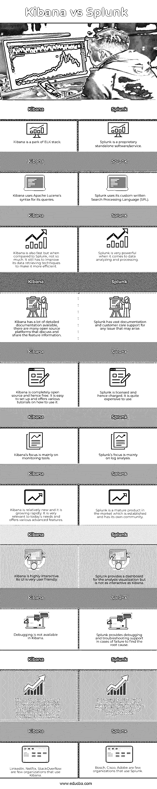

# Kibana vs Splunk

> 原文：<https://www.educba.com/kibana-vs-splunk/>

## Kibana 与 Splunk 的区别

Kibana 是一个开源的可视化和探索工具，用于应用程序监控、日志分析、时序分析应用程序。它还提供了内置特性，如统计图(直方图、饼图、折线图等)。).它是麋鹿栈的一部分；因此，它还提供了与 Elasticsearch 搜索引擎的内置集成。Splunk 是一款可视化软件，用于分析日志和机器生成的数据、应用程序监控、安全性和 web 应用程序。它可以在其内置的仪表板、图表等中显示数据。

### Kibana 与 Splunk 的面对面比较(信息图)

以下是 Kibana 与 Splunk 的 11 大对比 **:**

<small>网页开发、编程语言、软件测试&其他</small>

### Kibana 与 Splunk 的主要区别

让我们从以下几点来讨论 Kibana 与 Splunk 之间的一些关键差异:

**1。** Splunk 是最早开发的数据可视化软件之一。它得到了很好的建立和维护。Kibana 是一种即将推出的工具，对市场来说相对较新。Splunk 对可能遇到的问题有完善的客户支持，而 Kibana 也建立了客户支持，但由于其新的。我们可以预测，随着社区越来越大，支持也会越来越好。

**2。** Kibana 提供了一个灵活的可视化平台；它有一个交互式仪表板，旨在使体验尽可能简单。它还提供运行数据的实时更新/汇总。

**3。** Splunk 提供了一个 SaaS 接口(软件即服务),可以非常高效地分析机器数据。Splunk 属于日志管理/分析类别，而 Kibana 可以归入监控工具类别。

**4。**设置 Kibana 非常简单。它的设置和用户界面非常灵活，而 Splunk 的设置非常复杂，但其内部/外部集成非常强大。

**5。** Kibana 完全开源。Splunk 是授权软件(SaaS)，其服务是收费的。Splunk 有三个版本。

*   **Splunk Enterprise:** 顾名思义，大型机构和企业使用。
*   Splunk cloud: 它是一个平台，用户可以在这个平台上开发他们的应用程序。它也可以托管在 AWS 云上。
*   Splunk Lite: 这是一个免费试用版，功能有限，用户可以体验一下它的功能。

**6。** Splunk 是真正的敏捷；用户可以开发他们的 PoC，并可以轻松地将其转换为产品，因为它支持即时转换。基巴纳与麋鹿群紧密相连。只有在完全设置好 ELK 堆栈之后，才能进行分析和可视化。

**7。** Splunk 允许用户跨 Splunk 云创建中央存储库；可以从各种来源检索存储的数据。

**8。** Kibana 不提供 Solaris 可移植性，而 Splunk 提供。

**9。** Kibana 使用 apache Lucene 开发，用 Java 开发。Splunk 是独立的，用 C++开发。

10。 Splunk 为用户的集中托管数据提供了额外的安全性，因为它是专有的和经过许可的；它提供了额外的安全功能来存储数据。

### Kibana 与 Splunk 对比表

下表总结了 Kibana 与 Splunk 的比较 **:**

| **Kibana** | **Splunk** |
| 基巴纳是一个麋鹿栈公园。 | Splunk 是专有的独立软件/服务。 |
| Kibana 使用 Apache Lucene 的语法进行查询。 | Splunk 使用其定制的书面搜索处理语言(SPL)。 |
| Kibana 的速度也很快，但与 Splunk 相比，就没那么快了。它仍然需要改进其数据检索技术，以提高效率。 | 在数据分析和处理方面，Splunk 非常强大。 |
| Kibana 有很多详细的文档可用；许多开源平台讨论和共享特性信息。 | 对于可能出现的任何问题，Splunk 都有大量文档和客户服务支持。 |
| Kibana 是完全开源的，因此是免费的。它很容易设置，并提供了各种教程如何使用它。 | Splunk 获得许可，因此需要付费。用起来挺贵的。 |
| Kibana 的重点主要是监控工具。 | Splunk 的重点主要是日志分析。 |
| Kibana 相对较新，发展很快。它非常符合当今的需求，并提供各种高级功能。 | Splunk 是市场上成熟的产品，已经建立并拥有自己的社区。 |
| 基巴纳是高度互动的。它的用户界面非常友好。 | Splunk 为分析可视化提供了一个仪表板，但不如 Kibana 那样具有交互性。 |
| 调试在 Kibana 中不可用。 | 如果无法找到根本原因，Splunk 会提供调试和故障排除支持。 |
| Kibana 允许 JSON 这样的数据格式；与 Splunk 不同，它不允许所有类型的数据，但可以与第三方集成，以所需的格式发送数据。 | Splunk 可以接受任何数据格式，如。csv、日志文件、JSON 等。并且非常灵活地与其他插件或工具集成。 |
| LinkedIn、网飞、StackOverflow 是少数使用 Kibana 的组织。 | 博世、思科、Adobe 是少数使用 Splunk 的组织。 |

### 结论

总的来说，正如我们前面看到的，这两种工具各有利弊。选择工具完全基于系统及其需求。对于需要持续后端支持和强大快速分析的应用程序，Splunk 是更好的选择，而负担不起 Splunk、需要实时监控的组织可以选择 Kibana。

### 推荐文章

这是 Kibana vs Splunk 的指南。在这里，我们讨论这两种工具的功能，并给出主要区别和一个比较表。您也可以看看以下文章，了解更多信息–

1.  [Splunk vs Nagios](https://www.educba.com/splunk-vs-nagios/)
2.  [Datadog vs Splunk](https://www.educba.com/datadog-vs-splunk/)
3.  [格雷洛与基巴纳](https://www.educba.com/graylog-vs-kibana/)
4.  [Splunk vs Tableau](https://www.educba.com/splunk-vs-tableau/)

