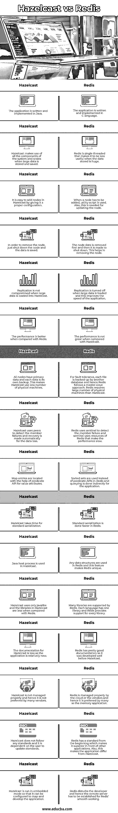

# 黑兹尔 cast vs 雷德斯

> 原文:# t0]https://www . educba . com/hazel cast-vs-redis/

## Hazelcast 与 Redis 的区别

用 Java 编写的存储内存数据网格的应用程序称为 Hazelcast。数据网格是开源的。开发该应用程序的公司将该产品命名为公司名 Hazelcast。它预测和扩展应用程序。这有助于减少数据库的负载，从而提高速度。Redis 是一个开源的分布式键值数据库，在这里我们可以选择要保存的文件的持久性。Redis 由 Redis 实验室开发，由 Salvatore Sanfillippa 编写。语言是 ANSI c。Redis 支持大多数抽象数据结构。在本主题中，我们将了解 Hazelcast vs Redis。

### Hazelcast 和 Redis 之间的直接比较(信息图表)

以下是 Hazelcast 与 Redis 之间的主要差异

<small>网页开发、编程语言、软件测试&其他</small>

### Hazelcast 和 Redis 之间的主要区别

下面提到了主要差异:

*   Hazelcast 易于使用，因为它类似于软件模型的客户端-服务器架构。而 Redis 并不像用户期望的那样简单，也不像客户机-服务器模型那样工作。这使得人们很难理解 Redis 的工作原理。
*   Redis 是单线程的，因此大负载无法正常工作。Redis s \主要用于简单的数据保存情况。虽然开发 Hazelcast 是为了支持更大的负载，但它可以扩展应用程序，从而降低数据库负载。
*   Hazelcast 的效率随着大数据的效率线性提高，因此即使对于 Hazelcast 中的较大数据，性能也不会受到影响。但是在 Redis 中，性能会受到更严重的影响，所以在将更大的数据装载到数据库中时应该小心。
*   Hazelcast 存储并安全地重新加载数据。这有助于安全地保存数据。但在 Redis 中，安全性要差一些，用户要给出访问权限，这样数据才能安全存储。
*   Hazelcast 从一开始就被开发成分布式工作模式。这有助于用其他几个应用程序和组件来扩展应用程序。Redis 的开发是为了在独立模式下工作，尽管后来有所改变。Redis 只支持每个集群一个数据库，这限制了存储容量。
*   由于在广播中使用多播传输，所以不使用额外的配置来了解其他应用。因此，传输相互了解，使应用程序正常工作。提供了单个地址，它适用于具有任意数量节点的集群。Redis 中没有多播网络。提供 TCP 连接是为了了解不同的客户端。
*   Redis 很难在定制云部署中使用，因为 Redis 不提供自动发现系统。Hazelcast 中提供了成员实例的自动发现。
*   借助于发现服务提供者接口，可以在任何平台上使用 Hazelcast。这实现了帮助用户的定制服务或发现机制。Redis 中使用的实用程序脚本是用 Ruby 编写的，因此应该为其提供依赖关系。该脚本用于所有成员地址，因此在发行版中有所描述。

### 对照表

现在，让我们在下表中起草比较。

| **黑兹尔卡斯特** | **再说一遍** |
| 该应用程序是用 Java 编写和实现的。 | 该应用程序是用 C 语言编写和实现的。 |
| Hazelcast 利用系统的所有组件，并在存储和保存大量数据时进行扩展。 | Redis 是单线程的，这使得它在存储大量数据时用处不大。 |
| 通过适当的配置，在 Hazelcast 中添加节点是很容易的。 | 当必须添加节点时，使用实用程序脚本。此外，这是更新节点所需要的。 |
| 要删除该节点，只需关闭该节点，数据即被保存。 | 首先删除节点数据，然后关闭节点。这有助于移除节点。 |
| 将大量数据加载到 Hazelcast 时，复制不会受到影响。 | 当加载大量数据时，复制被关闭，这提高了应用程序的速度。 |
| 与 Redis 相比，性能更好。 | 与 Hazelcast 相比，性能并不出色。 |
| 所有节点都有主数据，每个数据都是自己的备份。这使得 Hazelcast 使用更少的物理机。 | 为了容错，每个文件都由另一个数据库备份，因此 Redis 遵循主从方法。Redis 比 Hazelcast 需要大量的物理机。 |
| Hazelcast 使用对等体来检测成员故障，并自动对数据丢失进行恢复。 | Redis 使用 sentinel 来检测成员故障，而 sentinel 使用 Redis 的资源，这会降低性能。 |
| 映射条目是在值属性的谓词 API 的帮助下定位的。 | Redis 中使用排序集代替谓词 API，查询是间接为应用程序完成的。 |
| Hazelcast 标准序列化需要时间。 | 标准序列化在 Redis 中完成得更快。 |
| Hazelcast 使用 Java 主机进程。 | Redis 中使用任何数据结构，这个特性使得 Redis 独一无二。 |
| Hazelcast 只使用 javalibs，与 Redis 相比，Hazelcast 中的库更少。 | Redis 支持许多库。每种语言都有一个库，Redis 为每个库提供支持。 |
| Hazelcast 的文档较少，因为该应用程序相对较新。 | Redis 有很好的文档，因为它是在 Hazelcast 之前开发的。 |
| Hazelcast 管理不当，因此许多供应商都不喜欢它。 | Redis 由云或供应商妥善管理，因此它作为内存应用程序受到许多人的青睐。 |
| Hazelcast 不遵循任何标准，它依赖于用户来更新标准。 | Redis 从一开始就有一个标准，这使得它在其他应用面前更胜一筹。这也使得应用程序不同于 Hazelcast。 |
| Hazelcast 在嵌入式模式下运行，因此可以对其进行配置以映射和开发应用程序。 | Redis 困扰着开发者，为了 Redis 的顺利运行，必须建立远程服务器。 |

### 推荐文章

这是 Hazelcast vs Redis 的指南。在这里，我们讨论了 Hazelcast 与 Redis 的主要区别，并提供了信息图表和比较表。您也可以看看以下文章，了解更多信息–

1.  [rabbitq vs redis](https://www.educba.com/rabbitmq-vs-redis/)
2.  背对卡夫卡
3.  [Cassandra vs Redis](https://www.educba.com/cassandra-vs-redis/)
4.  背对背

