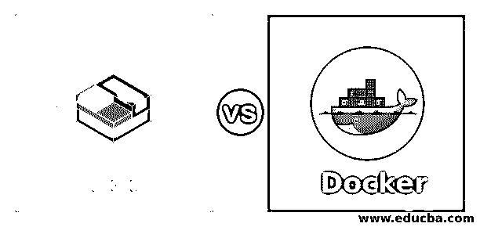
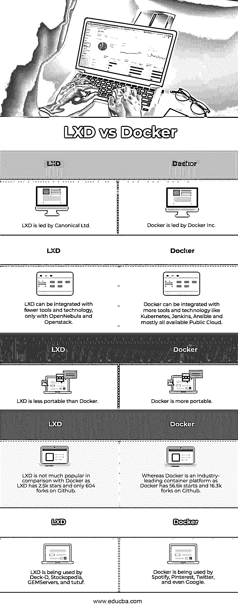

# LXD 与坞站

> 原文:# t0]https://www . educba . com/lxd-vs 坞站/

## LXD 和码头工人的区别

LXD 是建立在 LXC (Linux 容器)之上的下一代容器管理器，它提供了更好的用户体验。特权守护程序是 LXD 的心脏。我们可以通过本地 Unix 套接字或网络使用 REST API 访问守护进程。

Docker 是一个容器运行时应用程序。它将应用程序作为一个容器来运行，使用包含所有依赖项和库的映像来运行应用程序。Docker 还使用 REST API 通过 Docker CLI 管理其对象。

<small>网页开发、编程语言、软件测试&其他</small>

### LXD 和 Docker 的面对面比较(信息图)

以下是 LXD 和 Docker 之间的五大对比:

### LXD 和码头工人的主要区别

让我们来看看主要的区别。

| **LXD** | **码头工人** |
| LXD 最有可能是一种在单个操作系统上运行多个容器的操作系统虚拟化。这些容器就像虚拟机，但它没有完整的操作系统。 | Docker 最有可能是运行多个容器的应用程序虚拟化，这些容器只有一个应用程序。 |

**平台:–**

| LXD 只能在任何 Linux 发行版上运行，而不能在 windows 上运行。没有什么像 Linux 上的 windows 容器或 Windows 上的 Linux 容器。 | Docker 现在是独立于平台的，它可以在 Linux 和 Windows 上运行。然而，如果有人想在 Windows 上运行 Linux 应用程序，Docker 守护进程会在后台创建一个小型 Linux VM，然后它会在其上作为一个容器运行 Linux 应用程序。 |

**整合:–**

| LXD can be integrated with OpenStack and OpenNebula to manage LXC compute nodes. | Docker 可以与 Kubernetes 集成来编排容器并提供容错。Docker 可以与 Jenkins 集成，以创建 CI/CD 管道来加快部署。 |

**流程管理:–**

| LXD 可以在同一个容器中运行多个进程，就像它用传统的 init 进程运行一个容器一样。例如，如果我们想要运行 LAMP(Linux + Apache + MySql +PhP)服务器，我们可以在单个容器中运行它。 | 我们在 Docker 中为每个容器运行一个流程。这意味着如果我们必须为一个应用程序运行 x 个并发进程，我们需要运行 x 个容器，每个容器都有自己独特的进程。 |

**状态管理:–**

| 使用 LXD，云提供商可以提供一个个人容器，这就像我们在使用成熟的操作系统，但它比虚拟机更便宜，并且能够快速旋转，提供我们需要的持久数据。 | Docker 不支持持久存储，这意味着在容器内部所做的更改一直存在，直到作为 Docker 映像或容器被删除或销毁；但是，在运行容器时，有一些方法可以使用卷或绑定挂载来持久存储数据。 |

**便携性:–**

| LXD 的可移植性不如 Docker，因为它更接近于一个带有附加网络和存储接口的完整操作系统环境。我们甚至可以运行嵌套在 LXD 内部的多个 Docker 容器，但反过来是不可能的。 | 便携性是 Docker 相对于 LXD 最重要的优势。网络、存储和操作系统与 Docker 应用程序松散耦合，这使得 Docker 容器比 LXD 更易于移植。 |

**基本命令:–**

| 1.      To create a container**lxc 启动 Ubuntu:18.04 first _ lxc _ container**以上命令将使用 ubuntu:18.04 映像创建一个名为 first_lxc_container 的 LXD 容器。2.在容器内执行命令lxc exec<name _ of _ the _ container>—/bin/bash3.停止集装箱**lxc 停止<名称 _ 集装箱名称>T1】**4.要完全移除容器**lxc 删除<名称 _ of _ 容器>T1】**

5.要手动导入图像

**lxc 图像导入<文件>–别名 my_image**

 | 1.      To create a container**docker 运行 nginx first_docker_container**上面的命令将用 nginx 映像创建一个名为 first_docker_container 的 Docker 容器。2.在容器内执行命令**docker 容器 exec -it <容器 _ 名称> sh**3.停止集装箱**码头工人停靠<集装箱 _ 名称>T1】**4.要完全移除容器**码头集装箱 rm <集装箱 _ 名称>T1】**5.在本地提取图像**码头工人拉<image _ name>T1】** |

**版本和支持:–**

| LXD 支持 LTS 版本和功能版本。LXC 的当前 LTS 版本是 3.0，支持到 2023 年 6 月。这个版本定期获得错误修复和安全更新，没有额外的功能。每个月都会推出新功能和错误修复的功能版本。 | Docker 守护进程目前的主要版本是 19.03，次要版本像 19.03.x，Docker 有两种类型的 Docker 引擎，一种是 Docker CE(社区版)，第二种是 Docker EE(企业版)。唯一不同的是 Docker EE 提供了一个 web 界面来管理 Docker Swarm。 |

**图像库:–**

| LXD has below image repository:1.ubuntu:(用于稳定的 Ubuntu 图像)2.ubuntu-daily:(用于每日 ubuntu 图片)3.图片:(对于其他发行版)[https://uk.images.linuxcontainers.org/](https://uk.images.linuxcontainers.org/)我们还可以使用远程 LXD 作为图像服务器。只需将它添加为遥控器并使用它。**lxc 远程添加我的图片<IP _ 地址>T1】****lxc 启动我的图片:<图片名称> <容器名称>** | Docker 有自己的公共知识库，名为[https://hub.docker.com](https://hub.docker.com)。当我们运行一个命令来运行一个容器时，Docker 守护进程在本地检查映像；如果在本地找不到该映像，它会转到 hub.docker.com 进行检查，并下载到本地运行该容器。但是，我们可以创建自己的私有注册表。Docker 为企业级私有注册中心提供 DTR (Docker 可信注册中心)。 |

### LXD 与多克的比较

以下是顶部对比:

| sr.no | **LXD** | **码头工人** |
| 1. | Canonical 有限公司领导 LXD。 | Docker 公司领先 docker。 |
| 2. | LXD 可以与更少的工具和技术集成，仅与 OpenNebula 和 Openstack 集成。 | Docker 可以集成更多的工具和技术，如 Kubernetes、Jenkins、Ansible 和所有可用的公共云。 |
| 3. | LXD 不如多克便于携带。 | Docker 更便携。 |
| 4. | 与 Docker 相比，LXD 并不太受欢迎，因为 LXD 在 Github 上有 2.5k 个星星，只有 604 个叉子。 | 鉴于 Docker 是行业领先的容器平台，因为 Docker 在 Github 上有 56.6k starts 和 16.3k forks。 |
| 5. | Deck-D、Stockopedia、GEMServers 和 tutuf 都在使用 LXD。 | Spotify、Pinterest、Twitter 甚至谷歌都在使用 Docker。 |

### 结论

LXD 和 Docker 都是集装箱化技术。LXD 将操作系统作为一个容器来运行，因此它可以利用虚拟机和容器的优势，而 Docker 是一个轻量级和简单的容器运行时应用程序，它为每个 Docker 容器运行一个应用程序进程。

### 推荐文章

这是 LXD vs 码头工人的指南。在这里，我们讨论了信息图表和 LXD 与 Docker 的比较表的主要区别。您也可以浏览我们的其他相关文章，了解更多信息——

1.  [Ubuntu vs Fedora](https://www.educba.com/ubuntu-vs-fedora/)
2.  [LXC vs 码头](https://www.educba.com/lxc-vs-docker/)
3.  [市场 vs 码头](https://www.educba.com/rkt-vs-docker/)
4.  [流浪汉 vs 码头工人](https://www.educba.com/vagrant-vs-docker/)

