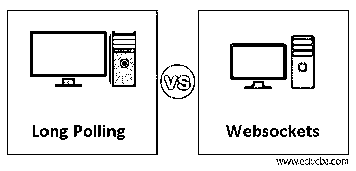
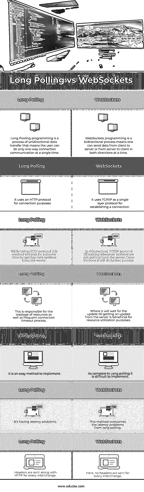

# 长轮询与 WebSockets

> 原文：<https://www.educba.com/long-polling-vs-websockets/>

## 长轮询与 WebSockets 的区别

*   长轮询是一种有效的技术，现在使用 HTTP 协议；其中服务器将向客户端发送数据；其中，没有事件延迟。
*   使用这种技术，服务器可以尽可能长时间地保持客户端的连接打开，并且只在有实际需要时才发送数据。
*   WebSocket 是一种构建浏览器的技术，每当浏览器向服务器发送信息时，服务器都会收到浏览器的通知。
*   这是一个借助称为 TCP 的单一协议建立全双工通信的过程。这是客户端和服务器之间的双向通信过程。

### 长轮询与 WebSockets 的直接比较(信息图)

以下是长轮询与 WebSockets 的 7 大比较:

<small>网页开发、编程语言、软件测试&其他</small>

### 长轮询与 WebSockets 的主要区别

有一些关键的不同点使得长轮询和 WebSockets 彼此分开，让我们一个一个地看细节:

#### 长轮询

*   正如我们所知，长轮询是一种技术，其中有两个实体；一个是客户端，另一个是服务器。所以在通信过程中客户端希望从服务器了解一些数据或信息。
*   因此，它向服务器请求所需的信息，而不对服务器做出任何即时响应；之后，它将保持连接为打开状态，这允许服务器稍后做出响应。
*   在长轮询中使用 AJAX 调用迫使服务器不断检查是否有新数据进入连接，这是非常短暂的。
*   这里，使用 HTTP 协议并不意味着保持连接开放并不意味着服务器想要频繁地发送数据或信息给其相关的客户机。
*   在这两个过程之间，会创建一个到服务器的连接，它会保持这个连接打开，这样客户端就可以从相关的服务器接收数据。

长轮询是基于基于事件的算法的过程，包括以下过程:

*   在初始步骤中，客户端将通过 ajax 发送一个 AJAX 请求。
*   之后，在下一步中，服务器将检查数据中发生的更改。
*   下一步确定算法的实际条件，在该条件下，它将检查数据内是否进行了更改，这意味着它将返回值 yes，然后将显示更改的数据，并且控制将返回到#1。
*   如果前一步失败，意味着数据没有任何变化，尽管服务器将等待一段短时间，控制将返回到#2

这种方法只有在非常接近实时地处理数据时才有用。这是因为它相信并等待，直到它做出一些举动，而不是一直等待计时器。因此，由于服务器端脚本而不是快速短时间戳，这被视为一个基于长时间的过程。

#### websocket

*   Web 套接字是基于称为 TCP/IP 的单层协议的连接流。这用于创建到服务器的连接，主要目的是根据需要等待尽可能多的时间，这与长时间轮询完全不同。
*   一旦连接中的所有进程或事件都完成了，客户机或服务器就可以很容易地终止它。它的主要有趣的特点是用户可以在客户端和服务器之间进行双向通信；这意味着在两个方向上同时进行，比如从客户端到服务器，以及从服务器到客户端。
*   由于这种情况，频繁发送消息的过程变得非常高效。数据加密也以非常简单的方式完成。
*   由于前面提到的所有特性，与长轮询相比，WebSocket 编程的性能非常高。
*   这也是有益的，因为它利用了由于使用 HTTP 协议而在长轮询中浪费的资源，这是非常不利的，并且还导致连接超时的困难。
*   兼容性是网页的主要因素之一；为了解决兼容性问题，WebSockets 使用 HTTP 升级头来取代 HTTP 协议，因此一个新的 HTTP 协议将支持 WebSocket。
*   WebSocket 被认为是基于帧的，而 other 被认为是基于流的。因此，在实际的数据传输中，它会被区别对待。

### 长轮询与 WebSockets 的比较表

让我们看看长轮询和 WebSockets 之间的主要比较。

| **Sr 号** | **长轮询** | **WebSockets** |
| 1. | 长池编程是一个单向数据传输过程，这意味着用户一次只能进行单向连接通信。 | WebSockets 编程是一个双向过程，这意味着一个人可以同时从客户机向服务器或从服务器向客户机双向发送数据。 |
| 2. | 它使用 HTTP 协议进行连接。 | 它使用 TCP/IP 作为建立连接的单层协议。 |
| 3. | 使用 HTTP 协议时，此方法将等待较短的时间从服务器获取数据更新。 | 在这种方法中，每当没有从服务器获得更新时，TCP/IP 协议就一直等待。一旦完成，它会做进一步的处理。 |
| 4. | 这是造成资源浪费和频繁连接超时的原因。 | 它将等待更新，直到从服务器获取更新有利于资源利用。 |
| 5. | 这是一个容易实现的方法。 | 与长轮询相比，它很难实现。 |
| 6. | 它有延迟问题。 | 这种方法克服了长轮询带来的延迟问题。 |
| 7 .**。** | 对于每次交换，报头都与 HTTP 一起发送。 | 这里，每次交换都不发送报头。 |

### 结论

从上面的信息中，我们了解到两者都是用于数据传输的连接流，其中长轮询用于单向传输，而 WebSockets 用于双向传输。使用 HTTP 处理长轮询很容易。一旦任务完成，WebSockets 需要一个显式的方法来关闭连接。

### 推荐文章

这是一个关于长轮询和 WebSockets 的指南。在这里，我们讨论信息图的主要区别，以及长轮询与 WebSockets 的比较表。您也可以浏览我们的其他相关文章，了解更多信息——

1.  [WebSockets vs WebRTC](https://www.educba.com/websockets-vs-webrtc/)
2.  [Html5 vs Html4](https://www.educba.com/html5-vs-html4/)
3.  [PHPStorm vs WebStorm](https://www.educba.com/phpstorm-vs-webstorm/)
4.  [WebLogic vs JBoss](https://www.educba.com/weblogic-vs-jboss/)

