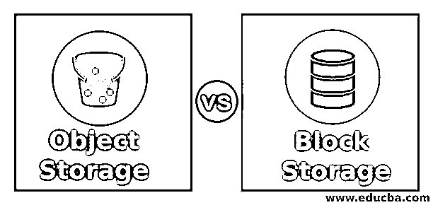
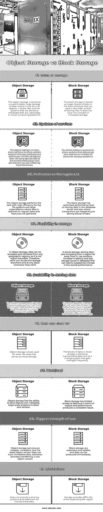

# 对象存储与块存储

> 原文：<https://www.educba.com/object-storage-vs-block-storage/>

## 对象存储与块存储的区别

对象存储通常是指我们以对象的形式使用和组织的存储空间。它通常是指我们以位或字节的形式存储在文件中的数据。在对象存储中，数据存储为元数据和唯一标识符。

块存储是最古老的数据存储版本，它以块或区块的形式存储数据。在块存储中，地址构成了构成块的标识部分，这就是为什么块存储中不包含元数据。

<small>网页开发、编程语言、软件测试&其他</small>

### 对象存储与块存储的直接比较(信息图表)

下面是对象存储和块存储之间的 9 大比较

### 对象存储与块存储的主要区别

让我们研究一下对象存储与块存储之间的一些关键区别:

尽管术语“对象”和“块”产生的声音与“静止工作”类似，但我现在将讨论对象存储和块存储之间的区别。

最大的区别在于处理数据存储的方式。

*   在云计算中，对象存储代表使用应用编程接口(API)以元数据或对象的形式存储和检索有用的数据。各种客户端与它关联，各种操作系统和编程语言与它连接。块存储是以块的形式存储大块数据的旧的、传统的方式，就像硬盘驱动器一样。它支持分布在世界各地的许多文件和文件系统。
*   对象存储提供了经济实惠的价格，因为使用存储的酷方法是购买所需的软件并相应地播放它。然而，在传统的块存储中，用户必须为所有存储空间付费，无论这些存储空间是已分配的还是未分配的，无论这些存储空间是否被使用。
*   对象存储提供了大量元数据和数据 blob 的存储，可以在性能方面产生更有效的结果，并增强整体基础结构。然而，在块存储的情况下，它们用于存储元数据和数据块的空间有限；任何附加信息都会增加维护基础架构的复杂性。
*   对象存储服务提供高延迟，这就是它们不适合数据库中任何操作更改的原因。而块存储服务提供低延迟，有助于数据库中的任何操作性能。
*   对象存储为我们提供了可选的版本控制功能，它有助于检索对象的旧版本，以取回可能被覆盖或键入错误的数据。块存储不提供这样的功能。
*   对象存储服务在云中提供流行的服务提供商，不需要维护任何硬盘或阵列。但是，块存储必须以块的形式维护保存在本地存储或硬盘中的数据块。
*   对象存储在云中以备份、安全、维护的形式提供内置支持，提供可扩展性以使用高级测试案例，具有无障碍通信，开发人员维护资源所需的返工更少，块存储服务需要大量设置和实际操作来构建完整的体系结构。

### 对象存储与块存储比较表

以下是主要对比:

| **比较的基础** | **对象存储** | **块存储** |
| **存储单位** | 对象存储器被存储为主要以对象形式的可定制的大型数据存储器。它将文件和文件系统存储为目前在云计算平台中使用的元数据。 | 块存储是以块的形式存储的大量数据，在旧版本的文件存储中使用。它没有元数据存储的概念。 |
| **服务更新** | 对象存储服务不具备可产生新的和更新版本的对象的就地更新支持，这将使整个体系结构变得复杂并妨碍整体性能效率 | 锁定存储支持就地更新，可以为存储目的创建新的和更新版本的块。 |
| **绩效管理** | 对于定期需要数据和收集资源的大型文件系统和大型组织来说，对象存储的效率最高。 | 数据块存储在数据库服务器中存储数据以及发生事务以存储数据块方面具有优化的性能水平。 |
| **存储灵活性** | 在对象存储中，可以从任何地理区域访问和检索数据，不受区域限制。因此，用户可以随时随地访问存储。 | 在块存储中，存储数据和访问远离数据的区域会增加数据库中的延迟和存储问题，从而导致整体性能的显著变化。 |
| **存储数据对象的可扩展性** | 对象存储提供了最佳的可扩展性特性，因为它可以毫无困难地存储海量数据并将其从 Pb 扩展到无穷大。 | 由于地址是块存储中块的信息部分，因此可伸缩性是一个问题，与对象存储相比有更大的限制。 |
| **最佳用例为** | 对象存储最适合用作云存储的静态文件数据。 | 块存储块存储为事务性数据和经常更改的更改数据。 |
| **工作量** | 对象存储可以存储功能丰富的元数据、大规模分析以供存储和检索。 | 块存储对数据的访问有限，但在输出和性能方面会产生一致的结果。 |
| **最大使用强度** | 对象存储服务更便宜、一致，但是最新的对象版本没有即时数据；变更提供了新对象版本的转移。 | 块存储昂贵而可靠，并且可以立即产生数据。 |
| **限制** | 它不提供共享协议，并且对于事务数据来说效率低下。 | 在扩展区域时，存储会带来困难。 |

### 结论

程序员总是很难选择正确的存储，但在当今世界，对象存储提供了一种在云服务器中存储数据的更快、更新的方式，而不是将数据存储为块的传统方式。

### 推荐文章

这是关于对象存储和块存储的指南。在这里，我们将介绍对象存储与块存储之间的区别、主要区别以及一个比较表。您也可以浏览我们的其他相关文章，了解更多信息——

1.  [块级存储](https://www.educba.com/block-level-storage/)
2.  [AWS vs Azure vs Google Cloud](https://www.educba.com/aws-vs-azure-vs-google-cloud/)
3.  [什么是块存储？](https://www.educba.com/what-is-block-storage/)
4.  [块存储与文件存储](https://www.educba.com/block-storage-vs-file-storage/)

