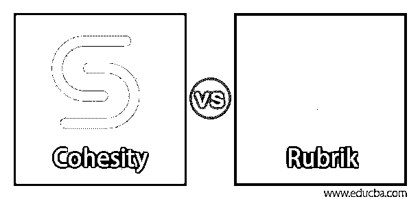
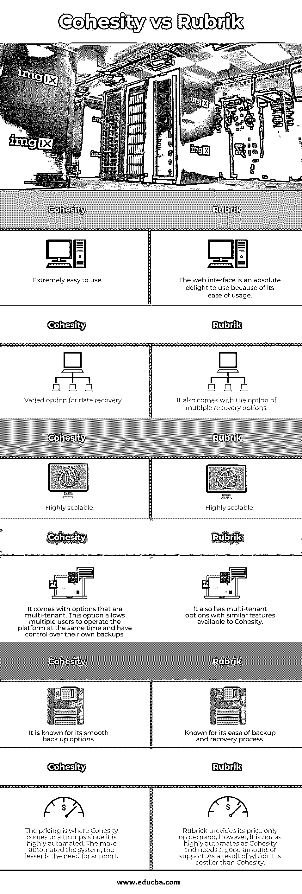

# 内聚性与规则性

> 原文：<https://www.educba.com/cohesity-vs-rubrik/>

## 内聚性与规则性的区别

Cohesity 和 Rubrik 都是由曾经是同事的人建立的。目前，在数据管理和恢复这一细分市场中，他们面临着最激烈的竞争。这种竞争和对抗肯定会进一步升温，Rubrik 指责 Cohesity 削弱了它。如果我们看一下软件系统及其各自设备的规格，我们会发现，除了一些小的差异之外，它们都是非常相似的系统，这是完全可以接受的。Rubrik 和 Cohesity 都是科技界的后起之秀，在数据管理和数据恢复市场掀起了风暴。易于使用且高度可扩展，使组织能够立即创建大规模备份。在关键场景中，这区分了失败和成功。在数据恢复和备份领域，两个最受欢迎的软件是 Cohesity 和 Rubrik。

### 什么是内聚性和 Rubrik？

以下是对 Cohesity 和 Rubrik 的详细解释:

<small>网页开发、编程语言、软件测试&其他</small>

#### 1.内聚性

Cohesity 是一家数据管理供应商，专门从事数据管理和恢复，并为此提供大量软件和设备。Cohesity 建立的专有系统之一是 DataProtect。它是使用 Cohesity 专有数据平台的数据保护和恢复软件。DataPlatform 是一个帮助组织有效整合数据的解决方案。

**粘结性特征:**

DataProtect 附带了许多功能，例如:

*   快速恢复点
*   代理服务系统
*   媒体服务器
*   云网关
*   即时恢复
*   超融合备份

C3000、C4000 和 C6000 型号能够存储大型文件和文档。

#### 2.标题呢

Rubrik 凭借其旗舰产品“Rubrik 云数据管理”进入数据管理和恢复领域。该解决方案允许客户端在任何需要的地方存储数据。它提供了一个易于使用的统一平台。Rubrik 支持多种存储选项。它们可以是虚拟存储、NoSQL 存储、物理存储和云存储。它带有其专有的红宝石北极星和红宝石马赛克。Polaris 是一个多统一系统，可以帮助客户获取数据，无论数据存储在哪里。Rubrik Mosaic 是一个专门为 NoSQL 创建的平台。Rubrik 云管理系统由三层构成。无限，脑波强化器和阿特拉斯。这三层为防止数据管理和恢复失败提供了一定的保证。它有许多功能:

**Rubrik 的特点:**

*   即时恢复
*   基于策略的控制
*   分析学
*   搜查
*   服从
*   数据管理副本
*   报告
*   安全性

这些特性可以跨所有平台、数据中心和云使用。有了 Rubrik，您将永远不会辜负您的 SLA，因为它适用于所有存储环境。

### Cohesity 与 Rubrik 之间的直接比较(信息图)

以下是 Cohesity 与 Rubrik 的 6 大对比 **:**

### 内聚性与规则性的主要区别

让我们从以下几点来讨论 Cohesity 与 Rubrik 之间的一些关键差异:

*   Rubrik 提供了一个实时的全球搜索选项，允许用户查找数据，无论数据位于何处。Cohesity 也是如此。但是，它们之间的区别在于，Rubrik 提供了灾难恢复流程编排。然而，Cohesity 的搜索选项更加无缝。
*   Rubrik 的界面是最容易使用的界面之一。Cohesity 为网络使用了一个直观的界面，虽然它的易用性很好，但比 Rubrik 稍逊一筹
*   Cohesity 和 Rubrik 都是基于硬件的系统。两者都提供了适用于小型组织和大型组织的设备。
*   Rubrik 体系结构允许无限扩展，而 Cohesity 体系结构在允许线性扩展的同时，最多允许 256 个节点。
*   Rubric 有一个单点失败，而 Cohesity，考虑到它的架构设计，没有一点失败。
*   与 Rubrik 相比，Cohesity 备份具有更高的不变性。此外，他们比红里克的更无缝。
*   Cohesity 的自动化程度高，专业维护服务的程度低。这使得它的成本低于 Rubrik。

### 连贯与规则对比表

下表总结了 Cohesity 与 Rubrik 之间的比较 **:**

| **内聚性** | **标题** |
| 极其容易使用。 | web 界面使用起来绝对令人愉快，因为它易于使用。 |
| 多种数据恢复选项。 | 它还提供了多种恢复选项。 |
| 高度可扩展。 | 高度可扩展。 |
| 它附带了多租户选项。此选项允许多个用户同时操作平台，并控制他们自己的备份。 | 它还提供多租户选项，具有 Cohesity 可用的类似功能。 |
| 它以其平滑的备份选项而闻名。 | 以其易于备份和恢复而闻名。 |
| 定价是 Cohesity 的一个王牌，因为它是高度自动化的。系统自动化程度越高，对支持的需求就越少。 | Rubrik 只根据需求提供价格。然而，它不像 Cohesity 那样高度自动化，并且需要大量的支持。因此它比内聚性更昂贵。 |

### 结论

这两家科技公司之间可能出现的唯一差异是在定价领域。尽管如此，他们都获得了足够多的客户，在数据管理和数据恢复领域跻身前 5 名。作为新人，这是一项艰巨的任务。

### 推荐文章

这是一个内聚性 vs Rubrik 的指南。在这里，我们讨论了 Cohesity 与 Rubrik 的主要区别，包括信息图表和比较表。您也可以看看以下文章，了解更多信息–

1.  [什么是 Apache Solr？](https://www.educba.com/apache-solr/)
2.  [Cassandra vs elastic search–最大差异](https://www.educba.com/cassandra-vs-elasticsearch/)
3.  [什么是 Elasticsearch？](https://www.educba.com/what-is-elasticsearch/)
4.  什么是 RESTful Web 服务？

