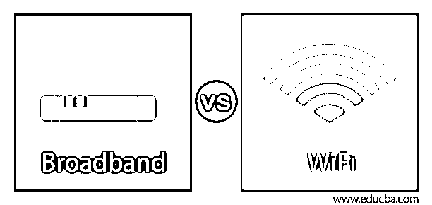
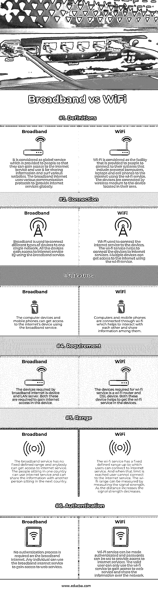

# 宽带与 WiFi

> 原文：<https://www.educba.com/broadband-vs-wifi/>

## 宽带与 WiFi 的区别

Wi-Fi 被认为是一种提供给用户的设施，用户可以通过信号定位来连接他们的设备(包括移动电话、笔记本电脑和计算机)以访问互联网，然后连接到该区域的其他无线设备。Wi-Fi 连接用于设置使用远程连接器的热点，以便客户端系统可以连接到 web 服务。宽带互联网被认为是用于向人们提供互联网接入的计算机网络，以便他们可以用来获取信息和浏览各种网站。

### 宽带与 WiFi 的面对面比较(信息图表)

以下是宽带与 WiFi 的五大对比:

<small>网页开发、编程语言、软件测试&其他</small>

### 宽带与 WiFi 的主要区别

我们来讨论一下宽带与 WiFi 的顶级对比:

*   wi-fi 和宽带互联网的主要区别在于，Wi-Fi 使用无线媒介将设备连接到互联网服务，该媒介定位信号并与位于该区域的设备连接。宽带互联网被认为是全球性的计算机网络，它向用户提供互联网服务以连接他们的设备来获得互联网服务并用于共享信息。宽带使用标准通信协议为其用户提供互联网接入。
*   wi-fi 和宽带互联网的另一个区别是，wi-fi 有助于将不同的设备连接到互联网服务。另一方面，宽带用于将多个设备连接到单个网络。随着设备数量的增加，互联网速度会下降。
*   wi-fi 和宽带的另一个关键区别是相互依赖。宽带不依赖于 wi-fi，并且可以向用户提供对互联网服务的访问，而另一方面，wi-fi 依赖于宽带互联网，因为 wi-fi 提供对互联网的访问。
*   wi-fi 和宽带的另一个区别是提供服务的范围和距离。为 wi-fi 定义的范围最多只有几码，随着距离的增加，wi-fi 服务的信号强度会下降。宽带互联网没有固定的距离范围，因为一个国家的人可以使用互联网服务，并与另一个国家的人共享信息。人们可以在任何地方使用宽带互联网服务，轻松分享信息。
*   宽带互联网和 wi-fi 的另一个关键区别是服务的用户数量。由于 wi-fi 是一种作为服务媒介向人们提供互联网的服务，它直接取决于使用该服务的用户数量。随着使用 wi-fi 服务的用户数量的增加，互联网速度变得缓慢，而且用户可以连接到特定 wi-fi 服务的容量也有所限制。而另一方面，宽带互联网服务具有无限的数量，许多用户可以同时连接到网络。宽带互联网不依赖于用户的数量，每个人都可以很容易地使用服务，并可以获得互联网接入以共享信息。在宽带连接中，互联网速度各不相同，无法保证用户将获得恒定的互联网速度。网速直接取决于网络拥塞。

### 宽带与 WiFi 对比表

下表总结了宽带与 WiFi 之间的比较:

| **因子** | **宽带** | **WiFi** |
| **定义** | 它被认为是一种全球服务，提供给人们以获得对互联网服务的访问，并使用它来共享信息和浏览各种网站。宽带互联网使用各种通信协议在全球范围内提供互联网服务。 | Wi-Fi 被认为是提供给人们使用 wi-fi 服务连接到他们的系统(包括个人计算机、笔记本电脑和手机)到互联网的设施。这些设备通过无线介质连接到位于其所在区域的设备。 |
| **连接** | 宽带用于将不同类型的设备连接到一个网络。所有设备都通过使用宽带服务来接入互联网服务。 | 用于将互联网服务连接到设备的 Wi-Fi。wi-fi 服务有助于将设备连接到互联网服务。多个设备可以使用 wi-fi 服务访问互联网。 |
| **功能** | 计算机设备和移动电话可以使用宽带服务访问互联网设备。 | 电脑和手机通过 Wi-Fi 连接，有助于彼此互动和分享信息。 |
| **要求** | 宽带互联网所需的设备是设备和局域网服务器。这两者都是设备接入互联网所必需的。 | wi-fi 服务所需的设备是 wi-fi 路由器和 DSL 设备。这两种设备都有助于在设备中获得 wi-fi 服务。 |
| **范围** | 宽带服务没有固定的范围，任何人都可以接入互联网服务。坐在一个国家的人们可以使用互联网服务，并且可以与坐在下一个国家的另一个人共享信息。 | wi-fi 服务有一个固定的定义范围，用户可以连接到互联网服务。并且当达到该限制时，用户不能连接到互联网服务。随着距离的增加，可以通过测量信号强度来测量 wi-fi 范围；信号强度降低。 |
| **认证** | 宽带互联网不需要认证过程。任何个人都可以使用宽带互联网服务来访问网络服务。 | Wi-Fi 服务可以被认证，并且可以设置密码以提供对互联网服务的访问。合法用户只能使用 wi-fi 服务来访问网络服务并通过网络共享信息。 |

### 结论

wi-fi 是一种使用某种无线介质将设备连接到互联网的服务。宽带被认为是一种服务，用于向用户提供互联网服务，以便他们可以共享信息。

### 推荐文章

这是一个宽带 vs WiFi 的指南。在这里，我们还将通过信息图和比较表来讨论宽带与 WiFi 的主要区别。您也可以看看以下文章，了解更多信息–

1.  [网络设备类型|前 8 种类型](https://www.educba.com/types-of-network-devices/)
2.  [道德黑客工具概述](https://www.educba.com/ethical-hacking-tools/)
3.  [FTP vs SFTP | 12 强对比](https://www.educba.com/ftp-vs-sftp/)
4.  [Wi-Fi 与以太网的主要区别](https://www.educba.com/wifi-vs-ethernet/)

