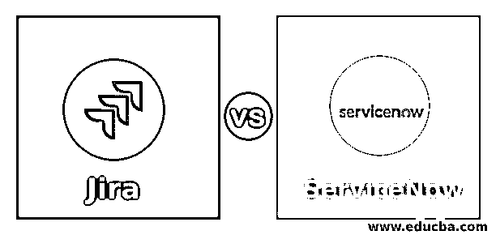
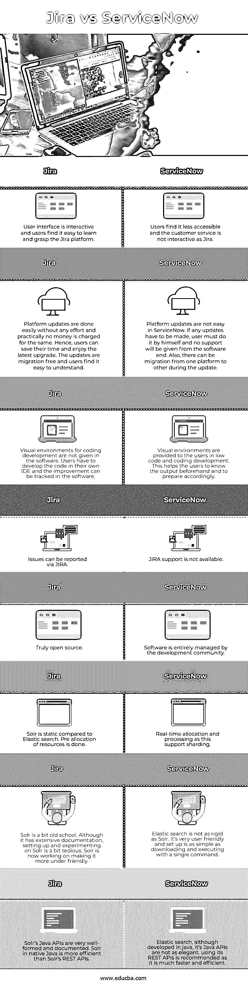

# 吉拉 vs ServiceNow

> 原文：<https://www.educba.com/jira-vs-servicenow/>

## 吉拉与 ServiceNow 的区别

以下文章概述了吉拉与 ServiceNow。项目中使用的一个问题跟踪产品叫做吉拉，它有助于 bug 跟踪和敏捷项目管理。它由 Atlassian 开发，用 Java 语言编写。随着项目团队的发展和在发展中做出改变，它可以添加或改变项目的问题、字段或工作流。ServiceNow 是一款面向企业的软件，有助于事件管理和满足项目中的要求。它完全负责项目中的 It 和服务管理问题。IT 业务管理是自动化的，它是一个基于云的平台，帮助用户遵循 ITIL 准则。

### 吉拉与 ServiceNow 的直接对比(信息图)

以下是吉拉和 ServiceNow 之间的 8 大区别:

<small>网页开发、编程语言、软件测试&其他</small>

### 吉拉与 ServiceNow 的主要区别

让我们讨论一下吉拉和 ServiceNow 之间的一些主要区别:

*   与 ServiceNow 相比，吉拉的价格较低，并且是按代理计算的。在吉拉，价格大约是每个代理每月 20 美元，而在 ServiceNow，价格是每个用户每月 100 美元。
*   吉拉总是建立在吉拉平台上，不使用任何其他平台。ServiceNow 不是建立在吉拉平台上的，这是两者的主要区别之一。
*   吉拉设置很容易，安装可以比预期更快完成。ServiceNow 的安装并不容易，安装需要时间。吉拉平均需要 1.2 个月才能上线，而 ServiceNow 平均需要 4.5 个月才能上线。
*   ServiceNow 的服务依赖于提出的请求，它不是由处理其他问题的同一组人来解决的。而在吉拉，所有请求都由一个服务台处理和解决，从而使运营更加顺畅。
*   ServiceNow 是一个基于云的应用程序，只能在云上运行，我们不能在内部运行。吉拉可以在内部和云平台上运行。
*   ServiceNow 面向企业，主要关注 ITIL。吉拉不是企业类型，外观和感觉比 ServiceNow 吸引更多的客户。任何业务类型都可以在吉拉进行，用户可以很快学会如何操作。
*   ServiceNow 的学习曲线很陡，因为用户发现探索不同的技术很好，而且使用了基于云的平台。吉拉的学习曲线并不陡峭，客户探索吉拉的已知用例以及项目软件的内部使用。
*   ServiceNow 通过为客户提供社区门户和产品文档来支持该平台。另一方面，吉拉提供了一个开发者门户和一个社区网站，这样用户就可以在这个门户中找到问题的答案。
*   ServiceNow 中提供了更多的集成和 API，并且有一个用于在应用程序中构建附加组件的文档化 API。在吉拉，虽然为构建附加组件提供了文档，但定制的集成较少，用户必须构建集成才能使用。

### 吉拉与 ServiceNow 对比表

让我们讨论一下吉拉与 ServiceNow 之间的主要比较:

| **吉拉** | **ServiceNow** |
| 用户界面是交互式的，用户很容易学习和掌握吉拉平台。 | 用户发现它不太容易接近，客户服务也不像吉拉那样互动。 |
| 平台更新很容易完成，不需要任何努力，而且几乎不需要花钱。因此，用户可以节省时间，享受最新的升级。这些更新是免费迁移的，用户觉得很容易理解。 | ServiceNow 中的平台更新并不容易。如果必须进行任何更新，用户必须自己完成，软件端不提供任何支持。此外，在更新期间，可以从一个平台迁移到另一个平台。 |
| 软件中没有给出编码开发的可视化环境。用户必须在他们自己的 IDE 中开发代码，并且可以在软件中跟踪改进。 | 可视化环境提供给低级代码和编码开发中的用户。这有助于用户预先了解输出并做好相应的准备。 |
| 在吉拉做应用程序开发时，平台服务是收费的，因为它是一个吉拉平台，用户发现它是交互式的。 | 平台服务是不收费的，平台取决于用户如何以及何时根据需要和使用来使用服务。有免费和付费的附加软件供用户使用，这样他们可以做出正确的决定。 |
| 硬件不在吉拉共享，因为它不是一个企业相关的平台。因此，没有订阅费，服务将照常提供。 | 由于硬件是在 ServiceNow 中共享的，如果从不同的系统使用服务，成本会发生变化，订阅费将被添加到额外的成本中。 |
| 如果服务是基于时间的事件，则不会增加额外费用，因为吉拉基本上是项目中的一个问题跟踪者。检查项目中的各种任务和问题，并向领导通报。 | 如果事件是相互关联的，并且基于基于时间的事件，额外的费用将被添加到 ServiceNow 的成本中，因为它不是问题跟踪程序，而是与企业相关。 |
| 在吉拉中添加了离线功能，当系统没有连接到网络时可以进行更改，因为它基于与时间相关的事件。 | ServiceNow 中没有离线功能，因为所有结果都在网络的帮助下存储在工具中，当系统离线时不能进行任何更改。 |
| 吉拉平台和吉拉软件有相同的用户界面和相同的 API，很容易与吉拉软件内的任何应用程序。 | 平台和软件建立在各种软件之上，因此 UI 和 API 是不同的。这使得软件更加复杂，从而导致生产力下降。 |

### 结论

用户需要了解项目的需求，并根据需求选择工具。成本是一个重要因素，每个工具提供的功能也是如此。复杂性取决于第一次使用的用户，一旦用户熟悉了这些概念，所有的工具都很容易。

### 推荐文章

这是吉拉 vs ServiceNow 的指南。在这里，我们通过信息图和比较表来讨论吉拉与 ServiceNow 的主要区别。您也可以看看以下文章，了解更多信息–

1.  [吉拉 vs 阿萨纳](https://www.educba.com/jira-vs-asana/)
2.  支尔格对雷场
3.  [吉拉 vs 特雷罗](https://www.educba.com/jira-vs-trello/)
4.  [吉拉 vs Github](https://www.educba.com/jira-vs-github/)

