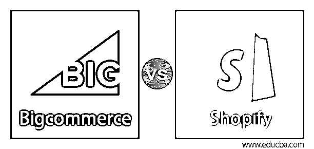
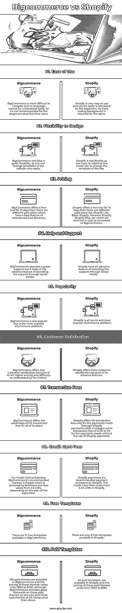

# Bigcommerce vs Shopify

> 原文：<https://www.educba.com/bigcommerce-vs-shopify/>

## Bigcommerce 与 Shopify 的区别

Bigcommerce 是允许开发在线商店的顶级电子商务平台之一。BigCommerce 于 2009 年进入市场。Bigcommerce 提供了一种独特的用户界面和用户体验设计方法。BigCommerce 提供了一个软件即服务的电子商务平台。Bigcommerce 是提升搜索排名的绝佳 SEO。Bigcommerce 有一些内置的高级功能，从令人印象深刻的数据报告工具到 0%的交易费用。Bigcommerce 允许人们通过他们的网站销售基于服务的、数字的和实体的产品。Bigcommerce 最好的一点是，使用第三方支付解决方案不需要额外收费。

Shopify 也是一个电子商务平台，提供各种工具来帮助人们建立和运营他们的业务。为了让自己的商店看起来很棒，很突出，Shopify 主题商店提供免费和付费主题，同样，为了扩展自己商店的功能，Shopify 应用商店提供免费和付费应用。除了个人的 Shopify 计划之外，Shopify 还提供独家的 24/7 支持。Shopify 每笔交易收费，从交易费用的 0-2.0%不等。

<small>网页开发、编程语言、软件测试&其他</small>

### Bigcommerce 与 Shopify 的面对面比较(信息图表)

以下是 Bigcommerce 与 Shopify 的 10 大区别:

### Bigcommerce 与 Shopify 的主要区别

以下是 Bigcommerce 与 Shopify 的主要区别:

*   多种货币支持: BigCommerce 拥有支持多种货币的高级功能，因此全球买家可以用他们的本地货币进行交易，而 Shopify 不提供国际可扩展性。对于多币种支持，必须依赖第三方应用程序。
*   **内置功能:** BigCommerce 在大多数电子商务平台上都有内置的开箱即用功能，而 Shopify 则缺乏这一功能。
*   **SEO 营销:** BigCommerce 内置了出色的搜索引擎优化，以提高搜索排名，为网站吸引大量流量，而 Shopify 也缺乏这一功能。
*   **易用:** Shopify 比较好用，最受新手欢迎，而 BigCommerce 复杂的术语让它非常不适合新手。
*   切换模板:如果你想切换网站的主题，BigCommerce 太灵活了，而在 Shopify 中，切换模板意味着重新格式化你的网站。
*   **销售功能:**销售功能包括从运输选项到交易费用的一切。Shopify 有一个广泛的应用程序商店，可以帮助人们向电子商务网站添加任何内容，而 BigCommerce 则为市场上的任何电子商务平台提供了高级内置功能，但与 Shopify 相比，它缺少一些功能。所以 Shopify 被认为是销售功能最好的。
*   **支持:**Shopify 和 BigCommerce 都提供了许多支持选项，如 24/7 实时聊天、电子邮件和 24/7 电话，但 Shopify 通过社交媒体提供了一个额外的支持选项，而这一支持功能是 BigCommerce 所不具备的。
*   **年销售额限制:**在 BigCommerce 中，标准计划的年销售额限制为 5 万美元，plus 计划的年销售额限制为 15 万美元，Pro 计划的年销售额限制为 40 万美元，而在 Shopify 中，年销售额没有限制。

### Bigcommerce 与 Shopify 对比表

让我们讨论一下 Bigcommerce 与 Shopify 之间的顶级对比:

| **功能** | **大贸易** | **Shopify** |
| **易用性** | BigCommerce 更难导航，它的语言也不容易理解。所以不建议新手和初次用户使用。 | Shopify 非常好用，初学者也很容易理解。同样不需要硬编码背景。 |
| **设计的灵活性** | BigCommerce 提供了很大的灵活性，因为人们可以很容易地改变网站的模板。 | Shopify 不够灵活，因为要改变网站的模板，必须重新格式化整个网站。 |
| **定价** | BigCommerce 提供 15 天的免费试用；然后，不同的付费计划放弃了购物车恢复的最佳功能。 | Shopify 提供 14 天的免费试用。有不同的付费计划，如 Shopify Lite、基本 Shopify、高级 Shopify、Shopify Plus 等。与 BigCommerce 相比，它的成本最低。 |
| **帮助和支持** | BigCommerce 提供了强大的支持，但它缺乏通过社交媒体提供支持的高级功能。 | Shopify 具有通过社交媒体提供支持的高级功能。 |
| **人气** | BigCommerce 不太受欢迎，但它是最具扩展性的电子商务平台。 | Shopify 是一个全方位的、最受欢迎的电子商务平台。 |
| **客户满意度** | BigCommerce 提供的客户满意度较低，因为它的定价稍高，而且难以被新人理解。 | Shopify 的高级功能让客户更加满意。 |
| **交易费用** | BigCommerce 为其所有计划提供 0%交易费的优势。 | Shopify 仅对通过 Shopify 支付进行的支付收取 0%的交易费，而对不使用 Shopify 支付进行的支付收取 0.5%至 2%的交易费。 |
| **信用卡费用** | 对于信用卡处理，BigCommerce 的推荐合作伙伴是 Paypal，其 Braintree 的权限和费用从 2.2%到 9%不等，取决于订户的计划。 | Shopify payments 是 Shopify 推荐的支付处理器。Shopify 的刷卡手续费从 2.4%-2.9%不等。 |
| **免费模板** | BigCommerce 中有 12 个免费模板。 | Shopify 中只有 8 个免费模板。 |
| **付费模板** | BigCommerce 中有 130 个付费主题，这些主题的定价从 165 美元到 250 美元不等。虽然 BigCommerce 在这些付费主题上提供了很好的折扣，但人们可以选择比上述更便宜的付费主题。 | Shopify 中有 64 个付费模板，这些付费主题的定价从 140 美元到 180 美元不等。 |

### 结论

根据上述比较，很难在 BigCommerce 和 Shopify 之间选择一个赢家，因为这两个平台都有自己的弱点和优势。选择 BigCommerce 的优势在于，无论使用哪种支付网关，都不会产生交易费，而且在 BigCommerce 中创建个人商店的 AMP 版本是免费且简单的。而且选择 Shopify 的好处是，以比 BigCommerce 非常低的成本，提供自动的弃车回收，在很多方面都比 BigCommerce 便宜很多。

### 推荐文章

这是 Bigcommerce vs Shopify 的指南。在这里，我们还将讨论 bigcommerce 与 shopify 的主要区别，包括信息图表和比较表。您也可以看看以下文章，了解更多信息–

1.  [MongoDB vs SQL server](https://www.educba.com/mongodb-vs-sql-server/)
2.  [Hadoop vs MongoDB](https://www.educba.com/hadoop-vs-mongodb/)
3.  [Magento vs Shopify](https://www.educba.com/magento-vs-shopify/)
4.  [WordPress vs Shopify](https://www.educba.com/wordpress-vs-shopify/)

