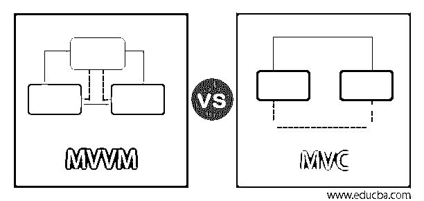

# MVVM vs MVC

> 原文：<https://www.educba.com/mvvm-vs-mvc/>

## MVVM 与 MVC 的区别

MVC 和 MVVM 是软件应用中著名的设计模式。设计模式支持许多应用程序的开发，为了简单的测试和维护，这些应用程序被简单地组合在一起。在这里，MVC 是通过结合控制器的操作、模型和视图来运行的，而 MVVM 是通过视图模型、模型和视图来运行的。设计模式旨在最大限度地降低表示层代码的复杂性，使用户界面无错误、整洁、有组织且易于管理。本文阐述了 MVC 和 MVVM 的比较和区别。

### MVVM 和 MVC 的面对面比较(信息图)

以下是 MVVM 和 MVC 的 8 大区别:

<small>网页开发、编程语言、软件测试&其他</small>

### MVVM 与 MVC 的主要区别

主要的关键区别，如体系结构、操作、优点和局限性将在下一节讨论，

#### 1.操作原理

MVC 的格式可以被编辑成最小的部分，以便理解设计模式之间的关系。链接分离模型和视图的简单方法是开发一个控制器，使视图能够开发数据模型。MVC 中的间接方法使查看者能够与背景交互，但它并不适用于每个应用程序。MVC 中的控制器不适合单页应用程序。这是一种流行的技术，通过一个非创造性的界面 ViewModel 来关联模型的视图。视图模型强烈依赖于前端应用程序，而在 MVVM 方法中，视图模型不是控制器。它的功能就像一个结合器，融合了模型和视图之间的信息。但是 MVC 的格式被用来开发依赖于视图和模型的分离。MVVM 的格式用于双向交互，在单页应用程序中非常有效。

#### 2.设计模式

1970 年引入的软件设计模式被称为 MVC，它推动了关注点的分歧，坚持领域模型和与用户界面分离的逻辑控制器。应用程序的测试和维护，简单易行。MVC 的结构分为控制器、模型和视图。在 MVVM 的设计模式中，它支持视图模型和视图之间的双向数据绑定。它支持 ViewModel 内部的本能传播来查看选项。视图模型使用观察序列来坚持视图模型中的任何变更，并且可以在模型中反映出来。

#### 3.体系结构

模型中的类集合描述了业务和数据模型。它描述了解释数据变更和操作的业务策略。在 MVC 中，模型是由业务逻辑定义的，业务逻辑由类的集合来解释。数据访问操作由业务和数据模型给出，它解释了业务规则中数据的安排和操作。MVC 和 MVVM 视图表示用户界面的组件，比如 CSS、HTML 和 jQuery。显示由视图提供，结果是从控制器收集数据。它还可以调整模型，并将其输入用户界面。MVVM 的 ViewModel 负责在视图和模型控制台中显示命令和功能、引导和查看状态以及触发实例。MVC 中的控制器负责处理传入的请求。它通过视图接收输入，然后通过模型处理并输出到视图。控制器充当模型和视图之间的中介。

### MVVM vs MVC 对比表

让我们来讨论一下 MVVM 和 MVC 的顶级对比:

| **属性** | **MVC** | **MVVM** |
| **架构** | 基础结构序列用于开发用户界面，它将应用程序分成三个内部连接的组件，如控制器、视图和模型。 | 基础设施序列促进了内置图形用户界面的分离，以开发后端逻辑和业务逻辑。 |
| **工作原理** | MVC 的工作是基于模型所表现的数据，视图用于定义用户界面，而控制器管理请求。 | 在 MVVM，模型定义了对象和实体；视图定义了用户界面。ViewModel 描述了视图和模型之间的合并。 |
| **应用程序** | 它被 Java、Spring、Asp 和. NET 使用。 | 它被微软 APF、Angular JS 和 Silverlight 使用。 |
| **用途** | MVC 支持异步请求，系统中的任何修改都不会影响整个应用程序。 | MVVM 提供独立的测试单元。整个系统的组件独立工作。内部组件的改变可以被改变，而不影响系统其余部分的操作。 |
| **输入数据** | 控制器管理 MVC 的输入。 | MVVM 的输入从模型开始。 |
| **映射** | 控制器和视图之间的连接是使用多对单关系建立的。 | 不同的视图模型提供了过多的连接。 |
| **视图功能** | MVC 视图的建立是为了定义用户界面，它与控制器没有任何关系。 | MVVM 视图包含对视图信息的任何引用。WCF 和 Silverlight 在 ViewModel 上共享一些视图。 |
| **控制器功能** | 视图在控制器上有功能，控制器不向模型传递任何逻辑。 | 视图的功能对模型没有任何感知。 |

### 优点和缺点

以下是 MVVM 与 MVC 的优缺点:

#### 优势

MVVM 的关键元素在数据绑定中提供了一个强大的模式，它用于在 XAML 平台中获取自然序列。它在请求之间提供了一个隔离空间。在应用中增加了可测试性特征。在 MVC 中，组件彼此不依赖，并提供隔离单元测试。MVC 中的内部实现可以在不影响其他系统的情况下进行更改。系统任何部分的修改都不会影响整个系统的生产率。MVC 支持异步方法，帮助程序员快速执行代码和开发应用程序。

#### 限制

MVVM 是基于观察者模式的工作，而 MVC 增加了复杂性。

### 推荐文章

这是一个 MVVM vs MVC 的指南。在这里，我们还通过信息图和比较表讨论了 MVVM 和 MVC 的主要区别。您也可以看看以下文章，了解更多信息–

1.  [MVC vs MVP](https://www.educba.com/mvc-vs-mvp/)
2.  [MVC vs MVP vs MVVM](https://www.educba.com/mvc-vs-mvp-vs-mvvm/)
3.  [MVP vs MVVM](https://www.educba.com/mvp-vs-mvvm/)
4.  [MVC 视图数据](https://www.educba.com/mvc-viewdata/)

