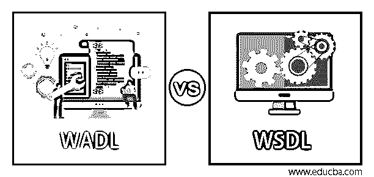
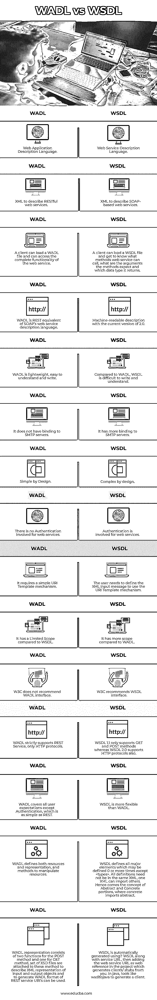

# WADL 对 WSDL

> 原文：<https://www.educba.com/wadl-vs-wsdl/>

## WADL 和 WSDL 的区别

在这篇文章中，我们将讨论 WADL 与 WSDL。之前我们研究了 SOAP 和 REST。WADL vs WSDL 就是要找出关键的不同点并进行比较。随着 RESTful Web 服务的兴起，有必要为这些类型的 Web 服务引入契约/接口。WADL 和 WSDL 是客户机和服务器之间的 web 服务契约/接口。web 服务的一个重要部分是位于服务器和客户端之间的接口。

### WADL 与 WSDL 的对决(信息图)

以下是 WADL 和 WSDL 的 15 大比较 **:**

<small>网页开发、编程语言、软件测试&其他</small>

### WADL 与 WSDL 的主要区别

让我们从以下几点来讨论 WADL ( Web 服务描述语言)和 WSDL ( Web 应用程序描述语言)之间的一些关键区别:

**1。WADL 是一种 XML 文件格式，而 WSDL 是一种描述 web 服务的 XML 语言。**

**2。** WADL 是基于 HTTP 的 REST web 服务的机器可读描述。

**3。** Web 服务被描述为一组通信端点/端口；端点由操作和消息组成

**4。** WSDL 负责提供操作/消息和调用所需的数据

**5。**使用数据格式和协议访问接口，作为特定的网络地址，如 URL。

**6。** WADL 用于简化基于现有 HTTP 架构的 web 服务重用，使用一组资源元素描述。

**7。**对于 RESTful 和混合服务，首选 Web 应用描述语言，WADL 库解析文件和可能的服务请求为 API。

**8。**WSDL 的主要元素:

| **元素** | **描述** |
| **<类型>** | 定义 XML 架构 web 服务中使用的数据类型。 |
| **<消息>** | 为 web 服务中的每个操作定义数据元素。 |
| **< portType >** | 描述了 web 服务中涉及的操作和消息。 |
| **<绑定>** | 基于 web 服务中的端口类型定义协议和数据格式。 |

**9。**WADL 的主要元素:

| **元素** | **描述** |
| **<语法>** | 在 web 服务中指定 W3C XML 架构。 |
| **<资源>** | 将 web 服务支持的方法指定为 URI 模板。 |
| **<方法>** | 指定 web 服务的请求和响应详细信息。 |
| **<表象>** | 描述 HTTP 格式，它指的是语法。 |

10。 WADL 被描述为一组资源元素，由描述请求和响应的输入和元素方法组成。

### WADL 与 WSDL 对比表

下表总结了 WADL 对 WSDL 的比较 **:**

| **WADL** | **WSDL** |
| Web 应用程序描述语言。 | Web 服务描述语言。 |
| XML 来描述 RESTful web 服务。 | XML 来描述基于 SOAP 的 web 服务。 |
| 客户端可以加载 WADL 文件，并可以访问 web 服务的完整功能。 | 客户端可以加载一个 WSDL 文件，并且知道 web 服务可以调用什么方法，这些方法需要什么参数，以及它返回什么数据类型。 |
| WADL 是 SOAP 的 web 服务描述语言的 REST 等价物。 | 当前版本为 2.0 的机器可读描述。 |
| WADL 是轻量级的，易于理解和书写。 | 与 WADL 相比，WSDL 很难写和理解。 |
| 它不绑定到 SMTP 服务器。 | 它对 SMTP 服务器有更多的绑定。 |
| 设计简单。 | 设计复杂。 |
| web 服务中不涉及身份验证。 | web 服务中涉及到身份验证。 |
| 它需要一个简单的 URI 模板机制。 | 用户需要定义 XML 输入消息来使用 URI 模板机制。 |
| 与 WSDL 相比，它的范围有限。 | 与 WADL 相比，它有更大的发展空间。 |
| W3C 不推荐 WADL 接口。 | W3C 推荐 WSDL 接口。 |
| WADL 严格支持 REST 服务，只支持 HTTP 协议。 | WSDL 1.1 只支持 GET 和 POST 方法，而 WSDL 2.0 也支持 HTTP 协议。 |
| WADL 涵盖了除认证之外的所有用户期望，认证就像 REST 一样简单。 | WSDL 比 WADL 更灵活。 |
| WADL 定义了资源和表示以及操纵资源的方法。 | WSDL defines all major elements which may be defined 0 or more times except <types>. All definitions need not be in the same XML; one XML can import others.因此出现了抽象部分和具体部分的概念，具体部分引入了抽象部分。 |
| WADL 表示由 POST 方法的两个函数和 GET 方法的一个函数组成；该方法附有一组 XSD 文件，用于描述输入和输出对象的 XML 表示，并生成可使用的 WADL 格式的 REST 服务 URI。 | WSDL 是使用？WSDL 和服务 URL，然后将 web 服务 URL 作为 web 引用添加到项目中，从您生成客户端/存根。在 java 中，像 wsdltojava 这样的工具用来生成客户端。 |

### 结论

WSDL 2.0 定义了 HTTP 协议以及 GET、POST、PUT 和 DELETE 方法的显式映射。WSDL 是资源导向，不是服务导向；因此，与 WADL 相比，RESTful 服务有所不同。抽象元素是 WSDL 2.0 中的<types>、<message>、 <porttype>/ <interface>。具体元素有<binding>和<service>。这种分离允许在定义 WSDL 服务时实现最大程度的重用和灵活性。这无疑是一场精彩的 WADL 对 WSDL 之旅。我们以公平的方式报道了 WADL 与 WSDL 的关键点和分歧；我们也看到了 WADL、WSDL 1.1 和 WSDL 2.0 的界面。，但是这些服务规范还有很多需要探索的地方。</service></binding></interface></porttype></message></types>

### 推荐文章

这是一个关于 WADL 和 WSDL 之间最大差异的指南。在这里，我们通过信息图和比较表来讨论 WADL 和 WSDL 的主要区别。您也可以看看以下文章，了解更多信息–

1.  [什么是 Apache Solr？](https://www.educba.com/apache-solr/)
2.  [卡珊德拉 vs 弹性搜索](https://www.educba.com/cassandra-vs-elasticsearch/)
3.  [什么是 Elasticsearch？](https://www.educba.com/what-is-elasticsearch/)
4.  [RESTful 服务](https://www.educba.com/restful-services/)

