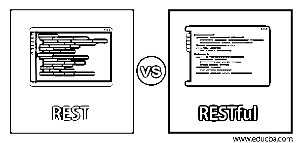
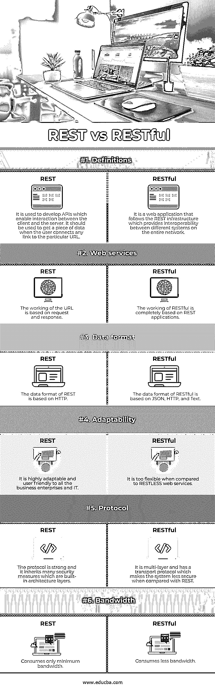

# 休息与宁静

> 原文：<https://www.educba.com/rest-vs-restful/>

## REST 和 RESTful 的区别

REST 表示通过 HTTP 与客户机共享 JSON 文件的服务器。这是一个完整的版本，似乎不完全依赖于 JSON、XML 或 HTTP。Restful 是 web exchange server 的一种高级形式，它共享任何其他文档或 JSON 来开发任何新的应用程序。其余的表示表述性状态转移，它使用一种架构模式来开发新的 web 服务并实现该架构模式；实现了 RESTful 服务。在本文中，我们将看到 REST 和 RESTful 之间的区别。

### REST 与 RESTful 的直接比较(信息图)

以下是 REST 与 RESTful 的 6 大对比 **:**

<small>网页开发、编程语言、软件测试&其他</small>

### REST 和 RESTful 的主要区别

让我们从以下几点来讨论 REST 和 RESTful 之间的一些关键区别:

#### 1.体系结构

REST 应用架构具有客户端-服务器、无状态、可缓存、分层系统和统一接口。但是在 RESTful web 应用程序中，它结合了与 REST 相同的架构，但是它具有独特的特性。REST 应用程序有一个单独的系统来处理应用程序信息。这个 REST 服务器与管理用户交互的客户机-服务器进行交互。它定义了独立轨道中的更新和改进。

#### 2.稳定性

REST 服务器不维护任何客户端状态，客户端管理所有应用程序阶段。对服务器的请求包括处理它们所需的所有强制数据。如果 RESTful APIs 中的状态有任何波动，客户机会回复系统进行存储。使用基础设施从 REST 中获取特定的对比度数据，该基础设施利用分布式对象来阻止来自其他组件的信息。但是在 REST 系统中，客户机和服务器交换关于状态和数据的知识。在 RESTful 服务中，数据隐藏不会发生，它只是隐藏了实现。

#### 3.缓存能力

REST 系统必须将响应表示为可缓存或不可缓存。因此，当有可能提高性能时，客户端和基础设施可以存储它们。当没有客户端使用存储的数据时，它可以替换不可缓存的数据。在 RESTful 应用程序中，客户端可以随时随地访问不偏离的状态和可缓存的信息。

#### 4.不偏离界面

这是最广为人知的基于用户需求的规则。核心功能将 REST 的架构与另一个依赖网络的外观隔离开来，因为它嵌入在设备之间的不可分离的接口上。REST 服务将数据作为一种资源来提供，具有惟一的、独立的名称空间。

#### 5.多层架构

在静止状态下，系统中的设备无法查看层以外的内容。因此，它可以简单地增加负载平衡器，并制作一些代理来增强性能和安全性。但是在 RESTful API 中，分层架构是建立在客户端-服务器上的，在这里，无状态的限制被合并以开发一个具有强边界的应用程序，并且边界之间的分离是清晰的。各层之间的数据流是基于客户需求的。客户端处理数据或显示数据。

#### 6.Web 服务上的远程过程调用

如果用户提到，如果一个服务不是在休息，它是在搜索 URI 工作或服务的 HTTP 动词。它被称为统一资源集，是 REST 数据的结构化表示。所以这种在每一帧或每一层之间的隔离被称为远程过程调用上的休息。用于添加、调度、从库存或电子商务数据库中删除任何对象的 web 服务可以由 RPC on REST 来完成。带有 HTTP POST 和 HTTP GET 查询的单一 URL 链接用于通过发布文件和配置内容来完成需求，从而与服务进行交互。REST 和 RESTful 服务用来执行 HTTP 操作的常用命令是 PUT、DELETE、GET、POST 和 PATCH，这些命令都有特定的限制。结构化 API 可以根据客户端的要求返回唯一的代码。

#### 7.理查森的成熟度模型

URI 资源利用 HTTP，使用户预测 API。但是如果它是不可预测的，用户可以通过超文本来使用 REST 服务。每个对象都可以在 inventory 应用程序中返回，该应用程序包含许多用于删除、编辑、输入或配置资源库存数据库的链接。文件解释说，在任何服务都是 RESTful 之前，它应该将超文本内容作为 API 的一部分。但是很多 web 服务没有满足这个需求，调用了 REST。在许多站点中，规则被分成较小的部分，Richardson 模型创建了一个 REST，它具有许多高级安全性级别的遵从性。该模型为设计和创建任何新的应用程序提供了合适且有效的指导。

### REST 与 RESTful 的比较表

下表总结了 REST 与 RESTful 的比较 **:**

| **属性** | **休息** | **宁静** |
| **定义** | 它用于开发支持客户机和服务器之间交互的 API。当用户将任何链接连接到特定的 URL 时，应该使用它来获取一段数据。 | 它是一个遵循 REST 基础设施的 web 应用程序，提供了整个网络上不同系统之间的互操作性。 |
| **网络服务** | URL 的工作基于请求和响应。 | RESTful 的工作完全基于 REST 应用程序。 |
| **数据格式** | REST 的数据格式是基于 HTTP 的。 | RESTful 的数据格式基于 JSON、HTTP 和 Text。 |
| **适应性** | 它对所有商业企业和 It 来说都具有高度的适应性和用户友好性。 | 与不安分的 web 服务相比，它太灵活了。 |
| **协议** | 该协议是强大的，它继承了许多安全措施，这些措施是内置的架构层。 | 它是多层的，并且有一个传输协议，与 REST 相比，这使得系统的安全性较低。 |
| **带宽** | 仅消耗最小带宽。 | 消耗更少的带宽。 |

### 推荐文章

这是一本关于 REST 和 RESTful 的指南。这里我们用信息图和比较表来讨论 REST 和 RESTful 的主要区别。您也可以看看以下文章，了解更多信息–

1.  [什么是 Apache Solr？](https://www.educba.com/apache-solr/)
2.  [Cassandra vs elastic search–最大差异](https://www.educba.com/cassandra-vs-elasticsearch/)
3.  [什么是 Elasticsearch？](https://www.educba.com/what-is-elasticsearch/)
4.  什么是 RESTful Web 服务？

