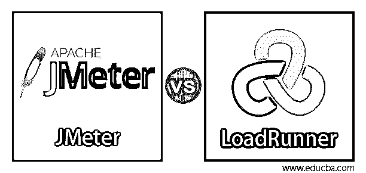
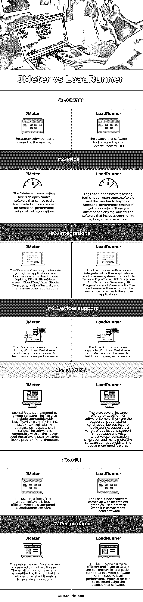

# JMeter vs LoadRunner

> 原文：<https://www.educba.com/jmeter-vs-loadrunner/>

## JMeter 与 LoadRunner 的区别

Loadrunner 被归类为 HP 提供的软件，广泛用于性能测试和检测 web 应用程序中存在的问题和威胁。该软件最好用于在应用程序的实际实现开始之前检测应用程序中的早期缺陷。JMeter 是 Apache 提供的另一个软件测试类型工具，开发人员使用它来测试应用程序。JMeter 软件是一个开源工具，使其适合开发人员在他们的应用程序中进行测试。它还用于 web 应用程序的功能性能。

### JMeter 与 LoadRunner 的面对面比较(信息图表)

以下是 JMeter 和 LoadRunner 之间的 7 大对比:

<small>网页开发、编程语言、软件测试&其他</small>

### JMeter 与 LoadRunner 的主要区别

让我们讨论一下 JMeter 和 LoadRunner 之间的一些主要区别:

1.  JMeter 软件和 LoadRunner 软件的主要区别在于软件的用途和软件的价格。JMeter 软件是一款开源软件，可以从其官方网站轻松下载。另一方面，LoadRunner 软件有付费版本，用户必须为使用该软件付费。开发人员更喜欢用 JMeter 软件来测试 web 应用程序的软件性能和基准测试。企业使用 LoadRunner 软件，因为它是一个付费版本，组织用来检测其 web 应用程序中的错误和问题，并测量其应用程序的性能。
2.  JMeter 软件和 LoadRunner 软件的另一个区别是它们支持的平台。JMeter 软件可以支持各种平台，如 Java 对象、servlets、FTP 服务器、数据库查询、HTTP、SOAP、Pearl 脚本和许多其他平台。JMeter 软件可以很容易地在所有提到的平台上运行测试。LoadRunner 软件可以支持各种平台，如 web 服务。net、J2EE、SAP、Siebel、PeopleSoft、无线媒体等等。所有这些平台都可以用来测试性能，并且可以使用 LoadRunner 软件进行测试。
3.  JMeter 软件和 LoadRunner 软件的另一个区别是使用的用户界面和性能。与 LoadRunner 软件相比，JMeter 软件的用户界面不够熟练，功能也较少。与 JMeter 软件相比，LoadRunner 软件在技术上更加熟练，并且具有更多的 g =特性，开发速度更快。与 JMeter 软件相比，LoadRunner 的用户界面结构更加复杂。LoadRunner 的性能远远超过 JMeter 软件。随着 LoadRunner 推出一个付费版本，它包含了更多用于查找 bug 和 web 应用程序问题的高级功能。LoadRunner 软件能够识别应用程序中存在的几乎所有错误，并增强应用程序的性能。由于 JMeter 是一个开源工具，所以它只有有限的特性，开发人员用它来发现应用程序中的错误。
4.  这两个软件的另一个区别是生成负载的能力。JMeter 软件能够生成无限的负载，并且可以处理其中的任意多个请求。另一方面，LoadRunner 软件生成的负载是有限的。
5.  JMeter 软件和 LoadRunner 软件的另一个区别是定制软件的特性。由于 JMeter 软件是一个开源工具，它提供了定制现有特性的功能，并根据需要对其进行修改。LoadRunner 不是开源的；因此，这些功能无法定制，用户必须使用软件提供的功能。

### JMeter 与 LoadRunner 的比较表

让我们来看看 JMeter 与 LoadRunner 之间的主要比较|

| **比较的基础** | **JMeter** | **装载机** |
| **所有者** | Apache 拥有 JMeter 软件工具。 | Loadrunner 软件工具归惠普公司所有。 |
| **价格** | JMeter 软件测试工具是开源软件，可以轻松下载，并可用于 web 应用程序的功能性能测试。 | Loadrunner 软件测试工具不是开源软件，用户必须购买才能对 web 应用程序进行功能性能测试。该软件有不同的版本，包括社区版和企业版。 |
| **集成** | JMeter 软件可以与其他应用程序和业务系统集成，包括 Jenkins、JSUnit、BlazeMeter、Maven、CloudGen、Visual Studio、Dynatrace、Meliora TestLab 和许多其他应用程序。 | Loadrunner 软件可以与其他应用程序和业务系统集成，包括 Jenkins、DynaTrace、UFT、SiteScope、AppDynamics、Selenium、HP Diagnostics 和 Visual studio。Loadrunner 软件工具可以很容易地与上述应用程序集成。 |
| **设备支持** | JMeter 软件支持 Linux、Windows、基于 Web 和 Mac，可用于测试软件性能。 | LoadRunner 软件支持 Windows、基于 Web 和 Mac，可用于测试软件性能。 |
| **特性** | JMeter 软件提供了几个特性。该功能包括兼容 REST/SOAP，FTP，HTTP，HTTPS，LDAP，TCP，邮件(SMTP)，数据库使用 JDBC，外壳脚本。该软件与上述所有软件兼容。软件使用 javascript 作为编程语言。 | LoadRunner 软件提供了几个功能。其中一些是对云测试、持续严格测试、移动测试的支持，对各种应用程序的支持，对根本原因分析的支持，交互式用户事务模拟等等。该软件具备上述所有功能。 |
| **GUI** | 与 LoadRunner 软件相比，JMeter 软件的用户界面效率较低。 | 与 JMeter 软件相比，LoadRunner 软件提供了一个高效的图形用户界面。 |
| **性能** | 与 LoadRunner 相比，JMeter 的性能较差。这个工具可以识别小的错误和威胁，但是在大规模应用程序中检测威胁是低效的。 | 与 JMeter 软件相比，LoadRunner 可以更高效、更快速地检测应用程序中的总线。使用 LoadRunner 软件可以收集所有系统级的性能信息。 |

### 结论

JMeter 和 LoadRunner 软件是用于测试软件性能的工具类型，可用于 web 应用程序。根据 web 应用程序的测试要求选择合适的软件。这两种软件都可以发现应用程序中的错误和威胁，并帮助消除应用程序。

### 推荐文章

这是 JMeter vs LoadRunner 的指南。这里我们讨论信息图和比较表之间的主要区别。您也可以浏览我们的其他相关文章，了解更多信息——

1.  [敏捷 vs 看板](https://www.educba.com/agile-vs-kanban/)
2.  [JMeter vs Selenium](https://www.educba.com/jmeter-vs-selenium/)
3.  [杰姆特 vs 加特林](https://www.educba.com/jmeter-vs-gatling/)
4.  [JMeter 中的定时器](https://www.educba.com/timers-in-jmeter/)

