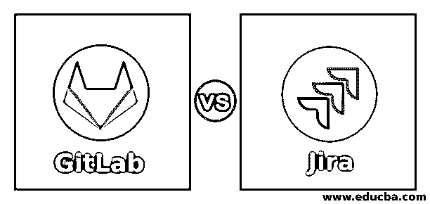
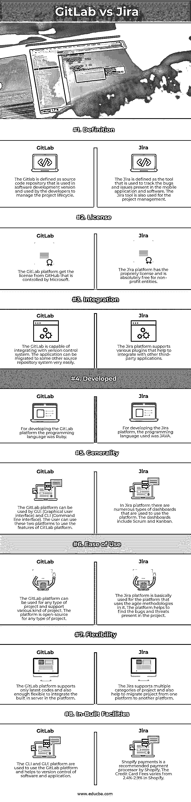

# GitLab vs 吉拉

> 原文：<https://www.educba.com/gitlab-vs-jira/>

## GitLab 与吉拉的区别

以下文章提供了 GitLab vs 吉拉的概要。GitLab 被认为是一个基于网络的工具，用于管理软件开发生命周期，并帮助开发人员在线存储他们的代码。GitLab 是为开发者提供的开源工具，也为大型组织所使用。吉拉是另一个用于跟踪错误、威胁、问题和项目管理的软件工具。吉拉工具的主要用途是跟踪移动应用程序和软件中存在的错误和问题。使用吉拉工具可以轻松处理这些问题。

### GitLab 与吉拉的面对面比较(信息图)

以下是 GitLab 和吉拉的 8 大区别:

<small>网页开发、编程语言、软件测试&其他</small>

### GitLab 与吉拉的主要区别

让我们讨论一下 GitLab 和吉拉的一些主要区别:

*   GitLab 和吉拉的主要区别在于两个平台的用途和功能。GitLab 被定义为一个开源工具，用于应用程序的版本控制、代码审查等等。GitLab 平台与每台服务器能够处理 25000 万用户的服务器相连。另一方面，吉拉平台被定义为软件的测试工具，敏捷团队主要使用它来跟踪软件和移动应用程序中的错误和威胁。吉拉平台的另一个用途是降低软件开发的复杂性，并有助于项目管理。
*   GitLab 和吉拉的另一个区别是定价。GitLab 平台是一个开源工具平台，这意味着它免费提供给开发人员用于版本控制。GitLab 平台支持对开发者免费的各种特性。而另一方面，吉拉平台被认为是一个昂贵的工具，因为它可以调试整个应用程序的威胁和问题。公司和组织广泛使用吉拉平台。
*   两者的另一个区别是平台的易用性。吉拉平台的用户界面非常复杂，本地用户无法轻松使用该平台进行应用。吉拉平台要求在使用之前完全了解该工具。这些特征不能正确地显示在平台的用户界面上。另一方面，GitLab 用户界面很好，所有功能都在 GitLab 上显示得很好。尽管与吉拉平台相比，GitLab 的用户界面较慢。
*   两者之间的另一个区别是平台提供的可靠性和客户支持。吉拉平台提供完整的客户支持，是一个可靠的平台，因为该工具价格昂贵；这个工具的服务很好。另一方面，GitLab 平台的可靠性不达标，客户支持也不适合 GitLab 平台。
*   两者的另一个区别是集团发行委员会的支持。在 GitLab 平台中，可以在组级别看到问题，以便可以解决与该特定组的所有项目相关的 bug 和威胁。另一方面，没有为吉拉平台提供这样的功能。
*   吉拉和 GitLab 平台的另一个区别是对投资组合管理的支持。在 GitLab 平台中，可以在项目组合级别对工作进行适当的规划和跟踪。可以在 GitLab 平台中对资源进行适当的管理。另一方面，吉拉纲领却没有这种支持。
*   两者之间的另一个区别是对现有功能的定制。由于吉拉平台是一个付费工具，该工具的功能可以根据用户的需求进行定制。另一方面，GitLab 平台没有提供这样的功能。用户需要使用 GitLab 平台提供的功能。

### GitLab 与吉拉对比表

我们来讨论一下 GitLab 和吉拉的顶级对比:

| **因素** | **GitLab** | **吉拉** |
| **定义** | Gitlab 被定义为在软件开发版本中使用的源代码库，由开发人员用来管理项目生命周期。 | 吉拉被定义为用于跟踪移动应用和软件中存在的错误和问题的工具。吉拉工具也用于项目管理。 |
| **执照** | GitLab 平台从微软控制的 GitHub 获得许可。 | 吉拉平台拥有专有许可证，对非营利实体完全免费。 |
| **整合** | GitLab 能够与版本控制系统集成。应用程序可以很容易地迁移到其他源存储系统。 | 吉拉平台支持各种插件，有助于与其他第三方应用程序集成。 |
| **发达** | 为了开发 GitLab 平台，编程语言是 Ruby。 | 为了开发吉拉平台，使用的编程语言是 JAVA。 |
| **通用性** | GitLab 平台可由 GUI(图形用户界面)和 CLI(命令行界面)使用。用户可以通过这两个平台来使用 GitLab 平台的功能。 | 在吉拉平台中，有多种类型的仪表板用于使用该平台。仪表板包括 Scrum 和看板。 |
| **易用性** | GitLab 平台可用于任何类型的项目，并支持各种类型的项目。该平台对任何类型的项目都是开源的。 | 吉拉平台基本上用于使用敏捷方法的平台。该平台有助于发现项目中存在的缺陷和威胁。 |
| **灵活性** | GitLab 平台只支持最新的代码，并且足够灵活，可以集成平台的内置服务器。 | 吉拉支持项目的多个类别，并帮助将项目从一个平台迁移到另一个平台。 |
| **内置设施** | CLI 和 GUI 平台用于使用 GitLab 平台和控制软件和应用程序。 | 吉拉平台纯粹是一个基于网络的应用程序，检测软件和移动应用程序中的漏洞和威胁。 |

### 结论

吉拉平台是一个问题跟踪工具，用于在项目中使用敏捷方法的应用程序。吉拉服务台能够解决客户的问题，并为他们提供出色的支持。GitLab 是一个开源的版本控制系统，帮助开发者管理软件版本和代码审查。

### 推荐文章

这是一个 GitLab vs 吉拉的指南。这里我们讨论信息图和比较表的主要区别。您也可以看看以下文章，了解更多信息–

1.  [Gitlab CI vs Jenkins](https://www.educba.com/gitlab-ci-vs-jenkins/)
2.  [GitLab vs GitHub](https://www.educba.com/gitlab-vs-github/)
3.  支尔格对雷场
4.  [吉拉 vs 阿萨纳](https://www.educba.com/jira-vs-asana/)

