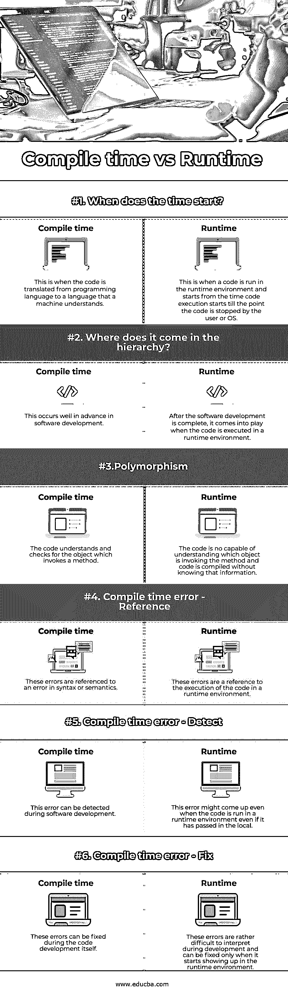

# 编译时间与运行时间

> 原文：<https://www.educba.com/compile-time-vs-runtime/>

## 编译时与运行时简介

在计算机术语中，编译时间是指程序通过遵循一些操作来编译程序的时间。这些操作之后是被称为编译器的部分。完成这些操作是为了转换以特定编程语言编写的代码，以便它可以被转换成相应的机器语言。例如，假设您必须收集大量的需求，您必须收集的人员来自不同的人口统计区域，每个人只能理解他们的母语。因此，所有这些语言必须转换成一种你能理解的语言，以便启动项目的元素集合是完整的，没有任何障碍。

关于运行时的一个有趣的事实是，很久以前，技术作家坚持写类似“当程序运行时”的东西，由于这种短语的不断重复，使用一个新术语变得很明显，这就是“运行时”一词如何出现和使用的。所以现在正式地说，运行时通常指的是程序运行的时候。在程序生命周期中，程序开始在内存中运行直到用户或操作系统终止程序的总时间本质上称为运行时间。

<small>网页开发、编程语言、软件测试&其他</small>

### 编译时与运行时的直接比较(信息图)

下面是编译时和运行时的 6 大对比 **:**

### 编译时和运行时的主要区别

让我们从以下几点来讨论编译时和运行时之间的一些关键区别:

*   现在，进一步说，让我们来看看运行时和编译时的区别。第一个层次的差异是编译时或运行时发挥作用的实例。编译时是代码开发正在进行的时候，开发人员试图编译编写的代码，将其转换成机器可以解释的代码。相反，运行时间实质上是代码被开发出来并被推到一个环境中运行的时间，这个时间从第一行代码开始执行的时刻开始。
*   下一个区别是这两者所属的层次级别。根据我们所了解的各种情况，编译时间是指代码语言被转换成机器可理解的语言，然后代码被执行的时间。因此，如果我们必须放置年表，它将是先计算编译时间，然后是运行时间。
*   现在我们来看看编译时和运行时的多态性技术。在编译时的情况下，要执行的方法在代码编译期间决定，调用对象的数据类型被查看。相反，在运行时多态的情况下，执行方法所需的对象事先并不知道，因此代码是编译的。当代码流开始时，只有在那时方法才知道什么对象要执行。
*   下一个区别是在错误报告方面。在编译时，错误是在编译时报告的，并且是参考语法或语义来检查代码，而在运行时错误中，错误是从代码开始执行时开始参考的。编译器是检测编译时错误的元素，而它是在运行时环境中；检测到运行时错误。人们可以在开发过程中很容易地修复编译时错误，而无需在生产模拟环境中运行它，然而，如果不在运行时环境中运行它，运行时错误就不能得到 100%的证实。

### 编译时与运行时的对照表

下表总结了编译时与运行时的比较 **:**

| 型 | **编译时间** | **运行时** |
| 时间从什么时候开始？ | 这是指将代码从编程语言翻译成机器能够理解的语言。 | 这是指代码在运行时环境中运行，从代码开始执行时开始，直到用户或操作系统停止代码。 |
| 它在层级中处于什么位置？ | 这发生在软件开发的早期。 | 软件开发完成后，当代码在运行时环境中执行时，它就开始发挥作用。 |
| **多态性** | 代码理解并检查调用方法的对象。 | 代码无法理解哪个对象正在调用该方法，并且在不知道该信息的情况下编译代码。 |
| **编译时错误–参考** | 这些错误指的是语法或语义错误。 | 这些错误是对运行时环境中代码执行的引用。 |
| **编译时错误–检测** | 这个错误可以在软件开发过程中检测出来。 | 即使代码在运行时环境中运行，也可能出现此错误，即使它已在本地。 |
| **编译时错误–修复** | 这些错误可以在代码开发过程中修复。 | 这些错误在开发过程中很难解释，只有在运行时环境中出现时才能修复。 |

### 结论

总之，我们已经对编译时和运行时之间的差异有了深入的了解，也理解了它们之间的差异，一旦我们处于软件开发的过程中，我们就更容易理解了。

### 推荐文章

这是编译时和运行时的指南。在这里，我们用信息图和比较表来讨论编译时和运行时的主要区别。您也可以看看以下文章，了解更多信息–

1.  [最佳 C 编译器](https://www.educba.com/best-c-compilers/)
2.  [卡珊德拉 vs 弹性搜索](https://www.educba.com/cassandra-vs-elasticsearch/)
3.  [Java 中的运行时多态性](https://www.educba.com/runtime-polymorphism-in-java/)
4.  [最佳 C++编译器](https://www.educba.com/best-c-plus-plus-compiler/)

