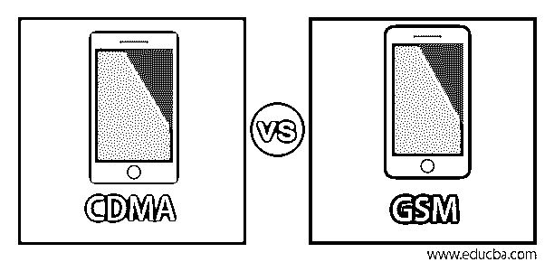
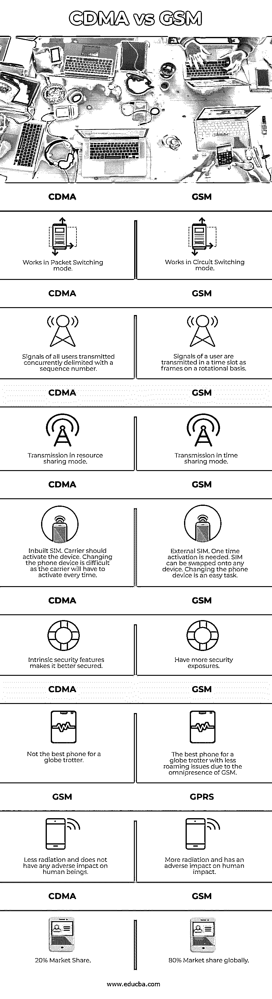

# CDMA 与 GSM

> 原文：<https://www.educba.com/cdma-vs-gsm/>

## CDMA 与 GSM 简介

直到 20 世纪 80 年代，座机通过有线网络上的语音通话将不同地理位置的人们联系在一起。有针对性的无线连接，如微波网络，方便了长途电话，电视广播等。使用无线电频率波的蜂窝技术实现了用户最后一英里的无线连接，即使他们从一个地方移动到另一个地方，也能保持连接。蜂窝网络是无线的，节省了电缆等物理介质的成本及其繁琐的维护。除了语音连接之外的数据传输设施使人们能够在移动中共享数据。移动技术展开翅膀，将汽车、船只和飞机等移动实体连接起来，以监控它们的位置并跟踪它们的性能。这项技术为物联网等新数字技术的更快采用铺平了道路，并开辟了许多新的商机。CDMA 和 GSM 是最流行的移动通信标准，许多最新一代的移动技术都建立在 GSM 和 CDMA 提供的基础之上。

在本文中，我们将分析和比较 GSM 和 CDMA 的特点。

<small>网页开发、编程语言、软件测试&其他</small>

### CDMA 与 GSM 的面对面比较(信息图表)

以下是 CDMA 与 GSM 的八大对比 **:**

### CDMA 与 GSM 的主要区别

让我们从以下几点来讨论 CDMA 与 GSM 之间的一些关键差异:

CDMA(码分多址)和 GSM(全球移动通信系统)属于第二代数字移动标准(2G)，它们取代了第一代(1G)模拟标准。2G 技术在 1990-2010 年期间占主导地位，它无法满足新的数字应用的数据需求。3G/4G 技术取代了 GSM/CDMA，但 GSM/CDMA 的基本概念被用于建立新的标准，它只是旧技术的虚拟扩展。

#### 1.CDMA 和 GSM 技术

**GSM**

*   由欧洲人在 20 世纪 80 年代开发，作为 Groupe 专用移动标准，被亚洲采用，
*   这种数字电路交换移动技术被全世界广泛接受，并在巅峰时期享有 80%的全球市场份额。
*   用于语音和数据服务(短信和彩信)。
*   它使用时分多址方法在 850 MHz–1900 MHz 频段传输信号。通信信道是在频率空间中划分出来的 200 kHz 的窄带宽，被分成八个时隙，称为一帧。每个用户被分配一个帧，并且信号在该帧上以旋转的方式传输。在任一点上，只传送一个用户的时间信号，但所有用户都会感觉整个频带都在服务。
*   GSM 中的组件是移动站、基站收发信台(塔)、基站控制器、移动交换中心和操作。

**CDMA**

*   多个信号或数据流作为一个复信号在通信信道上发送。它导致有效利用可用的。
*   CDMA 采用扩频技术，允许许多用户同时共享频带，每个用户的信号都标有唯一的序列号(代码)。
*   使用 800 MHz 到 1900 MHz 的频带。
*   所有用户在任何时候都可以使用整个信道带宽，代码用于区分

#### 2.SIM 卡

*   用户识别模块(SIM)卡在 GSM 仪器中是强制性的，它包含国际移动用户识别(IMSI)、密码保护和激活/停用设施。SIM 卡由服务提供商提供，激活一次即可。
*   CDMA 仪器中有一个内置的 SIM 卡，它有一个电子序列号，主叫号码应由服务提供商分配/激活。

#### 3.灵活性

*   在 GSM 中，SIM 卡可以自由地从一台设备移动到另一台设备，而无需服务提供商的干预。主叫号码可以从一个服务提供商转移到另一个服务提供商。
*   在 CDMA 中，改变工具对消费者来说并不容易，因为运营商必须参与调用新工具。

#### 4.安全性

与 GSM 技术相比，CDMA 内置了更多的安全特性，其中一些是

*   CDMA 有加密设施
*   该设备的 64 位认证密钥和电子序列号增强了的安全性
*   附在通信信道中用户信号上的唯一代码在 CDMA 中提供了安全保护。由于它的设计，CDMA 数据的破解不是
*   在 GSM 中，用户的信号在一个频率信道的时隙中以循环的方式传输
*   由于 GSM 中的信号以集中的方式被打包在窄带中，它们很容易被追踪，留下了安全隐患。而 CDMA 在整个信道中传输信息，安全性很低
*   CDMA-IS-41 安全协议是移动通信标准中最好的协议之一

#### 5.辐射

GSM 手机更容易受到辐射的威胁，因为它们会持续产生电波脉冲，并更多地暴露在电磁场中。GSM 手机的辐射水平比 CDMA 手机高 28 倍，生物反应性更强。

#### 6.全球使用

GSM 在全球占有 80%的市场份额，在 200 多个国家都有业务。一个拥有 GSM 手机的环球旅行者在世界各地旅行时将会遇到最少的漫游问题。

### CDMA 与 GSM 对比表

下表总结了 CDMA 与 GSM 的比较 **:**

| **CDMA** | **GSM** |
| 在分组交换模式下工作。 | 在电路交换模式下工作。 |
| 同时发送的所有用户的信号用序列号定界。 | 用户的信号在一个时隙中以帧为单位旋转传输。 |
| 资源共享模式下的传输。 | 分时传输模式 |
| 内置 SIM 卡。运营商应该激活设备。更换电话设备很困难，因为运营商每次都必须激活。 | 外部 SIM 卡。需要激活一次。SIM 卡可以换到任何设备上。更换电话设备是一项简单的任务。 |
| 固有的安全特性使其更加安全。 | 有更多的安全隐患。 |
| 不是环球旅行者的最佳手机。 | 全球旅行者的最佳手机，由于 GSM 无处不在，漫游问题较少。 |
| 辐射少，对人体没有任何不良影响。 | 更多的辐射和对人体有不利影响的影响。 |
| 20%的市场份额。 | 全球 80%的市场份额。 |

### 结论

手机的性能并不取决于它使用 GSM 还是 CDMA 标准，而是取决于网络的后端基础设施和控制它的软件。GSM 和 CDMA 技术从根本上来说是稳健的，并且在相当长的一段时间内统治了移动市场，并且后来的技术是基于这两种技术构建的。

### 推荐文章

这是一个关于 CDMA 和 GSM 的主要区别的指南。在这里，我们通过信息图和比较表来讨论 CDMA 和 GSM 的主要区别。您也可以看看以下文章，了解更多信息–

1.  [什么是 Apache Solr？](https://www.educba.com/apache-solr/)
2.  [卡珊德拉 vs 弹性搜索](https://www.educba.com/cassandra-vs-elasticsearch/)
3.  [什么是 Elasticsearch？](https://www.educba.com/what-is-elasticsearch/)
4.  [WLAN vs WWAN](https://www.educba.com/wlan-vs-wwan/)

