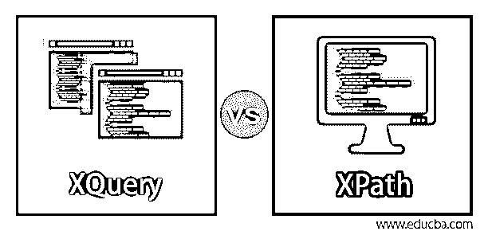
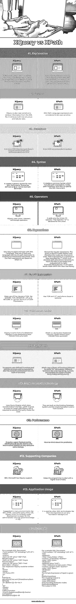

# XQuery 与 XPath

> 原文：<https://www.educba.com/xquery-vs-xpath/>

## XQuery 和 XPath 的区别

XQuery vs XPath、XML 路径语言(XPath)和 XML 查询语言(XQuery)是 W3C 指定的查询 XML 文档的推荐标准。前者是一个路径表达式，允许计算产生类似字符串的值；布尔因此告诉 XML 数据文件的路径和地址也计算值。Xpath 促进了 XSLT 和 Xpointer 之间的语法共享，并通过树导航来选择特定方向上的各个节点，以满足某些属性，使用(/)来遍历节点。根节点被认为是默认上下文的 Xpath 节点。XQuery 是一种非标准化的通用查询语言，源于 Quilt，它允许从有效的 XML 文档中提取数据。

### XQuery 和 XPath 的直接比较(信息图表)

下面是 XQuery 和 XPath 之间的 14 大比较

<small>网页开发、编程语言、软件测试&其他</small>

### XQuery 和 XPath 的主要区别

让我们研究一下 XQuery 和 XPath 之间的一些重要差异:

*   Xpath 是查询语言的重要组成部分，就其含义而言，它不是查询；它们是不完整的；因此，它是 XML 路径语言。而 XQuery 是基于查询的函数式编程，支持 XPath。
*   XPath 被表示为一个树模型，它通过选择路径中的不同节点来遍历，并且有七个节点。Xpath 用其他 XML 文档进行计算。XQuery 也是一个树模型，但是有七个节点，如元素、属性、文本节点、文档节点、注释、指令，但是用于操作。
*   Xpath 执行简单的代码，而 XQuery 指定了简单的灵活性，并具有一些额外的功能以及关键概念，如混合输出和逻辑的排序。
*   Xpath 不允许字母排序；相反，它必须用其他语言编写代码。它不能重新排序或创建新元素，但是另一方面，XQuery 可以进行转换(XML-XML 转换)来对结果进行排序，并使用 Xpath 作为组件。
*   最好在 XQuery 部分使用不同的值()来消除重复。Xpath 使用 index-of()函数作为解决方案。
*   XQuery 从 XML 文档中提取数据值。做分类、搜索、分组之类的工作。此外，XQuery 解决了 XPath 的缺陷，而没有增加太多的复杂性。
*   XQuery 表达式采用不同的形式，如路径表达式、FLWR、条件表达式。XPath 是稳定和成熟的，在许多系统中都有规定。

### XQuery 与 XPath 的比较表

下面是对比表:

| **比较的基础** | **XQuery** | **XPath** |
| **解释** | 它定义了 XML 文档的查询集合。它采用 XPath+SQL 之类的查询语言。XML 需要一个数据模型来表达复杂的查询。 | 它是 XSLT 中的主要元素。通常是描述有效 XML 文档的语法。path 是两个通用 XSLT 和 XQuery 的核心元素。 |
| **功能** | 从 XML 文件中检索信息时，XQuery 也区分大小写。它检索树结构和表格数据。 | XML 路径语言表达式是区分大小写的。 |
| **标准** | 它不是 W3C 标准，不支持 2014 年推荐的所有 XPath 轴。 | 这是 W3C 推荐的标准。 |
| **语法** | 它为新的 XML 文档创建了通用语法。应该定义为$(var name)例:$animals。 | 它创建了一个公共语法，包括路径表达式、节点、路径符号和 URL，以指定 XML 文档。 |
| **操作员** | XQuery 使用 Union、intersect 和 except 运算符。 | 它只添加联合(' &#124; ')运算符。运算符“or”是为 union 声明的。 |
| **表情** | 非常容易用 XML 语言解析和输入。它们是一种只读语言，依靠路径表达式来遍历分层文档。路径表达式基于 XPath 1.0。 | 像正则表达式一样解析。查询是以有序的方式完成的，因此节点按顺序返回。路径表达式是由“/”分隔的连续步骤，它是一个绝对路径(到达文件夹中文件的文档层次结构),从左到右计算。
例:/library/books——它将选择类根库中的 books 节点。 |
| **FLWR 表达式** | 利用 SQL 的五个子句，如 WHERE、FOR、ORDER BY、LET 和 RETURN。通俗地说，就是 FLWR-Expressions。 | Has FOR 和 LET 以及 where 子句是可选的。 |
| **关系模型** | XQuery 是某种形式的关系代数。它被设计成具有投影和排序功能。 | XPath 是一种声明式关系演算。Xpath 没有投影和排序。 |
| **功能** | 它支持用户定义的函数，允许递归，封装也有强大的谓词(许多是内置函数)。 | XPath 使用一个函数库，后跟前缀“fn”名称空间。不同的功能，如排序，字符串，数字是可用的。Xpath 包括文本()、节点()、名称()、计数()。 |
| **实施策略** | 使用查询引擎，它可以转换成 SQL、LDAP。它倾向于处理较大的工作。在代码中执行查询需要 XQuery API。 | 它们建立在现有的数据库系统上，实现是从头开始的。 |
| **性能** | 需要更大的有效负载，通过消除(//)双斜线和中间变量，它可能会消耗一些存储空间。 | 必须注意谓词。 |
| **支持公司** | IBM，微软都有 XQuery 支持。 | 它帮助程序员处理更高层次的数据 |
| **应用使用情况** | 在许多环境中建议使用，如 XML、HTML 和 URL 的某些部分。目前正在开发中的 XQuery 对于具有良好 SQL 知识的管理员来说更容易。 | 它被 XSLT 和 Xpointers 等其他 XML 技术用作基础背景。 |
| **例子** | 对于一个示例 XML 文档:
`<?xml version="1.0" encoding="UTF-8"?>
<Hotel>
<menu>
<item id="01" price="250">Fish Biriyani</item>
<item id="02" price="450">hoysa Prawns</item>
<item id="03" price=”555"> fried Rice</dish>  </menu>`
，相应的 XQuery 可以写成:
`<html>
<body>
<h1>menu</h1>

{
FOR $d IN document("hot.xml")/Hotel/menu/item
RETURN
<b> {$d/text ()} </b> 
}

</body>
</html>`
调用函数:
`<menu>{uppercase($item)}</name>`
比较:
`$Hotel//menu/@id >01` | 对于一个示例 XML 文档:
`<?xml version="1.0" encoding="UTF-8"?>
<kid>
<kidbook>
<Title> Harry Potter </Title>
<author> J.K.Rowling </author>
<year> 2010 </year>
</kidbook>
<kidbook price=“440”>
<Title> Welcome to Kids world </Title>
<author> Sergen mark </author>
<year> 2012 </year>
</Kidbook>
</kid>`Xpath 的简单表达式如下:/kid/kid book/year 得到的输出是:
`<year>2010</year>
<year>2012</year>`
并且包括属性节点:
/kid/kidbook/@price
输出是 440。 |

### 结论

在本文中，我们看到了 XPath 和 XQuery 等重要概念的详细信息。尽管从技术角度来看，XQuery 并不是标准化的。也许一些开发人员利用这一点来构建应用程序，并有助于创建复杂的数据选择。路径应该是在 XML 存储库中获取数据的首选。

### 推荐文章

这是 XQuery 和 XPath 的对比指南。这里我们讨论 XQuery 和 XPath 之间的区别、主要区别和比较表。您也可以浏览我们的其他相关文章，了解更多信息——

1.  [Selenium 中的 XPath 是什么？](https://www.educba.com/what-is-xpath-in-selenium/)
2.  [什么是 XML？](https://www.educba.com/what-is-xml/)
3.  [什么是 XPath？](https://www.educba.com/what-is-xpath/)
4.  [XQuery 函数](https://www.educba.com/xquery-functions/)

