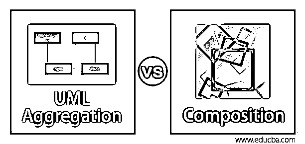
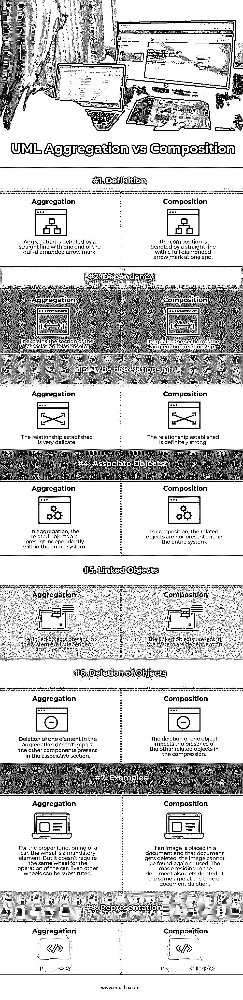

# UML 聚合与组合

> 原文：<https://www.educba.com/uml-aggregation-vs-composition/>

## UML 聚合与组合简介

XML 中使用了许多不同类型的符号来表示关联、组合和聚合。这里，关联由一个简单的箭头表示，而空的菱形箭头表示聚合，完整的菱形箭头用于表示组合。如果应该构建任何 UML 图来表示两个类 P 和 Q 之间的任何关系，如果 P 和 Q 之间存在关联，那么它由 P -> Q 表示。任何类之间的组合和聚合也用类似的技术表示。UML 符号也用于建立类之间可变类型的依赖关系。

### UML 聚合与组合的直接比较(信息图)

下面是 UML 聚合与组合的 8 大比较 **:**

<small>网页开发、编程语言、软件测试&其他</small>

### UML 聚合和组合之间的主要区别

让我们从以下几点来讨论 UML 聚合和组合之间的一些关键区别:

#### 1.定义

*   聚合和组合基于所需的关联类别。在组合和聚合中是单个类的对象，代表另一个类的对象。未成年人不同，因为聚合推断一个关系，其中孩子是独立于父母。
*   比如父类和子类都在一个类里，如果父类的删除不影响子类的操作。但在构成中，它推断出了没有孩子存在的那种关系，它不依赖于父类。孩子依赖于父母，没有父母就不能独立存在。

#### 2.操作

*   聚集是关联的一部分及其可变对象的分类。它用来表示任何关系。它对协会更为具体。它简要地解释了整个关系的一部分。侵略只包括双重阶级，并代表一个二元协会。这是一种孩子不依赖父母的关系
*   作文是一段隔离，它表示整个关系的一部分。它描绘了孩子和父母之间的关系和依赖。它也可以表示为组件及其部件。它坚持认为，如果组件被淘汰，其零件也将被丢弃。因此，组成是建立在类似的对象。

#### 3.例子

*   用一个最好的例子来解释这种聚合。让我们以汽车和轮子作为一个集合的例子。没有轮子，汽车是不可能移动的。但是车轮在其他车辆中被用作单独的物体。因此，即使没有汽车的存在，物轮也意味着一种意义。因此，车轮和汽车之间的关系被称为聚合，其中分离的对象车轮不基于父对象汽车。
*   构图最好的例子是人体。子对象依赖于父对象，如果任何父对象被丢弃，子对象将被忽略。如果人类死亡，所有的子类如腿和手将没有任何意义并被删除。所以孩子完全依赖父母。
*   在聚合中，重要的是表示链接不以任何方式存在于拥有类 q 的类 P 中。它不表示任何父子关系，而在组合中，强生命周期依赖是在父和子之间建立的。父代被删除，并且不存在子代。

#### 4.面向对象编程

*   在这里，对象依赖于其他对象来利用对象提供的功能和服务。两个不同对象之间的关系在软件设计中被称为关联，在 UML 中用箭头表示。
*   聚合和组合是两个不同对象之间的关联部分。但是 UML 的符号反映了侵略性和复合性之间的微妙差异。不同对象之间的关联称为组合。在这里，一个类拥有另一个类，即使父类被删除，这个类也没有意义。

#### 5.Java 语言(一种计算机语言，尤用于创建网站)

就 Java 而言，聚合和组合类似于继承上的面向对象编程。作文有一个汽车和发动机的例子。即使汽车被拆除，发动机也没有用，因为发动机的型号只适合特定的汽车。相比之下，车轮和汽车之间会产生一种积极的关系。因为如果把车拆了，轮子可以用于其他任何车辆。

### UML 聚合与组合的比较表

下表总结了 UML 聚合与组合的比较 **:**

| **属性** | **聚合** | **压缩** |
| **定义** | 聚合由一端带有空心箭头标记的直线表示。 | 该组成由一端带有全菱形箭头标记的直线表示。 |
| **依赖关系** | 它解释了关联关系的部分。 | 它解释了聚合关系的部分。 |
| **关系类型** | 建立的关系很微妙。 | 建立的关系肯定是牢固的。 |
| **关联对象** | 在聚合中，相关对象独立存在于整个系统中。 | 在组合中，相关对象也不存在于整个系统中。 |
| **链接对象** | 系统中存在的链接对象独立于其他对象。 | 系统中存在的链接对象依赖于其他对象。 |
| **删除对象** | 删除聚合中的一个元素不会影响关联部分中的其他组件。 | 删除一个对象会影响压缩中其他相关对象的存在。 |
| **例题** | 为了汽车的正常运行，车轮是一个必不可少的部件。但是它不需要同一个轮子来操纵汽车。甚至其他轮子也可以替代。 | 如果图像被放置在文档中，而该文档被删除，则该图像将无法再被找到或使用。在删除文档时，文档中的图像也同时被删除。 |
| **表示法** | P ——- <>问 | P ———— <filled>问</filled> |

### 结论

软件设计中的聚合和组合是共有和部分共有的。假设任何对象都是其他对象的一部分。这种关系被称为组合，如果一个对象拥有其他对象而没有任何依赖性，这就是聚合。

### 推荐文章

这是一个关于 UML 聚合和组合的指南。在这里，我们用信息图和比较表来讨论 UML 聚合和组合的主要区别。您也可以看看以下文章，了解更多信息–

1.  [UML 顺序图](https://www.educba.com/uml-sequence-diagram/)
2.  [UML 用例图](https://www.educba.com/uml-use-case-diagram/)
3.  [UML 组件图](https://www.educba.com/uml-component-diagram/)
4.  [UML 部署图](https://www.educba.com/uml-deployment-diagram/)

