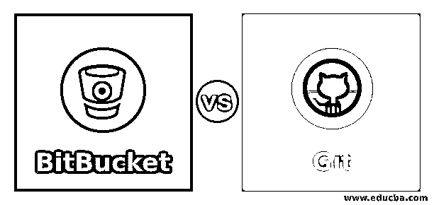
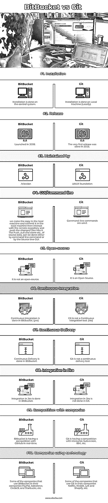

# BitBucket vs Git

> -= the last fantasy =-荣誉出品本字幕仅供学习交流，严禁用于商业途径

## BitBucket 和 Git 的区别

BitBucket vs Git，BitBucket 是一个基于 web 的版本控制系统。BitBucket 于 2008 年推出。由亚特兰蒂斯人维护。我们使用命令行命令与本地存储库进行交互；在进行代码更改之前，我们在本地机器上制作副本，并在本地机器上提交它，然后与远程存储库进行交互，并将更改后的文件推送到其中。推、拉和克隆等。可以通过命令行命令或源树 GUI 来完成。

Git 是在我们的本地系统上安装和维护的，而不是在云中。Git 是一个分布式版本控制系统。而 GitHub 是基于云的托管服务。Git 最初是在 2005 年开发的。这是一个版本控制系统。由 LINUX 基金会维护。它是一个主要的命令行工具。为了与已经安装在桌面上的 Git 存储库进行交互，我们需要一个名为“GIT GUI”的 GUI(图形用户界面)

<small>网页开发、编程语言、软件测试&其他</small>

### BitBucket 与 Git 的面对面比较(信息图表)

下面是 BitBucket 和 Git 的十大对比。

### BitBucket 和 Git 的主要区别

现在让我们检查一下 Bitbucket 和 Git 之间的主要区别:

Bit bucket 是一个基于 Web 的版本控制系统。Bitbucket 的开发者是 Jesper Noehr。用 Python 写的。它为 Git 存储库提供 web 服务。源树用于推、拉和克隆数据。用于基于 web 的。比 GitHub 更快更高效。

Git 是一个分布式版本控制系统。由 Linux Torvalds 开发。目前，Junio 已经成为 GIT 的开发者。用 C，shell，pearl，Tcl，Python 写的。它是一个分布式版本控制系统，用于跟踪源代码中的变更。Push、pull 和 clone 都在命令行中编写了语法。git 中使用命令行。有时会过于复杂。

### BitBucket 与 Git 对照表

下面的表格从特性的角度比较了 BitBucket 和 GIT。让我们简单地看一下同样的情况:

| **特性** | **BitBucket** | **去** |
| **安装** | 安装在控制系统上完成。 | 安装在本地机器上完成(本地) |
| **发布** | 于 2008 年推出 | 第一次发布是在 2005 年。 |
| **由**维护 | 亚特兰蒂斯人 | LINUX 基金会 |
| **GUI/命令行** | 我们在本地机器上制作副本，并在本地机器上提交它，然后与远程存储库进行交互，并将更改后的文件推送到其中。推、拉和克隆等。可以通过命令行命令或源树 GUI 来完成。 | 使用命令行命令。 |
| **开源** | 它不是开源的 | 这是一个开源软件 |
| **持续集成** | 持续集成是在 BitBucket 中完成的。(是) | Git 不是一个持续集成工具。(否) |
| **连续交货** | 连续传送是以比特桶为单位完成的。 | Git 不是一个持续的交付工具。 |
| **融入吉拉** | 吉拉的集成是以比特为单位完成的。 | 吉拉的集成不是在 Git 中完成的。 |
| **与公司的竞争** | Bitbucket 正在与 GitHub 进行实时竞争。 | Git 正在与 Mercurial、Subversion、IBM 等竞争。, |
| **使用技术的公司** | 在他们公司使用 BitBucket 的公司有 PayPal，Salesforce，CircleCI，Starbucks 等。 | 在他们的公司中使用 Git 的一些公司有网飞、Reddit、Lyft 和 Shopify 等。, |

### 结论

BitBucket 是一个基于 web 的版本控制系统。我们使用命令行命令与本地存储库进行交互；在进行代码更改之前，我们在本地机器上制作副本，并在本地机器上提交它，然后与远程存储库进行交互，并将更改后的文件推送到其中。推、拉和克隆等。可以通过命令行命令或源树 GUI 来完成。内置用户管理。Git 是在我们的本地系统上安装和维护的，而不是在云中。GIT 中不使用用户管理特性。这是一个完全分布式的版本控制系统。所有人都有自己的工作分支。只有当分支机构所有者批准变更时，合并才会发生。我们在 git 中采用的克隆存储库充当存储库的完整备份。

### 推荐文章

这是 BitBucket vs Git 的指南。在这里，我们讨论 BitBucket 和 Git 之间的区别，主要区别，以及一个比较表。您也可以浏览我们的其他相关文章，了解更多信息——

1.  [GitHub 替代品](https://www.educba.com/github-alternatives/)
2.  [格拉法纳 vs 基巴纳](https://www.educba.com/grafana-vs-kibana/)
3.  [Git Fetch vs Git Pull](https://www.educba.com/git-fetch-vs-git-pull/)
4.  什么是 Git Fetch？

