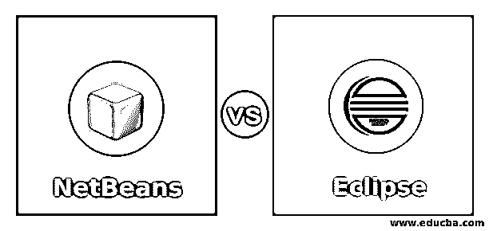
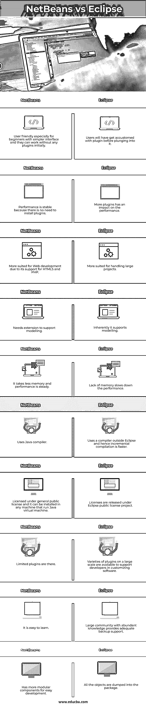

# NetBeans vs Eclipse

> 原文：<https://www.educba.com/netbeans-vs-eclipse/>

## NetBeans 与 Eclipse 的区别

下面的文章提供了 NetBeans 与 Eclipse 的概要。20 世纪 70 年代的程序是用流程图写在编码纸上的；这种代码以脱机方式键入穿孔卡片，然后提交编译。当时程序员的生产力太低了。随着个人电脑的发展，软件开发活动得到了改善，程序通过本地编辑器键入。记事本是第一个程序开发工具。集成开发环境(IDE)诞生于 20 世纪 90 年代，它提供了一个用户友好的界面，可以在最短的时间内端到端地开发任何应用程序。它有助于开发人员编辑、整理、构建、调试、打包、实现软件，并最小化将多个部分拼接成一个内聚产品的配置工作。

IDE 提高了开发人员的生产力，并在软件开发中提供了许多功能，如图形前端、语法突出显示、版本控制、代码完成、内部结构改进、访问类/函数库、步骤的可视化呈现、基于表单的小部件、基于语言的界面、创建交互式流程图的可视化编程、多语言支持、对不同计算平台的适应性。最受欢迎的 10 个 IDE 软件是 Netbeans、Eclipse、Microsoft Visual Studio、IntelliJ Idea、Code::Blocks、Aptana Studio 3、Komodo、RubyMine、Xcode 和 Pycharm。

<small>网页开发、编程语言、软件测试&其他</small>

### NetBeans 与 Eclipse 之间的直接比较(信息图表)

以下是 NetBeans 和 Eclipse 之间的 10 大区别:

### NetBeans 与 Eclipse 的主要区别

让我们讨论一下 NetBeans 和 Eclipse 之间的一些主要区别:

#### 1.背景

*   Netbeans 于 1996 年在布拉格开始作为一个学生项目，Sun Microsystems 于 1999 年收购了它的商业部门。后来被 Sun 开源了。当 Oracle 收购 Sun 时，Netbeans 接手了 Oracle 著名的 IDE JDeveloper，Netbeans 被移交给 Apache foundation。
*   在 eclipse 中，软件平台是在 visual age 系列 IDE 产品的启发下构建的，而通过 Visual age 是一个成功的产品，它没有像 Netbeans 那样的模块化结构，所有东西都像 zip 文件一样打包。它后来被 IBM 和联盟中的 80 个其他人开发为开源工具。Eclipse 这个名字与 Sun 没有任何关系，但它的目的是为了盖过 MS visual studio，后者是它当时的主要竞争对手，因此得名。

#### 2.许可证

*   在 Netbeans 中，IDE 产品现在在 Apache 2.0 类别中获得许可。在此之前，它们是 Sun 公共开发库和通用公共许可证版本 2 的一部分。甲骨文收购 Sun 后，Netbeans 平台成为另一个开源产品。
*   在 Eclipse 中，这些产品最初是在通用公共许可证下许可的，它被重新归类为 Eclipse 公共许可证，这是任何 Eclipse 项目的基本许可证。很少有项目需要额外的许可，即。，Eclipse 发行许可证，应该根据具体情况购买。

#### 3.操作系统（Operating System）

*   Netbeans 可以在 Windows、Solaris、Linux 和 Mac 上运行，它主要面向 java 加上 add，它支持 C，C++，HTML5，PHP 和 JS。Netbeans 框架简化了基于 Windows 的应用程序的开发。使用更新中心模块，用户可以单独下载更新并升级应用程序。定制、插件的易管理性、对库的访问、卓越的支持以及社区中丰富的知识帮助开发人员改进他们的交付质量和时间表。
*   Eclipse 运行在多种操作系统上，并且像其他 ide 一样支持多种语言。但是它主要关注 Java 和 C++。

#### 4.模块性

*   Netbeans 为开发人员提供了模块化的软件组件来动态构建他们的应用程序。各种功能以模块的形式提供，其中包含一组类，以简化开发人员的工作。用户开发的模块可以在这个平台上共享，让其他人受益。
*   Eclipse 不提供广泛的基于组件的特性，代码被打包成一个整体，这个包中的任何类对其他人都不可用。

#### 5.插件

*   Netbeans 支持插件来支持其他语言和额外的功能。
*   Eclipse 为插件提供了广泛的支持，成千上万的插件被提供给开发人员来加速他们的活动。一个人可以开发自己的插件，并与他人分享。大量的插件和配置选项使得这个 IDE 非常健壮。

#### 6.系统模型化

*   Netbeans 在很大程度上不支持建模，它需要几个扩展来支持建模。
*   在 Eclipse 中，IDE 提供了软件建模特性，以便在模拟模式下进行虚拟建模、验证和确认，并减少实际实现过程中的错误。它提供了一个标准的软件开发环境，前期的缺陷检测和可重用的代码供将来使用。它为统一模型语言和系统建模语言项目提供了良好的建模支持。

#### 7.其他人

*   Netbeans 提供了大量的服务来简化开发人员的工作，并允许他们只关注业务逻辑。这些服务包括管理界面、设置、存储、窗口、向导、可视化库和开发工具。
*   在 Eclipse 中，除了建模和插件工具，这个 IDE 还提供了丰富的前端特性，如标准框架、小部件工具包、查看器类、视图和透视图等。

### NetBeans 与 Eclipse 比较表

让我们讨论一下 NetBeans 与 Eclipse 之间的主要比较:

| **NetBeans** | **月食** |
| 用户友好，特别是对初学者来说，界面更简单，而且他们可以在没有任何插件的情况下工作。 | 在投入使用之前，用户必须习惯这个插件。 |
| 性能稳定，因为不需要安装插件。 | 插件多了对性能有影响。 |
| 由于支持 HTML5 和 PHP，更适合 Web 开发。 | 更适合处理大型项目。 |
| 它需要一个扩展来支持建模。 | 本质上它支持建模。 |
| 它占用更少的内存，性能稳定。 | 内存不足会降低性能。 |
| 使用 Java 编译器。 | 它使用 Eclipse 之外的编译器，因此增量编译更快。 |
| 根据通用公共许可证授权，它可以安装在任何运行 Java 虚拟机的机器上。 | 许可证是在 Eclipse 公共许可证项目下发布的。 |
| 有限的插件在那里。 | 各种大规模的插件可以用来支持开发者定制软件。 |
| 这很容易学。 | 拥有丰富知识的大型社区提供了足够的后备支持。 |
| 具有更多易于开发的模块化组件。 | 所有的物品都被倒进包裹里。 |

### 结论

这两个 ide 都是开源的，并且提供了相当好的软件开发环境。它们各有利弊，选择合适的工具取决于目的。对于小型初学者项目，Netbeans 是正确的选择，对于大型项目，Eclipse 是最佳选择。

### 推荐文章

这是 NetBeans vs Eclipse 的指南。在这里，我们用信息图和比较表来讨论 NetBeans 与 Eclipse 的主要区别。您也可以看看以下文章，了解更多信息–

1.  [WebLogic vs WebSphere](https://www.educba.com/weblogic-and-websphere/)
2.  [Groovy vs Scala](https://www.educba.com/groovy-vs-scala/)
3.  [Node.js vs Java 性能](https://www.educba.com/node-js-vs-java-performance/)
4.  [Java vs .Net](https://www.educba.com/java-vs-dot-net/)

