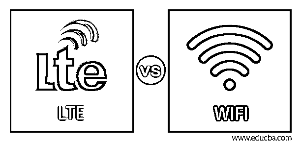
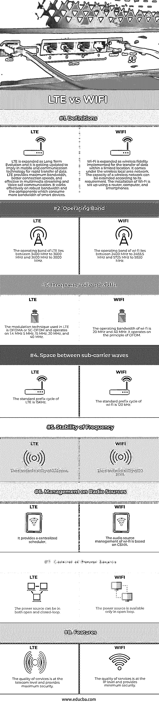

# LTE 与 WIFI

> 原文：<https://www.educba.com/lte-vs-wifi/>

## LTE 与 WIFI 的区别

4G 无线技术是建立在长期演进基础上的第三代合作伙伴关系。LTE 集成在服务于快速速度和网络协议的高速下行链路分组上，以通过移动通信组件建立连接。Wi-Fi 支持几种类型的计算组件，包括移动电话和个人电脑，并通过路由器连接所有无线网络。所有无线技术的原理都是相同的，本文将解释其主要差异和比较。

LTE 与 Wi-Fi 的主要区别 LTE 与 Wi-Fi 的显著区别在于其类型、历史、注意事项和速度范围，如下所述。

<small>网页开发、编程语言、软件测试&其他</small>

### LTE 与 WIFI 的直接对比(信息图表)

以下是 IPS 和 IDS 的 8 大对比 **:**

### LTE 与 WIFI 的主要区别

以下是 LIT 和 WIFI 的一些主要区别:

#### 无线网络的历史

LTE 被扩展为长期演进，并基于 3GPP 技术于 2008 年发布。它是为平板电脑、智能手机、笔记本电脑和个人电脑等移动计算设备开发的。LTE 技术的可用性仅限于在实施时只能接入 4G 网络的几款手机。Wi-Fi 技术于 1999 年以 802.11b 发布标准实现，提供无线网络和移动计算设备的所有主要功能。不同于 LTE 技术，Wi-Fi 标准需要路由器来服务无线网络的连接。

#### 无线网络的类型

LTE 技术在各种版本中都可用，甚至在当前更新的 Release 12 版本中也可用。Wi-Fi 协议包括 802.11b、802.11n、802.11g 和 802.11 a。LTE 标准是由无线服务提供商和电子制造商(包括美国电话电报公司、三星和 T-Mobile)共同努力制定的。Wi-Fi 标准是由一个国际企业(一个由一些在 3GPP 下工作的相关企业组成的 Wi-Fi 联盟)用合适的规范设计的。

##### 1.无线网络的速度范围

LTE 技术提供了从每秒 100 兆比特到每秒 1 千兆比特的数据传输速率。而 Wi-Fi 标准的数据传输速率从每秒 11 兆字节到每秒 600 兆字节。在恶劣天气、网络流量和每台设备的能力下导致速度变化的各种情况和条件的集合。LTE 标准允许在全国范围内广泛建立网络覆盖的链接组件。基于 Wi-Fi 的计算组件必须在无线路由器的 300 英尺范围内保持不变，以维持无线网络的功能。

##### 2.考虑无线网络

用户可以访问移动路由器，享受 LTE 网络的优势。移动路由器使通信设备能够将 4G 网络的无线服务提供商与一端的 Wi-Fi 技术和另一端的 LTE 技术相关联。同时，Wi-Fi 是基于 802.16 开发的，最大化了 300 英尺到 30 英里的无线连接类型。Wi-Fi 在 LTE 技术上是独立的，并且依赖于支持 Wi-Fi 的路由器进行连接，而不是无线服务提供商的 4G 网络。

#### 优势

LTE 是一种受欢迎的 4G 技术，现在它正以飞快的速度发展，它取决于几个因素。它基于无线电波，不同于基于微波的 Wi-Fi 和 3G，因此它被开发为在现有的硬件组件上运行。它还会影响 LTE 网络在远程位置的最佳渗透，以获得最大的覆盖范围。LTE 可以在光缆上运行，为信号编码提供更好的编解码器，并改善多媒体文件和数据通信的传输。Wi-Fi 上的无线信号使其他组件能够链接重要的发射器进行交互。它可以共享文件和传送语音信息。wi-fi 的主要需求是让组件像电话、电脑或路由器一样共享无线信号。

### LTE 与 Wi-Fi 对比表

以下是 LTE 与 WIFI 的对比:

| **行为要素** | **LTE** | **无线网络** |
| **定义** | LTE 被扩展为长期演进，并且它正在更新以暗示用于快速数据传输的移动和通信技术。LTE 提供了最大的带宽、更好的连接速度，在多媒体流和语音通话通信中非常有效。它在强大的带宽和消耗更多智能设备带宽的组件上有效地工作。 | Wi-Fi 扩展为无线保真，用于在有限的位置内传输数据。它属于无线局域网。无线网络的容量可以根据其需求进行扩展。使用路由器、电脑和智能手机来设置 Wi-Fi 的安装。 |
| **工作频段** | LTE 的工作频带位于 3400 MHz 至 3600 MHz 和 3600 MHz 至 3800 MHz 之间 | wi-fi 的工作频段介于 2400 MHz 至 2483.5 MHz 和 5725 MHz 至 5820 MHz 之间 |
| **带宽频率** | LTE 中使用的调制技术是 OFDMA 或 SC-OFDM，工作频率为 1.4 MHz、5 MHz、15 MHz、20 MHz 和 40 MHz | wi-fi 的工作带宽是 20 MHz 和 40 MHz。它根据 OFDM 原理工作 |
| **子载波之间的间隔** | LTE 的标准前缀周期是 15KHz。 | wi-fi 的标准前缀周期是 120 kHz |
| **频率的稳定性** | 0.25 ppm 的标准稳定性 | 20 ppm 的标准稳定性 |
| **射电源管理** | 它提供了一个集中的调度程序。 | wi-fi 的音频源管理基于 CSMA。 |
| **电源控制** | 电源可以是开环的也可以是闭环的 | 电源仅在开环中可用。 |
| **特性** | 服务质量达到电信级别，并提供最大的安全性。 | 服务质量处于 IP 级别，并提供最低限度的安全性。 |

### 结论

最近几天，互联网的使用急剧增加。实施 LTE 或移动宽带和 Wi-Fi 是为了轻松、即时地访问互联网，并执行数据建立所需的功能。网络空间的重要性以及通过 Wi-Fi 和 LTE 接入互联网实现的物联网应用的集成。

### 推荐文章

这是 LTE 与 WIFI 的对比指南。在这里，我们讨论了 LTE 与 WIFI 之间的区别，用信息图和对照表进行了面对面的比较。您也可以浏览我们的其他相关文章，了解更多信息——

1.  [抽象 Vs 封装](https://www.educba.com/abstraction-vs-encapsulation/)
2.  [ITIL Vs ITSM](https://www.educba.com/itil-vs-itsm/)
3.  [ITIL VS PMP](https://www.educba.com/itil-vs-pmp/)
4.  [Java 8 Vs Java 9](https://www.educba.com/java-8-vs-java-9/)

