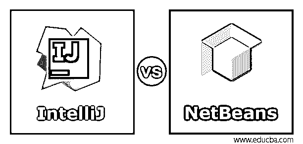
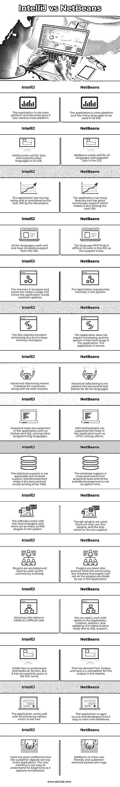

# IntelliJ 与 NetBeans

> 原文：<https://www.educba.com/intellij-vs-netbeans/>

## IntelliJ 与 NetBeans 的区别

我们可以在集成开发环境中用不同语言编程的编程环境叫做 IntelliJ。它可以用于社区和商业版，由 JetBrains 开发。IntelliJ 最初发布于 2001 年，高度兼容并面向 Java。Intellij Idea 表示，他们有一个智能的想法，并且愿意编写相同的代码。NetBeans IDE 也是为 Java 开发的，具有不同的软件组件。这是一个新软件，我们也可以在这个 IDE 中用多种语言编程。桌面应用程序也可以在 NetBeans 的帮助下开发。

### IntelliJ 与 NetBeans 的直接比较(信息图表)

以下是 IntelliJ 与 NetBeans 的 15 大对比 **:**

<small>网页开发、编程语言、软件测试&其他</small>

### IntelliJ 与 NetBeans 的主要区别

让我们从以下几点来讨论 IntelliJ 与 NetBeans 之间的一些关键差异:

*   Android 支持和开发可以在 IntelliJ 中完成，而在 NetBeans 中，我们不能这样做。IntelliJ 是 Android 的官方开发 IDE。
*   Intelli 中有更多用于软件开发的插件，而 NetBeans 中的插件较少。插件有助于为平台中编写的代码添加应用程序级别。
*   IntelliJ 有社区版本和商业版本，开发在商业版本中完成。因此，钱应该被支付，并且软件在系统中需要更多的空间。与 Intellij 不同，NetBeans 不需要太多空间，而且是免费的，因为它是开源的。
*   Git 集成是在两个应用程序中完成的，在 IntelliJ 命令行的帮助下完成。这可能会降低系统速度。然而，在 NetBeans 中，git 集成不会降低系统的速度，而且它非常适合任何人在 NetBeans 中编程。
*   与 IntelliJ 相比，NetBeans 速度更快，并且以更好的方式集成环境。此外，它占用的内存更少，有助于开发人员编写网络程序。IntelliJ 的工具包中没有这些属性。稳定使 IntelliJ 成为更大应用的更好软件。功能越来越多，软件中的功能越来越多。
*   插件的社区参与和开发都在软件中，但是 IntelliJ 的社区更强大，因为它是由一个公司开发的，并且仍然由一个公司控制，并且有忠实的成员。
*   顾名思义，IntelliJ Idea 自己完成代码。智能完成是 Intellij 的一个主要特性。尽管智能完成在 NetBeans 中不可用，但最新的技术仅在 NetBeans 中可用。
*   在 IntelliJ 中，代码分析完成得更快，编译也更快。NetBeans 需要一些时间，代码编辑是以更好的方式完成的。
*   我们可以在这两个应用程序中创建项目，但是项目管理在 NetBeans 中是有序的。高效的项目管理技术帮助应用程序管理应用程序中的编码和编程。IntelliJ 的项目管理效率不是很高。
*   现代技术和更有用的功能在 IntelliJ 中使用得更多，因此它被认为是一个智能应用程序。这个头衔不是开发人员给 NetBeans 的。

### IntelliJ 与 NetBeans 的比较表

下表总结了 IntelliJ 与 NetBeans 之间的比较 **:**

| **智能 J** | **NetBeans** |
| 该应用程序不是跨平台的，如果跨平台使用，会变得很慢。 | 该应用程序是跨平台的，在其 IDE 中可以使用多种语言。 |
| IntelliJ 适用于 Java，并在其 IDE 中支持其他语言。 | NetBeans 适用于所有语言，并且在 IDE 中支持 Java。 |
| 该应用程序具有最高评级，被开发人员视为最佳 IDE。 | 该应用程序有许多功能，并有良好的社区支持，这使它成为最好的 IDE 之一。 |
| 所有的语言都运行良好，并且有 IDE 的完全支持。 | 语言 PHP 发现很难在 IDE 中工作，因为支持较少。 |
| 它访问和存储代码的内存很大，因此应用程序需要不断更新。 | 该应用程序需要较少的系统内存。 |
| 由于内存和空间较大，IDE 需要不断地重新索引。 | 应用程序不需要重新索引，并且系统没有应用程序中的错误。应用程序是安全的。 |
| 高级重构及其代码分析让它成为客户最喜爱的工具。 | 高级重构并不存在，但是有几个针对所有语言的工具编辑器。 |
| 应用程序支持分析工具，例如 Python 和 SQL，以及其他编程语言。 | Web 技术在应用程序中得到最多的支持，比如 HTML 等等。 |
| 数据库支持不适用，但 android 支持和开发使其成为其他 ide 中最好的 android studio。 | 数据库支持比分析工具更重要，因此 android 开发在这里不是一个选项。 |
| 软件在插件的帮助下工作，系统中的插件多达 900 个。 | 通过使用插件，插件很少，app 靠自己支撑工作。 |
| 随着社区的强大，插件被用户接受和使用。 | 插件从社区中被考虑，但是被彻底地检查，并且不是所有的插件都在应用程序中使用。 |
| 在 IntelliJ 中使用表是一项困难的任务。 | 我们可以轻松地在应用程序中使用表格。由于 SQL 支持，表的创建、删除和更新很容易完成。 |
| IntelliJ 没有前身，独立工作。但它已经在 IDE 界占据了自己的空间。 | 这源于 eclipse，现在是 Eclipse 在市场上的竞争对手。 |
| 该应用程序与其企业版配合得很好，企业版不是免费的。 | 该应用程序是开源的，开发人员发现使用 NetBeans 很容易。 |
| 给予用户偏好，但在应用程序中客户方面较少。用户界面对初学者来说不容易理解，因为它看起来很复杂。 | NetBeans 更人性化，面向客户方面是巨大的。 |

### 结论

这两个应用程序各有所长。一个需要高内存，另一个不支持 Android。它们的局限性和优点使得它最适合程序员用于编码和开发。本文帮助开发人员从任何一个应用程序中进行选择。

### 推荐文章

这是 IntelliJ 与 NetBeans 的指南。在这里，我们还将讨论 IntelliJ 与 NetBeans 在信息图和比较表方面的主要区别。您也可以看看以下文章，了解更多信息–

1.  [单片内核 vs 微内核](https://www.educba.com/monolithic-kernel-vs-microkernel/)
2.  [微服务 vs 网络服务](https://www.educba.com/microservices-vs-webservices/)
3.  [NetBeans vs Eclipse](https://www.educba.com/netbeans-vs-eclipse/)
4.  [什么是 NetBeans？](https://www.educba.com/what-is-netbeans/)

