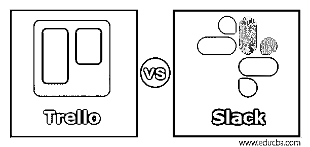
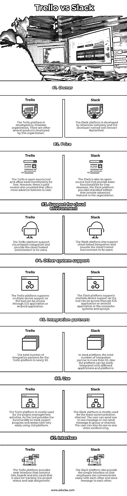

# 特雷罗 vs 斯莱克

> 原文：<https://www.educba.com/trello-vs-slack/>

## Trello 与 Slack 的区别

Trello 是一种项目管理平台，可以通过 web 浏览器轻松访问。Trello 平台是一个开源平台，任何用户都可以免费访问该平台进行项目管理活动。该平台包含用于表示项目工作流的板。Slack 是组织和公司用来在员工之间进行交流的一个交流平台。用户可以共享图像、文档，还可以使用 slack 平台进行视频会议。slack 平台可以通过手机、台式机或笔记本电脑访问。它也是一个开源平台。

### Trello 与 Slack 的直接对比(信息图)

以下是 Trello 与 Slack 的 11 大区别:

<small>网页开发、编程语言、软件测试&其他</small>

### Trello 与 Slack 的主要区别

以下是 Trello 与 Slack 的主要区别:

*   Trello 平台和 Slack 平台这两个平台的主要区别之一是平台的用途。slack 平台是一个强大的通信平台，为组织员工提供公共和私有通道或项目类型通道来发送信息。slack 平台还提供了相互发送直接消息的功能。slack 平台的用户可以彼此进行一对一的视频会议。另一方面，Trello 是一个广泛用于管理项目工作流和管理项目活动的项目管理工具。Trello 平台提供了分配任务的功能，可以进行活动的进度监控，还可以使用该工具控制项目活动。用户还可以使用 Trello 平台讨论任务活动。
*   两个平台的另一个区别是定价体系。Trello 平台的基本版是免费的，用户可以使用该平台的基本功能。然而，Trello 平台也提供商务类版本，用户需要支付 9.99 美元一个月。Trello 平台还提供企业版，用户需要每月支付 20.83 美元才能使用该平台的其他功能。另一方面，slack 平台也是一个开源平台，用户可以在其中使用平台的基本功能。slack 平台提供标准版，用户需要每月支付 6.67 美元。在这种情况下，平台可以很容易地集成许多应用程序。在标准版中，用户可以存储无限的消息。
*   这两个平台的另一个区别是平台的易用性。由于 Trello 平台和 Slack 平台都使用了 SaaS 集成，因此这两种平台都可以轻松访问。但如果比较的话，Trello 平台比 slack 平台更有吸引力，用户界面也更好。Trello 平台的用户界面设计比 slack 平台具有更多高级功能。
*   这两个平台之间的另一个区别是与其他平台和应用程序的集成。slack 平台可以很容易地与其他应用程序和平台集成，但是 Trello 平台没有这种功能。Slack 是一个更好的协作平台，支持根据用户需求集成不同的 API。slack 平台也提供了可定制的支持。在可定制选项中，可以根据用户要求定制平台。但是，Trello 平台不支持此功能。
*   Trello 平台和 Slack 平台的另一个关键区别是平台的目标受众。Trello 平台主要面向个人用户，因为该工具用于项目监控活动和跟踪项目活动。另一方面，slack 平台面向整个组织或公司，因为它被整个组织用来在组织内进行通信和聊天。slack 提供工程、IT、销售、客户支持、人力资源和营销解决方案。

### Trello 与 Slack 对比表

让我们来讨论一下特雷罗和斯莱克之间的顶级对比:

| **功能** | 特雷罗 | **松弛** |
| **所有者** | Atlassian 组织开发了 Trello 平台。这个组织开发其他几个产品。 | 一家美国公司开发 Slack 平台，开发者名叫斯图尔特·巴特菲尔德。 |
| **价格** | Trello 是一个开源工具，免费提供基本功能。但是，也提供了一个付费版本，为用户提供更高级的功能。 | Slack 也是一款开源工具，免费提供基本功能。然而，Slack 平台提供了一个标准版本，为组织提供了高级特性。 |
| **支持云环境** | Trello 平台支持基于云的集成，并为其用户提供云托管环境。 | Slack 平台还支持基于云的集成，并为其用户提供云托管环境。 |
| **其他系统支持** | Trello 平台支持多设备支持，因为它可以通过 IOS 应用程序或 android 应用程序访问。 | Slack 平台支持多设备支持，因为该工具可以通过 IOS 应用程序或 android 应用程序或计算机系统和笔记本电脑访问。 |
| **整合合作伙伴** | Trello 平台的集成合作伙伴总数接近 30 个。 | 在 slack 平台中，集成合作伙伴的总数超过 50 个。此外，该平台可以轻松地与不同的应用程序和平台集成。 |
| **使用** | Trello 平台主要用于项目管理活动，因为该工具提供了跟踪项目进度的功能，使用该平台可以非常轻松地分配任务。 | Slack 平台主要用于团队沟通渠道。用户可以发送一对一的消息，或者可以在群组或频道中发送消息。用户也可以进行一对一的视频会议。 |
| **界面** | Trello 平台提供了一个简洁的界面，包含用于跟踪项目状态和任务分配的列表、公告板和卡片。 | Slack 平台还提供了一个简单的接口，以便员工之间可以轻松地相互交流和发送消息。 |

### 结论

Trello 平台和 Slack 平台是两种不同类型的平台。Trello 是一个项目管理平台，用于管理项目活动。另一方面，slack 是一个沟通聊天平台，组织使用它来建立组织内部的沟通媒介。

### 推荐文章

这是一个特雷罗 vs Slack 的指南。在这里，我们还讨论了 Trello 与 Slack-key 的差异，并提供了信息图表和比较表。您也可以看看以下文章，了解更多信息–

1.  [Node.js vs Nginx](https://www.educba.com/node-js-vs-nginx/)
2.  [吉拉 vs 特雷罗](https://www.educba.com/jira-vs-trello/)
3.  [特雷罗 vs 规划师](https://www.educba.com/trello-vs-planner/)
4.  [梅斯特任务 vs 特雷罗](https://www.educba.com/meistertask-vs-trello/)

