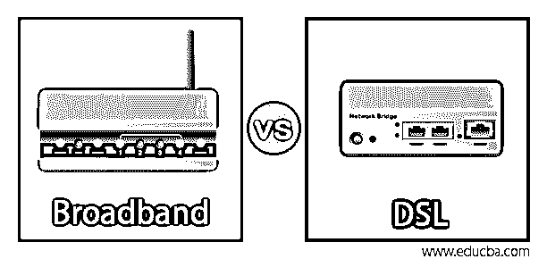
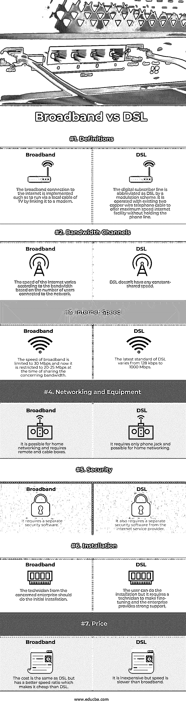

# 宽带与 DSL

> 原文：<https://www.educba.com/broadband-vs-dsl/>

## 宽带与 DSL 的区别

宽带通常被用来代表高速工作的互联网服务，它们基于电话和拨号，并且总是保持连接。提供宽带设施的一些服务有电缆、卫星、DSL、光纤。除此之外，所有其他宽带服务都很少使用。DSL 被扩展为数字用户线和舒适的调制模式，将互联网数据捆绑到相关的铜双绞线中，并连接到用户电话服务。本文解释了宽带和 DSL 之间的主要区别和比较。

### 宽带与 DSL 的面对面比较(信息图表)

以下是宽带与 DSL 的 7 大对比:

<small>网页开发、编程语言、软件测试&其他</small>

### 宽带与 DSL 的主要区别

让我们讨论一下宽带与 DSL 之间的主要比较:

宽带和 DSL 中的重要元素，如配置、网速、优势、限制和定价等，将在下面进行解释。

#### 1.互联网服务的配置

DSL 是一种“最后一英里”技术，它只能用于从电话连接到办公室、家庭或交换站，但不能用于多个交换站之间。它被称为“永远在线连接”,因为它使用现有的铜线电话线路和连接到房屋的双线连接，并且不会由于已建立的拨号连接而干扰电话。不需要拨入 ISP，因为 DSP 始终处于开启状态。同样，宽带互联网服务是通过电缆提供的，可以通过带有调制解调器的电视的本地电缆进行操作。宽带互联网在电视上运行，在信道空间传输数据，上行传输存在于其他可用信道上，因为与电话线相比，有线电视中的同轴电缆提供了更宽的带宽。调制解调器用于快速访问浏览器。出现了数万亿的房子和办公室已经与电视连接，并使宽带服务成为企业最舒适和最有利可图的附加服务。

#### 2.宽带和 DSL 的优势

使用 DSL，它可以比拨号连接更快地同时接入电话和互联网。它提供了在 ISP 提供的不同连接速度和价格之间进行选择的能力。同时，宽带提供的性能不依赖于与提供商中心位置的距离。它的速度比拨号和 DSL 快。

#### 3.宽带和 DSL 的局限性

DSL 的数据接收速度很快，但由于 ISP 与用户之间的距离最大，DSL 与提供商的中心位置相距甚远，因此无法在多个远程位置接收数据。而宽带将一个单元线路的可用带宽分配给邻近的另一个单元线路，如果更多的人使用相同的信道线路，则宽带会使其变慢。与 DSL 相比，它非常昂贵，而且在偏远地区无法使用。

#### 4.互联网接入速度

30 Mbps 的宽带粗略速度在 DSL 中具有 10 Mbps 的明显优势。但是宽带互联网服务已经根据用户的使用限制了更高的速度，因此更多的用户可以被分配在单个带宽信道上。DSL 的速度取决于用户和主源之间的距离。所以网速是根据家里和 ISP 的距离来定的；如果距离最小，速度最大，如果距离最大，速度最小。DSL 提供商不会与不属于所定位的源的特定半径的外部消费者建立连接。

#### 5.宽带和 DSL 的成本

宽带和 DSL 可以适应几个因素，如供求区域、居住位置、服务提供商。虽然实际价格的比较，它是适应选择 DSL 的速度。因为宽带的配置设置和成本比最大。宽带的互联网连接提供了最大的速度，用很少的受益套餐吸引了更多的消费者。

#### 6.宽带和 DSL 之间共享的连接

与宽带不同，共享连接不能通过 DSL 建立。它主要使用办公室或家中专用的电话线。很多人共用同一个带宽通道，影响了网速，平衡了 DSL 在这个因素上的缺点。

### 宽带与 DSL 对比表

下表总结了宽带与 DSL 之间的比较:

| **特征元素** | **宽带** | **DSL** |
| **定义** | 实现了到互联网的宽带连接，例如通过将电视连接到调制解调器来经由本地电缆运行。 | 通过调制方案，数字用户线路被缩写为 DSL。它使用现有的两根铜线电话电缆来提供最高速度的互联网设施，而无需占用电话线。 |
| **带宽通道** | 根据连接到网络的用户数量，互联网速度因带宽而异。 | DSL 没有任何恒定的共享速度。 |
| **网速** | 宽带的速度被限制在 30 Mbps，现在在共享相关带宽时被限制在 20-25 Mbps。 | DSL 的最新标准从 128 kbps 到 1000 Mbps 不等。 |
| **网络和设备** | 它可以用于家庭网络，需要遥控器和有线电视盒。 | 它只需要一个电话插孔，可能用于家庭网络。 |
| **安全** | 它需要单独的安全软件。 | 它还需要互联网服务提供商提供单独的安全软件。 |
| **安装** | 相关企业的技术人员应进行初始安装。 | 用户可以进行安装，但需要技术人员进行微调，企业提供强有力的支持。 |
| **价格** | 成本与 DSL 相同，但速度比更好，比 DSL 更便宜。 | 价格不贵，但是速度比宽带慢。 |

### 结论

宽带的速度高于 DSL，并取决于用户数量和所用电缆的质量。与 DSL 不同，宽带连接不依赖于距离，因此它提供了一个公认的速度。DSL 的专用电缆是几个用户共用的，影响上网速度。

### 推荐文章

这是宽带与 DSL 的对比指南。在这里，我们还将通过信息图和比较表来讨论宽带与 DSL 的主要区别。您也可以看看以下文章，了解更多信息–

1.  [网络设备的类型](https://www.educba.com/types-of-network-devices/)
2.  [道德黑客工具](https://www.educba.com/ethical-hacking-tools/)
3.  [FTP vs SFTP](https://www.educba.com/ftp-vs-sftp/)
4.  [Wi-Fi vs 以太网](https://www.educba.com/wifi-vs-ethernet/)

