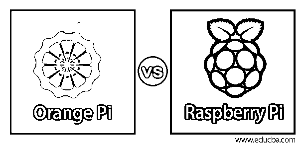
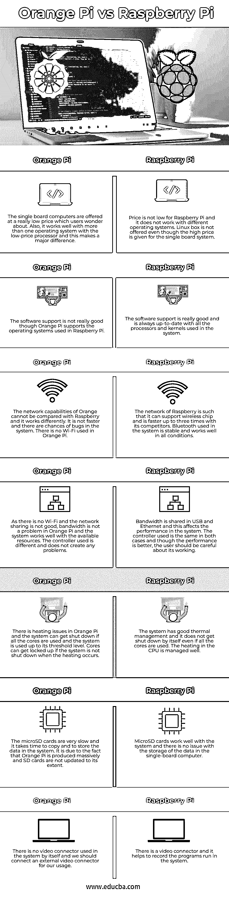

# 橘子皮 vs 树莓皮

> 原文：<https://www.educba.com/orange-pi-vs-raspberry-pi/>

## 桔子皮和树莓皮的区别

一台由 Linux 驱动的单板开源计算机叫做 Orange Pi。板载互联网连接允许使用 4 个 CPU 内核。系统中不需要适配器，因为 Wi-Fi 是内置的。它可以在任何操作系统中运行，并以较低的成本在系统中运行良好。树莓基金会开发的小型单板计算机叫树莓 Pi。它是为了学生的利益在学校教授计算机科学而开发的。它使用 MicroSDHC 插槽进行存储，内存为 1.2 到 4 GiB RAM。

### 桔子酱和树莓酱的直接对比(信息图)

以下是橘子皮和树莓皮的 7 大区别:

<small>网页开发、编程语言、软件测试&其他</small>

### 桔子皮和树莓皮的主要区别

以下是 Orange Pi 与 Raspberry Pi 的主要区别:

*   比较两者，Orange Pi 比 Raspberry Pi 表现更好。对于更高范围的系统，Raspberry 使用 1.4 GHz 四核，Orange 使用 1.6 GHz 四核处理器。两者的内存容量相同，都是 1 GB，但 Orange 使用 DDR3，Raspberry 使用 LPDDR2。使用的图形在 Orange 中略好，因为它使用 Mali400MP2 GPU，Raspberry 使用 Broadcom Video core-IV GPU。Orange 仅使用一个以太网作为 10/100 以太网 RJ45，而 Raspberry 使用以太网和 Wi-Fi，如千兆以太网和 2.4GHz 和 5GHz 802.11b/g/n/ac Wi-Fi。
*   对于 I/O 服务，两者都使用 HDMI 和 3.5 mm 模拟音视频插孔，但 Raspberry 使用相机串行接口和显示器串行接口。Orange 不使用任何接口，但系统中有一个 USB 2.0 OTG。还有，树莓的 OS 是基于 Linux 的，Orange 的 OS 是同时基于 Linux 和 Android 的。因此，Android 4.4 在 Orange 上运行良好，但在 Raspberry 上就不行了。
*   Orange Pi 可以运行在不同的操作系统中，与 Raspberry Pi 相比，它的性能很好。与 Raspberry Pi 相比，内核速度、RAM 和视频性能更好，但只是在标称模式下。由于使用的操作系统不同，两者在许多方面的规格和功能都很相似。
*   社区对树莓的支持非常好，因为它在 Orange Pi 之前就已经开发出来了。为树莓提供的在线信息和支持是巨大的。互联网上的忠实追随者支持 Raspberry Pi 的新版本，社区追随者给出了几个项目来帮助该系统。而对 Orange Pi 的社区支持并不好，并且正在互联网上发展社区。用户应该找到问题的解决方案，因为他们无法在网上找到或没有任何文档可用。
*   橘子皮的价格比树莓皮便宜。但由于在线社区的支持，Raspberry Pi 在支持、稳定性和各种项目方面都很好。这种优势是橘皮所缺乏的。Orange Pi 有助于运行不同的应用程序和使用不同的操作系统，其行为类似于 Android。这有助于用户在系统中尝试不同的项目。
*   Raspberry pi 的 CPU 比 Orange Pi 更快，它使用热量管理来管理 CPU 的热量。时钟速度很好，并且有比 Orange Pi 更好的电压调节，这使得在系统中工作成熟。此外，系统应用程序比 Orange Pi 更快，并且与所有应用程序配合良好。

### 橘子皮与树莓皮对比表

我们来讨论一下橘子皮和树莓皮的顶级对比:

| **橘皮** | **树莓派** |
| 单板计算机的价格非常低，用户对此感到疑惑。它还可以与多种带有低价处理器的操作系统配合使用，这一点非常重要。 | 树莓派的价格不低，而且它不能在不同的操作系统上运行。即使给出了单板系统的高价，也不提供 Linux box。 |
| 虽然 Orange Pi 支持 Raspberry Pi 中使用的操作系统，但软件支持并不是很好。 | 软件支持非常好，系统中使用的所有处理器和内核都是最新的。 |
| Orange 的网络能力无法和 Raspberry 相比，工作原理也不一样。它不是更快，而且系统中有可能出现错误。橘皮没有用 Wi-Fi。 | Raspberry 的网络支持无线芯片，速度是竞争对手的三倍。系统中使用的蓝牙是稳定的，在各种条件下都能正常工作。 |
| 由于没有 Wi-Fi，网络共享也不好，所以在 Orange Pi 中带宽不是问题，系统在可用资源的情况下运行良好。使用的控制器不同，不会产生任何问题。 | USB 和以太网共享带宽，这会影响系统的性能。两种情况下使用的控制器是相同的，虽然性能更好，但用户应该小心它的工作。 |
| Orange Pi 中存在发热问题，如果所有内核都被使用，并且系统被使用到其阈值水平，则系统可能会关闭。如果系统在发热时没有关闭，铁芯可能会被锁住。 | 该系统具有良好的热量管理，即使使用了所有内核，它也不会自行关闭。CPU 中的发热得到了很好的管理。 |
| microSD 卡非常慢，而且在系统中复制和存储数据需要时间。是由于橘皮大量生产，SD 卡没有更新到他们的程度。 | MicroSD 卡与系统配合良好，在单板计算机中存储数据没有问题。 |
| 系统中没有单独使用的视频连接器，我们应该连接一个外部视频连接器供我们使用。 | 有一个视频连接器，它有助于记录系统中运行的程序。 |

### 推荐文章

这是一本橘子皮 vs 树莓皮的指南。在这里，我们还讨论了 Orange Pi 与 Raspberry Pi 的主要区别，并提供了信息图表和比较表。您也可以看看以下文章，了解更多信息–

1.  [树莓酱的替代品](https://www.educba.com/alternatives-to-raspberry-pi/)
2.  [树莓派 0 比 3](https://www.educba.com/raspberry-pi-zero-vs-3/)
3.  [ASP vs ASP.NET](https://www.educba.com/asp-vs-asp-dot-net/)
4.  [树莓派 3 vs 树莓派 2](https://www.educba.com/raspberry-pi-3-vs-raspberry-pi-2/)

