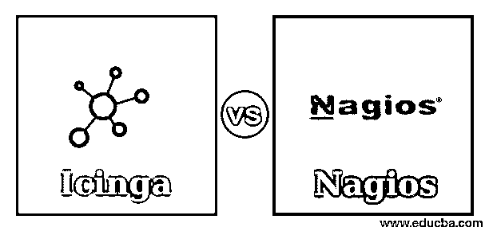
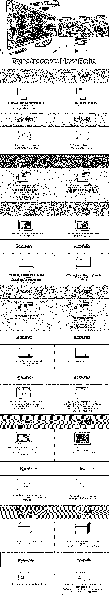

# Icinga vs Nagios

> 原文：<https://www.educba.com/icinga-vs-nagios/>

## Icinga 与 Nagios 的区别

Nagios 和 Icinga 是用于跟踪系统性能的监控工具。Icinga 在市场上存在了大约 10 年，为用户提供了很好的功能，而 Nagios 是一个拥有广泛社区的成熟产品，有更多的附加组件。它们都是开源软件，可以根据用户需求定制。尽管这些工具都是为同一来源开发的，但它们有一些相似之处和不同之处，本文将对此进行简要讨论。

### Icinga 与 Nagios 的正面比较(信息图)

以下是 Icinga 与 Nagios 之间的 6 大对比:

<small>网页开发、编程语言、软件测试&其他</small>

### Icinga 与 Nagios 的主要区别

让我们从以下几点来讨论 Icinga 和 Nagios 之间的一些关键差异:

#### 1.Icinga 和 Nagios 的定义

Nagios 可以监控所有的服务、应用程序、操作系统，监控网络协议，这加载了多种功能。Icinga 是一个开放的软件，可自由发布，带有经过编辑的源代码，并可根据社区和需求进行定制。Icinga 是一个灵活的监控工具，用于网络管理，以有效地监控应用程序和服务。Nagios 是用于网络管理的高级监控工具，可以全面监控 IT 基础设施设备，即时检测故障、发出警报并解决网络问题和事件，以及规划基础设施的下一次升级。

#### 2.定价

Icinga 的产品在安装时向用户收取开发和支持费用。但是 Nagios 的安装费是 1995 美元，而且它们提供了大量的功能和支持。它对大型行业产生了巨大的影响，并与它们所有的软件集成，这只有通过 Nagios 才能实现。

#### 3.体系结构

这两个工具有相似的 IT 基础设施，这提供了最大的可靠性和防弹安全性。但是 Nagios 在强大的防火墙下提供了令人惊叹的功能。如果任何服务器出现故障，它会发出即时警报，即使是在离线状态下。而 Icinga 是一个稳定且成熟的产品，包含一组与 Nagios 相似的附加组件和插件。ice 和 Nagios 有类似的模块，如命令行界面、可视化界面、核心和用户界面。Nagios 有一个简单的导航过程，可以通过高度配置的设备(如笔记本电脑和 PC)快速流动。如果用户有一个现代化的浏览器，他可以选择 Nagios。

#### 4.业务适应性

Icinga 非常适合中小型企业，因为它具有最低的安装成本和定制选项。以金钱为导向的公司可以选择将其产品集成到自己的应用程序中的 ice。所以他们不想花在购买其他产品上，但不确定他们是否承诺长期运行。由于价格不贵，小规模工业陷入困境，渴望从中获利。而 Nagios 提供了一个物有所值的完整包，使它成为一个出色的独立产品，可以跟踪企业端到端的基础设施、服务、服务器、网络和应用程序。有时，即使一个集线器故障也会导致巨大的损失，Nagios 的安装可以防止这种情况。因此，在大规模企业中不考虑定价，因为他们只想关注生产率和长期服务。

#### 5.特征

Nagios 可以安装在 Linux、Unix、Windows、Mac 和基于 web 的服务器上，而 Icinga 可以安装在 Linux、Unix、Mac 和 Windows 上。Icinga 只支持英语和德语，而 Nagios 支持多种语言，包括英语、德语、西班牙语、日语、中文、意大利语、法语、葡萄牙语和俄语。Nagios 的主要客户是惠普、哈佛大学和凯悦，而 Adobe、奥迪和沃达丰是 Icinga 的客户。

#### 6.提供的服务

Icinga 高度安全，提供弹性搜索、有吸引力的仪表板、性能监控、Rest API 和基于规则的配置，使 Icinga 更加稳定。它提供文本通知，多检查插件，警报，Icinga 导演，并有通用的 TTS。Nagios 的标准服务是其认知能力规划和更新基础设施、令人惊叹的基础设施管理、对 IT 运营、业务和网络管理的清晰可见性、强大的搜索引擎、网络和事件警报、规划图、可定制性、用户管理、高级配置向导和 web 界面、具有高度保护的防火墙的多租户功能。发生的警报和事件可以立即解决，甚至在发送管理通知之前就可以解决。

### Icinga 与 Nagios 对比表

下表总结了 Icinga 与 Nagios 之间的比较 **:**

| **属性** | **Icinga** | **纳吉奥斯** |
| **描述** | Icinga 是一款网络监控工具和开源软件，可以安装在 Linux、Mac、Windows 等所有操作系统中。 | Nagios 是一个用于基础设施管理的网络监控工具和用户，可以安装在 Linux、Mac 和 Windows 上。它是开源软件。 |
| **适应性** | 它支持中小型工业。根据一项全球调查，用户满意度约为 84%，smart 评分为 8.4。 | 它支持小型、中型和大型工业。根据一项全球调查，Nagios 的用户满意度在 89%左右，smart 评分为 8.8。 |
| **定价信息** | 价格细节是按照报价给出的，比 Nagios 的价格低。它完全基于报价。 | Nagios 的价格比 Icinga 最高，标准价格为 1995 美元。它还提供免费试用、按年试用和按报价试用。 |
| **替代品** | 流行的替代品是 Atera，Uptrend，Website pulse 和 GlassWire。 | 流行的替代方案有 Atera、CoScale、Easy-IP 和 site 24*7。 |
| **集成** | 它可以与 puppet、Ansible、Chef、vagger、Graphite、Graylog、Elastic、Dashing、Terraform、Pagerduty 等应用程序集成。 | 它可以与 Slack、xMatters、OpsGenie、SysAid、VictorOps、CloudMonix、CoreStack、Datadog、Cherwell 服务管理等集成。 |
| **支持** | 可用的支持方式包括电子邮件、培训和票证。 | Nagios 的可用支持包括电子邮件、电话、现场支持、门票和培训。 |

### 结论

为了充分利用这两个软件，用户可能会选择 Nagios，因为它在全球行业中享有最好的声誉，提供了开箱即用的惊人功能和广泛的支持。它是根据用户的需求来选择他的产品，以抓住整个优势。

### 推荐文章

这是一个 Icinga vs Nagios 的指南。在这里，我们还讨论了 Icinga 和 Nagios 的关键区别，包括信息图和比较表。您也可以看看以下文章，了解更多信息–

1.  [什么是 GIS？|五大特色](https://www.educba.com/what-is-gis/)
2.  [地理信息系统的 8 个最佳应用](https://www.educba.com/applications-of-gis/)
3.  [Splunk 与 Nagios–主要差异](https://www.educba.com/splunk-vs-nagios/)
4.  [数据分析与数据分析–主要差异](https://www.educba.com/data-analytics-vs-data-analysis/)

