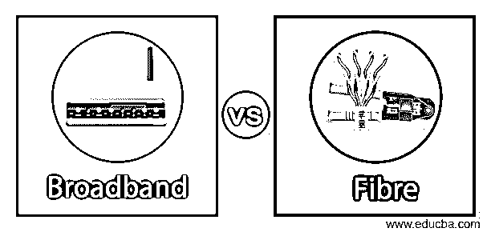
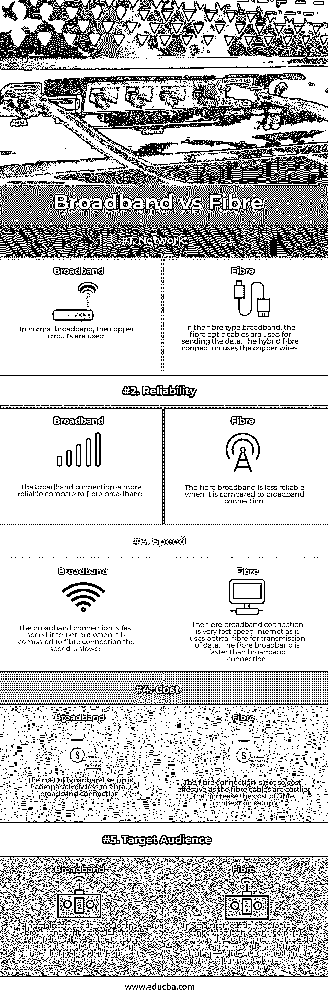

# 宽带与光纤

> 原文：<https://www.educba.com/broadband-vs-fibre/>

## 宽带与光纤的区别

宽带是一种互联网服务，为其服务提供高速互联网。宽带能够传输多个信号的宽带宽类型传输。宽带使用的介质是光纤、同轴电缆、双绞线和无线电。可以供组织使用，也可以供个人使用。在光纤宽带中，光缆用于通过它发送数据。光纤宽带比普通宽带相对更快，而且连接也很可靠。

### 宽带与光纤的直接比较(信息图表)

以下是宽带与光纤的五大对比 **:**

<small>网页开发、编程语言、软件测试&其他</small>

### 宽带与光纤的主要区别

让我们从以下几点来讨论宽带与光纤之间的一些关键差异:

**1。**当用户选择拥有互联网服务时，首先需要考虑的因素是可靠性。在当今的互联网时代，宽带和光纤都被认为是提供高速互联网的可靠连接。宽带连接比光纤连接等其他选择更可靠，因为在光纤连接中，由于影响光纤连接可靠性的本地条件，可能会有一些中断。两种连接类型的设计都是被动的，就像它没有面临任何类型的中断一样，但如果需要在两种宽带之间进行比较，从可靠性方面来说将是更好的选择。

**2。**对于使用互联网服务的组织来说，带宽是一个重要的比较因素。与在组织中一样，他们需要高速互联网，因为他们的业务运营，如视频会议、会议、在线演示以及许多大文件的上传或下载。对于所有这些要求，公司把重点放在对带宽的高要求上。在宽带连接中，服务由许多个人同时共享，这影响了连接的带宽。而另一方面，光纤是一种专用服务，仅由建立该服务的企业使用，因此速度不会受到影响，并且用户在恒定时间内获得最大带宽。因此，与宽带服务相比，光纤具有更大的带宽。

**3。**在全球范围内开展任何业务，任何组织的首要要求都是在云平台上提供服务。在云存储上上传或下载文件的过程中，公司无法承受任何延迟。由于他们直接与顾客和客户打交道，因此总是需要高速互联网。在提供高速互联网时，与宽带相比，光纤是更好的选择，因为光纤是一种专门的服务，为商业组织提供直接的互联网服务，因此没有人共享带宽，但在宽带连接中，带宽由许多用户共享，导致连接缓慢，并且当组织执行业务操作时可能会出现延迟。

**4。**当个人使用互联网服务时，首要考虑的始终是网络安全以及在使用互联网服务时是否存在任何潜在风险。当我们比较宽带服务和光纤连接时，宽带更便于攻击者攻击网络并进行恶意活动。攻击者更容易访问宽带连接来攻击和破坏网络。而另一方面，攻击者需要付出更多的努力来攻击专用光纤连接。因此，当组织在宽带和光纤互联网之间进行选择，并且需要基于安全性进行选择时，他们总是选择光纤连接而不是宽带。

**5。**宽带和光纤互联网的另一个重要区别是连接价格。与宽带连接相比，光纤互联网连接相对昂贵。这些组织正在努力使用户能够负担得起光纤连接。由于价格原因，普通人负担不起家中的光纤连接，但普通的宽带连接既便宜又实惠。大型组织选择光纤连接，因为他们需要执行需要高速互联网连接的大规模操作，并且他们很容易负担得起在其组织场所中使用光纤连接。与宽带连接相比，光纤在速度、可靠性和安全性方面有几个优势，但当基于价格进行比较时，宽带连接比光纤连接更胜一筹，但光纤连接是物有所值的互联网服务。

### 宽带与光纤对比表

下表总结了宽带与光纤的比较 **:**

| **因子** | **宽带** | **纤维** |
| **网络** | 在普通宽带中，使用铜线。 | 在光纤型宽带中，光纤电缆用于发送数据。混合光纤连接使用铜线。 |
| **可靠性** | 与光纤宽带相比，宽带连接更加可靠。 | 与宽带连接相比，光纤宽带不太可靠。 |
| **速度** | 宽带连接是高速互联网，但与光纤连接相比，速度较慢。 | 光纤宽带连接是非常高速的互联网，因为它使用光纤传输数据。光纤宽带比宽带连接更快。 |
| **成本** | 与光纤宽带连接相比，宽带设置的成本相对较低。 | 光纤连接的成本效益不是很高，因为光纤电缆更贵，增加了光纤连接设置的成本。 |
| **目标受众** | 宽带连接的主要目标受众是家庭和个人使用，因为宽带连接的成本很低，连接也很可靠，而且互联网速度很快。 | 光纤连接的主要目标受众是办公室和企业部门，因为这种设置的成本很高，组织无法承受。光纤是大规模组织所需的高速互联网连接。 |

### 结论

在一个快速发展的世界中，每个人都需要快速可靠的互联网服务，在市场上，互联网服务有多种选择。宽带连接和光纤连接都是为用户提供高速互联网的便利选择。两者之间的选择完全取决于用户的要求和需要。

### 推荐文章

这是一个关于宽带和光纤的主要区别的指南。在这里，我们通过信息图和比较表来讨论宽带与光纤的主要区别。您也可以看看以下文章，了解更多信息–

1.  [IPS 工具| 7 大不同的 IPS 工具](https://www.educba.com/ips-tools/)
2.  [IDS 工具介绍|简要说明](https://www.educba.com/ids-tools/)
3.  [网络安全攻击的类型](https://www.educba.com/types-of-network-security-attacks/)
4.  [网络安全工具](https://www.educba.com/cyber-security-tools/)

