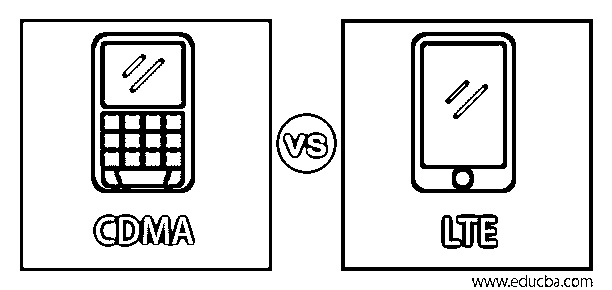
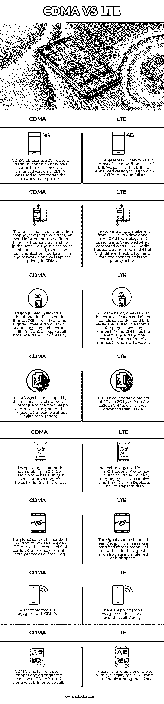

# CDMA 与 LTE

> 原文：<https://www.educba.com/cdma-vs-lte/>

## CDMA 与 LTE 的区别

CDMA 或码分多址是一种使用无线电通信技术的移动通信标准。许多发射器可以通过单一通道发送信息，它们之间不会有任何通信问题。多个用户可以共享相同的频带。CDMA 是许多移动标准中的接入方法。长期演进或 LTE 是 4G 移动设备中的通信标准。无线宽带服务使用无线电通信来提高容量和速度。速度是 3G 网络的十倍。数据以很快的速度被转移到互联网系统。在本主题中，我们将了解 CDMA 与 LTE 的区别。

### CDMA 与 LTE 的直接对比(信息图表)

以下是 CDMA 和 LTE 的主要区别

<small>网页开发、编程语言、软件测试&其他</small>

### CDMA 与 LTE 的主要区别

以下是 CDMA 和 LITE 之间的一些主要区别:

*   CDMA 是在 20 世纪 90 年代开发的，用于通过 2G 连接连接手机，而 LTE 是在 21 世纪初开发的，用于通过 4G 连接连接手机。CDMA 有助于数据和蜂窝连接，而 LTE 仅有助于 4G 数据连接。这一点现在正在改进，它有助于语音通话的连接。
*   CDMA 手机不需要 SIM 卡。他们有一个唯一的识别号，用来识别用户。这些数字是序列号，以便于识别用户。LTE 手机使用 SIM 卡，这有助于用户在需要时对手机进行必要的更改。现在大多数手机都有 LTE 功能，因此更换手机不成问题。
*   由于 CDMA 手机没有 SIM 卡，用户不容易切换手机。用户必须通知运营商关于新电话的情况，并且必须给新电话分配序列号。如果手机不是为他们购买的，运营商可能会制造问题，他们可能不会给新手机分配序列号。这会让用户更换电话号码，这并不容易。LTE 没有这些问题，因为换手机时有 SIM 卡。我们可以插入旧的 SIM 卡使用电话。
*   无线用户使用无线电波，而不是手机中的任何技术，这就是 CDMA。我们可以称之为扩频。美国使用 CDMA，欧洲使用 GSM。LTE 是一种宽带技术，仅在网络中传输数据。它支持更快的网络，用户也因此受益。
*   CDMA 是一项技术进步，因为它可以结合并使用数据和语音通话，这在 20 世纪 90 年代是不可能的。它具有良好的频谱效率。CDMA 的进步为 GSM 和后来的 UMTS 铺平了道路，最终达到了 LTE。虽然 LTE 现在不支持语音通话，但高速互联网是任何其他技术都无法夸耀的优势。
*   在 CDMA 中，电话由运营商控制，这使得用户的电话和安全易受攻击。但是在 LTE 中，由于 SIM 卡，电话和运营商没有连接。运营商无法控制手机，因为手机有 SIM 卡，因此 LTE 标准手机的安全性不会受到影响。

### CDMA 与 LTE 对比表

为了便于理解，让我们通过一个比较表来看看 CDMA 和 LTE 之间的更多差异:

| **CDMA** | **LTE** |
| 码分多址代表了美国的 2G 网络。当 3G 网络出现时，增强型码分多址被用来将网络整合到手机中。 | LTE 代表 4G 网络，大部分新手机都使用 LTE。我们可以说 LTE 是 CDMA 的加强版，全互联网，全 IP。 |
| 几个发射机可以通过单个通信信道发送信息，不同的频带在网络中共享。虽然使用相同的信道，但是在网络中没有通信干扰。语音通话是 CDMA 的优先选择。 | LTE 的工作方式不同于 CDMA。它是从 GSM 技术发展而来的，与 CDMA 相比，速度有了很大的提高。在 LTE 中使用无线电频率，但是对于不同的技术和数据，连接是 LTE 中的优先事项。 |
| 在美国，几乎所有的手机都使用 CDMA，但在欧洲，使用 GSM，这与 CDMA 略有不同。技术和架构不同，所有人都不会轻易理解 CDMA。 | LTE 是新的全球通信标准，所有人都可以轻松理解 LTE。现在几乎所有的手机都使用这种技术，了解 LTE 有助于用户了解手机通过无线电波进行的通信。 |
| 军方首先开发 CDMA，因为它遵循某些协议，用户无法控制电话。这有助于对军事行动保密。 | LTE 是一家名为 3GPP 的公司的 2G 和 3G 合作项目，这比 CDMA 先进得多。 |
| 使用单一频道在 CDMA 中不成问题，因为每部手机都有一个唯一的序列号，这有助于识别信号。 | LTE 中使用的技术是正交频分复用。此外，频分双工和时分双工用于传输数据。 |
| 由于手机没有 SIM 卡，信号不能像 LTE 那样容易地在不同的路径上处理。此外，数据传输速度很低。 | 即使是在单个路径或不同的路径中，也可以容易地处理信号。SIM 卡在这方面有所帮助，而且数据传输速度也很快。 |
| CDMA 分配了一组协议。 | LTE 没有分配任何协议，这非常有效。 |
| CDMA 不再用于手机，增强版的 CDMA 与 LTE 一起用于语音通话。 | 灵活性和效率以及可用性使 LTE 更受用户青睐。 |

### 结论

我们希望 CDMA 和 LTE 都能让手机正常工作。CDMA 用于语音通话，LTE 用于数据连接。一个不能代替另一个。然而，一些新一代手机正在 LTE 中使用语音通话，以避免在其技术中使用 CDMA。

### 推荐文章

这是 CDMA 与 LTE 的对比指南。在这里，我们讨论 CDMA 与 LTE 的主要区别，通过信息图和比较表进行面对面的比较。您也可以看看以下文章，了解更多信息–

1.  [灰鲸 vs 麋鹿](https://www.educba.com/graylog-vs-elk/)
2.  [背对蒙戈布](https://www.educba.com/redis-vs-mongodb/)
3.  [MVVM vs MVC](https://www.educba.com/mvvm-vs-mvc/)
4.  [MVP vs MVVM](https://www.educba.com/mvp-vs-mvvm/)

